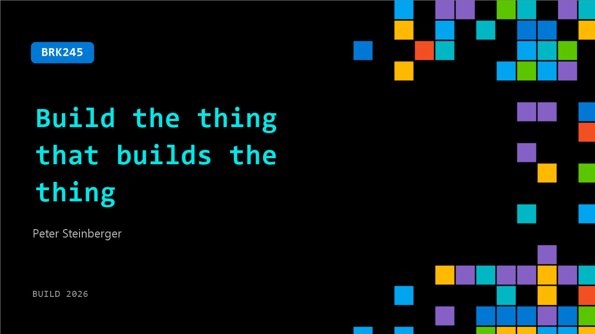

# BRK245: Build the thing that builds the thing

**Session code:** BRK245  
**Date:** Tuesday, June 2, 2026 / 2:30 PM - 3:15 PM PDT (Duration 45 minutes)  
**Watch on-demand:** <https://build.microsoft.com/en-US/sessions/BRK245>

---

## Speakers

- **Peter Steinberger** - Clawfather, OpenAI/OpenClaw

## About the session

The way software is built is changing rapidly. Learn how we build a whole ecosystem of tools to build OpenClaw faster and with more confidence.

Seating for this session is first-come, first-served. Add it to your schedule to plan your day and arrive early to secure a spot.

## AI summary

**Introduction and Core Philosophy:** The talk begins with the speaker greeting the audience and explaining that this will not be a conventional presentation (00:00:00–00:00:16). The central theme is "build a thing that builds the thing" — a concept that emphasizes developing tools and automation that enhance the software-building process. The speaker notes that in the age of coding agents, many traditional ways of writing software have become outdated (00:00:38). Instead of focusing solely on speed, developers should now ask how they can help their AI agents build faster and close feedback loops more efficiently (00:02:05).

**From Open Source Chaos to Automation:** Discussing open source development, the speaker humorously reflects on media reports of “failed” projects, clarifying that each was built to improve their own workflow rather than for public success (00:01:28). When managing their Opencloud project, the number of GitHub issues exploded beyond 10,000 (00:03:31), prompting the creation of tools like Close Reaper to automatically review, group, and close issues (00:05:23). By integrating project vision documents and clear automated rules, they reduced clutter and closed around 15,000 issues autonomously (00:06:35). The system even updates weekly through continuous code-agent reevaluation, ensuring lingering issues are resolved without direct human review.

**Scaling Tools and Managing Data:** As more maintainers joined the project, the speaker needed better management dashboards. They created a report system integrating both GitHub and Discord discussions (00:09:01) to highlight true maintenance contribution beyond code commits. To collect data from community chats, they built “Disk Crawl,” a crawler for Discord, and stored structured outputs directly in GitHub repositories for transparency and safe backup (00:15:14). This automation ecosystem extended into tools like Release Bar, which visually tracks version recency to guide release timing (00:15:35), demonstrating how each small helper tool compounds to accelerate overall productivity.

**Solving Bottlenecks and Expanding Infrastructure:** A persistent issue was hitting GitHub’s API rate limits when running multiple agents. This led to building “Octopus,” a token-balancing layer using both user and GitHub App tokens to prevent throttling (00:17:05). When tests became computationally expensive, the speaker introduced “Crab Box,” which spins up isolated cloud instances to distribute testing workloads across platforms and providers like AWS or Azure (00:22:00). They then added GUI capabilities using VNC and even computer vision support so agents could autonomously interact with user interfaces. Later expansions, such as “Mantis,” let agents record videos of test failures and fixes (00:25:41), turning previously manual verification into automated visualization.

**Creating Continuous Review and Collaboration Systems:** To address inefficiencies with manual reviews, “Auto Review” was implemented, allowing coding agents to iteratively self-review until code passes test criteria (00:27:12). This concept expanded into “Core Patch,” wherein large projects are subdivided for parallel agent-based audits (00:35:00). Team collaboration improved with “Crab Fleet,” enabling co-working sessions between maintainers and their agents — effectively turning debugging and coding into multiplayer experiences (00:36:35). Each automation layer derived from specific frustrations, reinforcing a culture where annoyance signals opportunity for optimization and innovation.

**Conclusion and Q&A Insights:** The talk closes by encouraging developers to harness irritation as a creative signal to automate recurring pain points (00:39:02). Questions from the audience explore tool dependency, compounding automation benefits, and balancing workload against innovation (00:40:02). The speaker emphasizes that none of these solutions must be polished — “slop is fine” if it works. Small tools and prototypes accelerate future builds and free up focus for higher-level creativity. The entire session reinforces the principle that in the agent-driven era, productivity scales not by writing code faster, but by constantly building the tools that empower both humans and agents to create better systems together.

## Session tags

- **Session type:** Breakout
- **Level:** (200) Intermediate
- **Topic:** Agents & apps
- **Tags:** Microsoft Purview, ACA, Secure App Development
- **Location:** Gateway Pavilion, Level 1, Cowell Theater
