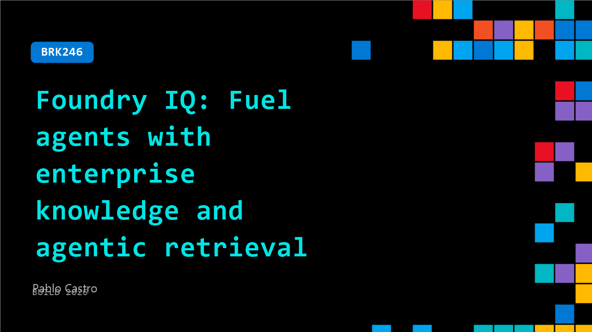

# BRK246: Foundry IQ: Fuel agents with enterprise knowledge and agentic retrieval

**Session code:** BRK246  
**Date:** Wednesday, June 3, 2026 / 9:00 AM - 9:45 AM PDT (Duration 45 minutes)  
**Watch on-demand:** <https://build.microsoft.com/en-US/sessions/BRK246>

---

## Speakers

- **Pablo Castro** - CVP & Distinguished Engineer, AI Knowledge, Microsoft

## About the session

Foundry IQ is Microsoft's context engineering platform that enables agents to unlock knowledge from everywhere, with state-of-the-art agentic RAG and enterprise-grade security built in. In this technical deep dive, we share the latest developments in Foundry IQ and Azure AI Search, new knowledge sources, agentic retrieval enhancements, and present retrieval performance innovations and evals for our 3rd year in a row — all designed to help you ship higher-quality agents faster.

Seating for this session is first-come, first-served. Add it to your schedule to plan your day and arrive early to secure a spot.

## AI summary

**Introduction to Foundry IQ:** The session opens with Pablo from the Foundry IQ team welcoming viewers and explaining that the focus will be on how to connect AI agents and models to company data and applications using knowledge sources (00:00:08–00:00:22). He describes Foundry IQ as the platform that simplifies this connection and outlines three foundational goals: ease of use, versatility for complex scenarios, and top-tier AI quality across retrieval and ranking (00:00:34). Each principle ensures that developers can get started quickly, scale as their needs evolve, and maintain relevance and precision across data queries.

**Demonstrating Easy Setup and Knowledge Base Creation:** To illustrate usability, Pablo demonstrates creating a simple knowledge base within Foundry (00:01:14–00:03:00). He uploads movie files from Wikipedia, names the collection “Movies Wiki,” and connects it seamlessly to an MCP server within Foundry IQ. Instead of writing a new agent, he uses GitHub Copilot to interact with this data by setting up a proxy that ties Foundry IQ services to Copilot through API endpoints (00:03:10). After configuration, the demo shows the system answering queries—like identifying which pill Neo took from *The Matrix*—proving how quickly data can be linked, indexed, and queried in a real-world scenario (00:06:06).

**Architecture and Serverless Foundry IQ Launch:** Pablo then explains the layered structure of Foundry IQ, comprising the Foundry integration layer, a complete retrieval engine, and a robust backend built on Azure AI Search (00:07:00). He transitions to the provisioning process and announces an important milestone—the public preview of the **serverless version of Foundry IQ** (00:09:03). This new capability allows developers to create services in 10–20 seconds, with auto-scaling and pay-per-use flexibility. Serverless Foundry IQ maintains enterprise-grade ranking, vector search, and security, making it ideal for dynamic agent workflows and scalable production environments. Pablo demonstrates provisioning a serverless instance in Foundry within seconds, underscoring its zero-friction setup (00:12:03).

**Expanding Knowledge Sources and AI Integration:** The next segment discusses how Foundry IQ integrates data from files, object stores, Fabric, and Microsoft 365 environments (00:13:00–00:21:00). Pablo introduces Azure Content Understanding for document parsing, optical character recognition, and complex layouts, improving index quality and search precision (00:17:00). He also showcases connections to Work IQ (for Microsoft 365 content), Fabric IQ (for structured analytics and SQL-based data access), and Web IQ (for web-grounded retrieval). By combining these sources, agents can retrieve contextually relevant insights from different repositories—document-based, analytical, or public web sources. He further explains how Foundry IQ ensures robust access control through Entra and Purview integration, propagating document-level permissions and sensitivity labels into search workflows (00:28:00).

**Retrieval Quality, Efficiency, and Improvements:** The presentation then examines how Foundry IQ’s retrieval process operates through agentic orchestration, iterative query planning, and synthesis steps that ensure accurate, grounded answers (00:31:00). Pablo highlights the evolution into a second generation of agentic retrieval technology, citing measurable improvements in recall, accuracy, and completeness compared to previous systems or hybrid search alone (00:32:32). He acknowledges that this sophistication slightly increases latency but dramatically enhances understanding. The system’s new semantic rankers, model-specific prompting, and caching optimization further reduce token usage while improving performance and cost efficiency. Metrics shown demonstrate that fewer tokens now produce better answers, reflecting the team’s ongoing focus on retrieval science and pragmatic AI efficiency (00:35:00).

**Deep Dive, Control, and Conclusion:** To close, Pablo explores the backend within Azure Portal, showing how developers can inspect or adjust indexes, transformation pipelines, and quantization settings for performance tuning (00:41:00). He compares the real-time speed between small indexes and massive datasets—such as all of English Wikipedia—and demonstrates instant sub-second search at scale for 22 million content chunks (00:43:22). He concludes by reiterating that all features, including serverless deployment, advanced retrieval, and integrated data intelligence, are available for use immediately via Foundry, the Azure portal, or SDKs. Pablo ends by thanking the audience and directing them to further sessions exploring related IQ technologies (00:44:51).

## Session tags

- **Session type:** Breakout
- **Level:** (300) Advanced
- **Topic:** Agents & apps
- **Tags:** AI, Azure, Security, Developer, Foundry IQ, Microsoft Foundry, Foundry Agents, Context Engineer, Grounding, Evaluations, Enterprise
- **Location:** Festival Pavilion, Breakout 2
