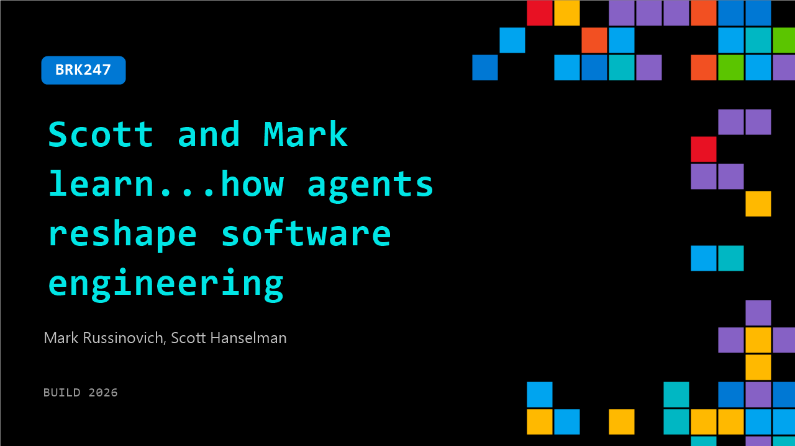

# BRK247: Scott and Mark learn...how agents reshape software engineering

**Session code:** BRK247  
**Date:** Wednesday, June 3, 2026 / 2:45 PM - 3:30 PM PDT (Duration 45 minutes)  
**Watch on-demand:** <https://build.microsoft.com/en-US/sessions/BRK247>

---

## Speakers

- **Mark Russinovich** - Chief Technology Officer, Deputy CISO, and Technical Fellow, Microsoft Azure, Microsoft
- **Scott Hanselman** - VP, Member of Technical Staff for Microsoft/GitHub, Microsoft

## About the session

AI is changing how software is created—and what it means to be a software engineer. We’ll explore how AI agents are reshaping development: where they accelerate progress, where they fall short, and what’s changing for the profession. Along the way, we’ll share failure modes, lessons learned, and propose ways engineers and organizations can adapt. Real talk, no hype.

Seating for this session is first-come, first-served. Add it to your schedule to plan your day and arrive early to secure a spot.

## AI summary

AI agents are changing software engineering from prompt-by-prompt coding to handling larger workstreams and even producing full apps. Developers are seeing major productivity gains using AI-assisted coding, including faster delivery with small teams. AI works especially well for small personal tools, such as quick utilities built for one user. There is a difference between “vibe coding” and real software engineering meant for production, maintenance, and collaboration. AI can generate convincing but incorrect solutions, including bugs, poor fixes, and false confidence. High activity does not always mean real productivity—AI can create the illusion of progress while producing weak results. Experienced engineers benefit more from AI because they can recognize mistakes and guide the output effectively. Junior engineers may struggle with AI-generated code because they may not yet know how to judge its quality. Some technical problems remain genuinely hard, and AI alone is not enough without strong engineering skill. Companies still need to invest in early-career engineers or risk creating a future talent gap.

## Session tags

- **Session type:** Breakout
- **Level:** (300) Advanced
- **Topic:** Agents & apps
- **Tags:** Agents, Developer, Agentic SDLC, Dev Tools
- **Location:** Festival Pavilion, Breakout 1
