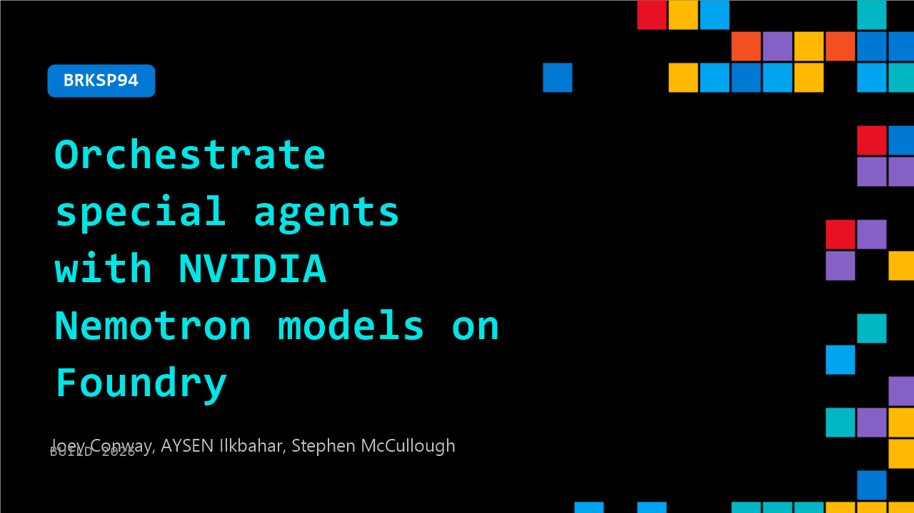

# BRKSP94: Orchestrate special agents with NVIDIA Nemotron models on Foundry

**Session code:** BRKSP94  
**Date:** Tuesday, June 2, 2026 / 3:45 PM - 4:30 PM PDT (Duration 45 minutes)  
**Watch on-demand:** <https://build.microsoft.com/en-US/sessions/BRKSP94>

---

## Speakers

- **Joey Conway** - Product Manager, NVIDIA
- **AYSEN Ilkbahar** - Sr Dir Cloud Dev Rel - AI Software, Nvidia
- **Stephen McCullough** - AI Solutions Architect, NVIDIA

## About the session

Optimize enterprise Agentic AI with a tiered system-of-models architecture in Microsoft Foundry. This session demonstrates a plan-and-execute pattern routing tasks across frontier models for reasoning, NVIDIA Nemotron for complex sub-tasks, and local models for latency-sensitive execution. Learn to route workloads across cloud and edge tiers to minimize cost-per-task while maximizing quality. Dive into using special agents and post-trained open-source models to achieve faster task completion.

## AI summary

**Introduction and Agenda:** The video opens with Joey Conway confirming audio and stating that the session will cover new announcements from NVIDIA, collaborations with partners such as Microsoft, and ongoing work with agent orchestration (00:00:08). He shares the agenda: a brief history of AI model development, details on NVIDIA’s Nemotron open model family, and the company’s efforts to strengthen the open ecosystem (00:00:22). Conway then recalls the early AI milestones, starting from the ChatGPT moment four years ago, followed by the release of DeepSeek reasoning models, and finally the emergence of agentic systems, which enable models to interact through complex task execution rather than simple Q&A (00:01:36).

**Understanding Agent Systems:** Conway explains NVIDIA’s conceptual framework for long-running agentic systems, describing a continuous loop where agents receive prompts, analyze context, observe data, create plans, act, and iterate until tasks are complete (00:02:00–00:03:02). He details the components involved, such as tools, skills, memory, and orchestration between multiple agents. These systems are powered by large language models (LLMs) and leverage enterprise-level security, governance, and CUDA-based computation across CPU and GPU platforms. Conway emphasizes NVIDIA’s vision of agentic systems of models—multiple specialized AI models working together—with an emphasis on efficiency across pre-training, fine-tuning, and inference phases, always striving for reduced compute costs without sacrificing intelligence (00:04:26).

**Nemotron Family Overview:** Conway introduces the NVIDIA Nemotron model family, describing it as an open suite of models, tools, and datasets for reasoning and multimodal intelligence (00:05:47). He outlines five main pillars: reasoning, vision, information retrieval, safety moderation, and speech processing (00:06:01). Conway transitions into the specifics of Nemotron’s three scalable tiers—Nano, Super, and Ultra—each optimized for different data center footprints and performance needs (00:07:01). Nano targets compact GPU setups, Super is designed for mid-scale enterprise tasks, and Ultra represents NVIDIA’s most capable model, optimized for frontier reasoning, orchestration tasks, and reduced inference cost. Announced recently, Nemotron 3 Ultra integrates advanced training techniques like multi-teacher distillation (00:09:08) and new NVFP4 precision formats for NVIDIA Blackwell architecture, allowing one unified checkpoint for device compatibility.

**Nemotron 3 Ultra Capabilities and Performance:** Conway presents Nemotron 3 Ultra as NVIDIA’s most advanced open model built with hybrid Mixture-of-Experts (MoE) architecture, multi-token prediction, and one-million-token context length (00:11:00). He explains how it achieves faster inference, improved accuracy, and cost-efficient reasoning through model distillation and hardware-optimized compute. Benchmark analyses demonstrate Ultra’s dominance in agentic tasks such as complex coding, long-horizon enterprise operations, and professional-level reasoning (00:13:00). Third-party evaluations by Artificial Analysis confirm the model delivers frontier accuracy alongside fivefold throughput improvements. Conway concludes this segment emphasizing that Ultra moves models toward the cost-efficient frontier—high accuracy at low compute cost—representing optimal task and resource tradeoffs (00:15:02).

**Demo of Hermes Agent and Enterprise Workflow:** The session transitions into a Nemotron 3 Ultra demo illustrating AI orchestration in real business scenarios with Hermes Agent (00:16:02). Conway describes how a small company’s team collaborates with Hermes, which learns and refines reusable skills, creating organizational "collective wisdom" as these skills propagate to other users. He explains that over time, employee-generated skills accelerate workflow and enable smarter digital co-workers. Conway concludes his segment predicting a future where employees evaluate companies by the quality of their digital agents and productivity support (00:18:03).

**Microsoft Foundry Integration and Closing:** Stephen McCullough takes over and explores NVIDIA’s partnership with Microsoft to deploy long-running agents through Microsoft Foundry-hosted environments (00:19:10). He demonstrates how hosted Hermes Agents integrate Nemotron models with enterprise resources like Outlook, GitHub, and Teams, using Entra ID identities to manage access securely. Through a debugged scenario, McCullough shows Hermes receiving an email, creating a GitHub PR, applying feedback, and learning new coding skills that persist across sessions and platforms, all visible through Foundry’s observability tools (00:27:00). He concludes that Foundry enables enterprises to treat agents like human employees—granting, auditing, and revoking permissions—while continuously improving workflows. McCullough ends by summarizing the combined value of Nemotron’s intelligence, Hermes’ orchestration, and Foundry’s enterprise-grade governance, inviting viewers to visit NVIDIA’s booth, explore their open resources, and participate in the feedback survey (00:37:17).

## Session tags

- **Session type:** Breakout
- **Level:** (300) Advanced
- **Topic:** Agents & apps
- **Tags:** Agents
- **Location:** Festival Pavilion, Breakout 3
