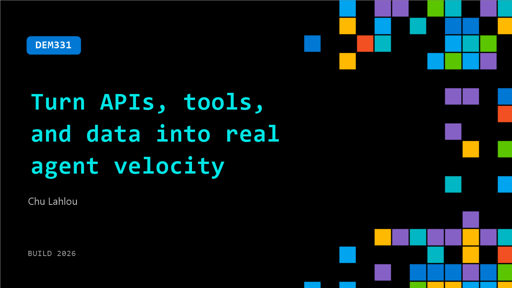

# DEM331: Turn APIs, tools, and data into real agent velocity

**Session code:** DEM331  
**Date:** Wednesday, June 3, 2026 / 9:30 AM - 9:55 AM PDT (Duration 25 minutes)  
**Watch on-demand:** <https://build.microsoft.com/en-US/sessions/DEM331>

---

## Speakers

- **Chu Lahlou** - Principal CoreAI Product Manager, Microsoft

## About the session

Most teams already have the APIs and data they need. In this demo, see how Foundry enables agents to securely call real APIs, use tools, and act on enterprise data. Learn how Foundry IQ provides grounding and context, while runtime governance ensures tool usage is observable and controlled—turning existing systems into callable agent capabilities.

Seating for this session is first-come, first-served. Add it to your schedule to plan your day and arrive early to secure a spot.

## AI summary

**Introduction and Problem Context:** The video begins by explaining how AI agents struggle when exposed to unstructured, real-world content such as scanned PDFs, lengthy emails, and office documents containing tables, figures, or multimedia (00:01:08–00:01:26). While large language models can reason well, they cannot truly “read” or interpret such data effectively, leading to poor reliability and higher costs when raw content is processed directly. To address these challenges, the concept of “content understanding” is introduced as a method to transform messy, multimodal inputs into clean, structured outputs (00:01:47–00:02:13), formatted as Markdown or JSON containing agent-ready inputs.

**Scenario Demonstration and Setup:** A sample use case illustrates how content understanding can streamline workflows. In this example, an engineer receives a 6:47 AM alert about signal degradation affecting 42 customers (00:02:22). Normally, the engineer must manually search through documents and media files, but the demo shows how content understanding automates parsing and structuring these materials (00:02:46–00:03:13). It employs the Azure Foundry endpoint and SDK to initialize a client and make prebuilt analyzer calls like “document search,” which captures layout, tables, barcodes, figures, and selection marks (00:03:17–00:04:28).

**Document Analysis and Comparison:** The demo continues with analysis of a site maintenance log using the document search analyzer (00:04:47). Within seconds, rich structured output is generated preserving tables, decoding QR codes, and capturing checkmarks. A comparison is made with a local PDF parser which fails to maintain structure or detect key visual elements (00:05:37–00:06:05). The video explains that content understanding turns this data into agent-readable formats for reliable reasoning, significantly improving quality and reducing guesswork for LLMs.

**Multimodal Analysis and Customization:** Later sections demonstrate handling of audio and video files using prebuilt multimodal analyzers (00:06:25). Audio examples are parsed into timestamped dialogue summaries, while videos yield context-aware insights about fiber strike repairs (00:09:25–00:09:33). Custom analyzers allow users to design bespoke extraction schemas focused on specific business fields. Classification and routing streamline processing by sending unknown document types to appropriate analyzers automatically (00:11:06–00:13:09), ensuring structured results without manual intervention.

**Agent Reasoning and Integration:** The next act demonstrates four-step agent reasoning using structured inputs from content understanding (00:14:03). The agent diagnoses root causes—such as mechanical failure at Vault TV3—then plans materials within an approved budget and dispatches instructions to relevant personnel (00:14:43–00:15:32). Integration with the Microsoft Agent Framework is then shown, where a context provider hooks into agent loops to automatically process attachments, retrieve structured data, and deliver it for reasoning without additional manual setup (00:16:02–00:18:02).

**Conclusion and Key Takeaways:** The session concludes by comparing SDK and Agent Framework implementations, noting their shared underpinning service with different integration shapes (00:18:07). Recommended practices include starting with prebuilt analyzers for unknown document types, using classifiers for automatic routing, and applying the "To-LLM input helper" function to format outputs and reduce token counts (00:19:55–00:20:24). The video closes by inviting viewers to explore full demo code on GitHub and attend a related breakout session on upcoming advancements like Generative Tech Mode and Foundry integration (00:21:19–00:21:47).

## Session tags

- **Session type:** Demo
- **Level:** (300) Advanced
- **Topic:** Agents & apps
- **Tags:** API, Foundry IQ, Microsoft Foundry, Governance, Agent Observability, Grounding, Enterprise
- **Location:** Gateway Pavilion, Level 2, Theater C
