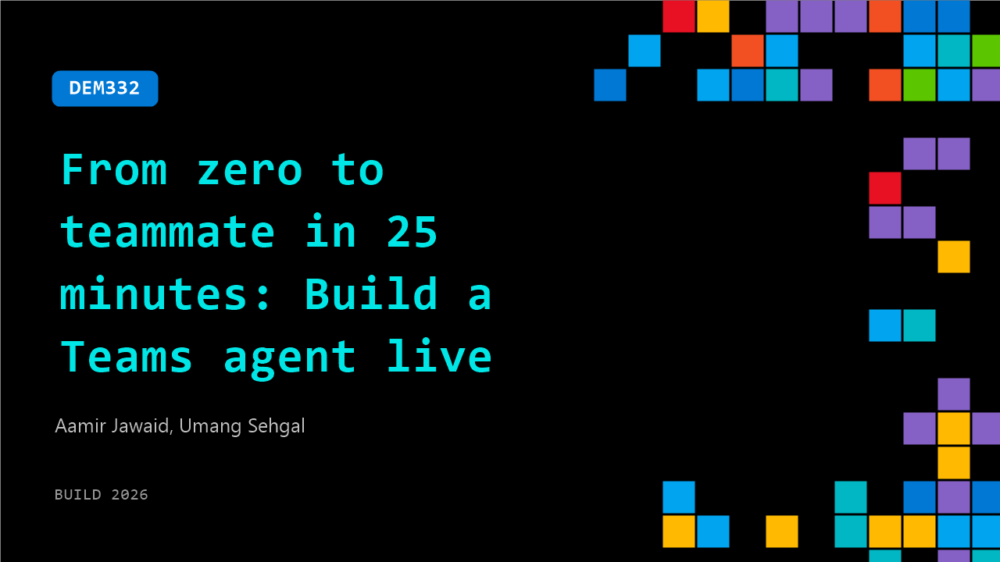

# DEM332: From zero to teammate in 25 minutes: Build a Teams agent live

**Session code:** DEM332  
**Date:** Tuesday, June 2, 2026 / 3:10 PM - 3:35 PM PDT (Duration 25 minutes)  
**Watch on-demand:** <https://build.microsoft.com/en-US/sessions/DEM332>

---

## Speakers

- **Aamir Jawaid** - Senior Software Engineer, Microsoft
- **Umang Sehgal** - Senior Product Manager, Microsoft

## About the session

In 25 minutes, flat, watch an agent come to life inside Microsoft Teams, one that works alongside you in the channels and chats you already use. Using the Teams CLI, the Teams SDK's new skills plugin, and GitHub Copilot, we'll go from blank terminal to a deployed agent your colleagues can @mention, delegate to, and collaborate with. No slideware, no shortcuts.

## AI summary

**Introduction and Agenda:** The session opens with the host, Umang, welcoming attendees to the Build conference (00:00:00). He introduces himself as a senior product manager for Microsoft Teams and his co-presenter, Aamir, a senior software engineer on the Teams SDK. The agenda includes a quick recap of the Teams SDK’s previous developments, the introduction of a new command-line interface (CLI), a live demonstration of building an agent in under 25 minutes, and the process of transforming that agent into a fully integrated teammate with its own identity inside Teams (00:01:10).

**SDK Evolution and Simplification Goals:** Umang explains that last year’s Build introduced the Teams AI library in TypeScript and C#, while this year’s focus is on the new integrated Teams SDK (00:01:15). This SDK consolidates tools and libraries into a unified developer experience and extends functionality to group collaboration. He reviews partnerships with various companies that have integrated with Teams and underscores the goal of simplifying agent development. Umang describes three core pillars of simplification: enabling agents built in any development stack to run in Teams, minimizing setup friction through automated scaffolding, and allowing agents to become true "teammates" with individual identities (00:03:00).

**Live Demo – Building and Integrating the Agent:** Aamir begins a live demonstration, showing a “project management helper” web application that summarizes and tracks project statuses (00:04:03). He uses the new Teams CLI to register and configure the agent with the command "Teams app create," explaining that the CLI automatically creates relevant app and bot resources and provides installation links (00:05:25). He then shows how Copilot can streamline integration using natural language prompts like “Integrate this application into Microsoft Teams.” The CLI is demonstrated in both interactive and JSON modes, offering ease-of-use for both human developers and agents. Features like progressive command disclosure help developers and AI agents efficiently find only the relevant commands they need (00:10:00).

**Deploying and Demonstrating the Agent in Teams:** After configuring the agent, Aamir installs it within Teams using the provided link, showcasing that the same query used on the web app — asking for a project summary — now works seamlessly inside Teams (00:12:11). The agent also functions in a group chat, responding to project-related queries across participants. Umang rejoins to emphasize that the CLI is “agent-first,” allowing seamless automation for coding and deployment tasks. He previews upcoming group UX features such as emoji reactions, targeted messages, slash commands, quoted replies, and markdown support, enhancing collaborative experiences with intelligent agents inside Teams (00:14:10).

**Transforming Agents into True Teammates:** The presenters shift focus to building agents that act as full-fledged teammates across Microsoft 365. Umang explains the concept of “Agents 365” — giving each agent an identity within the M365 ecosystem so they can be mentioned in chats, tagged in documents, or even send emails just like human coworkers (00:16:00). A video demo shows how the same project management agent now functions as a “mobile redesign project manager” capable of one-on-one interactions, contextual awareness of its assigned project, and inclusion in relevant group discussions. Thanks to its identity, the agent can send messages and emails directly from its own address inside Outlook, linking collaboration across Teams and email environments (00:19:00).

**Conclusion and Call to Action:** The session concludes by reinforcing that the new Teams SDK and CLI dramatically simplify building intelligent, collaborative agents that feel like real teammates within Microsoft’s productivity suite (00:19:53). Developers are encouraged to explore the SDK and CLI via the official Microsoft link, attend the follow-up session on group chat integrations, and leverage the evolving tools to create agent-driven experiences within Teams. Umang thanks attendees, closing on the theme that Teams is becoming the central workspace where both humans and intelligent agents can work side by side efficiently (00:20:02).

## Session tags

- **Session type:** Demo
- **Level:** (300) Advanced
- **Topic:** Agents & apps
- **Tags:** Agents, Developer, Skills, Enterprise
- **Location:** Gateway Pavilion, Level 2, Theater C
