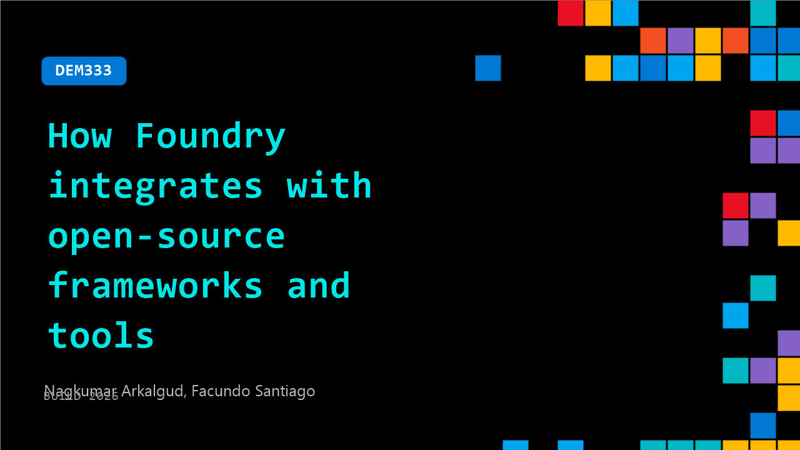

# DEM333: How Foundry integrates with open-source frameworks and tools

**Session code:** DEM333  
**Date:** Tuesday, June 2, 2026 / 4:00 PM - 4:25 PM PDT (Duration 25 minutes)  
**Watch on-demand:** <https://build.microsoft.com/en-US/sessions/DEM333>

---

## Speakers

- **Nagkumar Arkalgud** - Senior software engineer, Microsoft
- **Facundo Santiago** - Principal Product Manager, Microsoft

## About the session

This demo walks through building a practical OpenClaw like agent using open-source technologies and then operationalizing the same solution in Microsoft Foundry. You will see how to connect enterprise tools with the Model Context Protocol, codify repeatable behavior with skills, add browser automation with Playwright CLI, observe with OpenTelemetry, and move from local development to cloud-hosted agents using open protocols like Responses API and A2A to agent-to-agent communication.

## AI summary

**Introduction and Objective:** The video opens with Fakundo, Principal Product Manager at Microsoft, and Nakumar, Senior Software Engineer, introducing the session on how Microsoft Foundry integrates with open source frameworks and technologies (00:00:04–00:00:17). They pose a key question: how can developers package and deploy agents built with open source tools to production without having to rewrite them (00:00:19)? They explain that the session will demonstrate building an agent — similar to well-known web-browsing assistants — using open source components and then deploying it on Microsoft Foundry to make it production-ready (00:00:40).

**Building a Basic Agent:** Nakumar begins by describing the minimal setup needed to build a basic local agent: a model and an agent loop (00:00:55–00:01:04). The loop continuously queries the model for actions, executes tools when required, and determines next steps. Using LangChain’s chat model and a “create_deep_agent” function, the code remains compact and framework-consistent (00:01:08). Since Foundry models expose OpenAI-compatible APIs, developers can point LangChain agents to Foundry without code rewrites, just by updating configuration. A demo shows this basic agent responding locally, confirming that it can converse but lacks functionality beyond model knowledge (00:01:57).

**Adding Tools with MCP Integration:** To enable useful actions, the open source protocol MCP (Model Context Protocol) is introduced (00:02:28). MCP allows an agent to discover and call external tools dynamically. In this demo, a Microsoft 365 integration called WorkIQ MCP server provides access to email tools such as search, get message details, and draft replies without the agent needing direct API knowledge (00:02:49–00:03:02). The presenters run an MCP-enabled agent that connects to Microsoft 365 mail, retrieves emails, and executes these tools in real-time. This demonstrates the ability for LangGraph agents to access services like Outlook, Teams, or Calendar through an open protocol rather than proprietary SDKs (00:03:33).

**Introducing Skills and Web Interaction:** The conversation shifts to enhancing agent intelligence using “skills” — reusable playbooks defining sequences of actions like inbox triage (00:04:38). Nakumar explains that tools act as verbs, while skills embody workflows such as “triage inbox” or “draft replies.” Skills are simple markdown documents the agent reads when needed. A demo shows how skills improve agent behavior, transforming it from merely reading emails to classifying and prioritizing them based on content (00:06:23). They also introduce web browsing capabilities powered by Playwright, an open source CLI tool that agents can use efficiently to fetch web data (e.g., checking product prices on Amazon) without the token overhead of large tool schemas (00:07:07–00:08:12).

**Deploying and Monitoring on Foundry:** The presenters move from local demos to production deployment using Microsoft Foundry (00:09:23). Foundry hosts the same LangGraph agent as a managed service while exposing it via an OpenAI-compatible responses API. The deployment process includes setting up telemetry instrumentation before graph construction for observability. Foundry’s integration with Application Insights and OpenTelemetry allows inspection of model spans, latencies, and token usage to identify performance bottlenecks (00:11:02). Since OpenTelemetry is an open standard, teams can visualize traces through any tool like Grafana or Azure Monitor. Demonstrations reveal trace replays showing user input, tool actions, and token costs across the workflow.

**Agent-to-Agent Interoperability and Conclusion:** Finally, they demonstrate cross-agent communication via the Agent-to-Agent (A2A) protocol (00:13:09). Hosting the agent in Foundry automatically exposes an A2A endpoint, allowing other agents — such as one in Copilot CLI — to locate and invoke it dynamically through directory-based discovery and MCP-compatible tools like “search agent” and “call agent” (00:14:09). The session concludes by emphasizing the power of open source interoperability: individual components (local agents, Foundry hosts, MCP servers) communicate seamlessly using shared standards without hard dependencies. Fakundo wraps up by inviting viewers to explore the accompanying repository and experiment with each stage of the showcased agent pipeline (00:16:04).

## Session tags

- **Session type:** Demo
- **Topic:** Agents & apps
- **Tags:** Agents, Developer, Microsoft Foundry, MCP, OSS, Agent Observability, Enterprise
- **Location:** Festival Pavilion, Theater A
