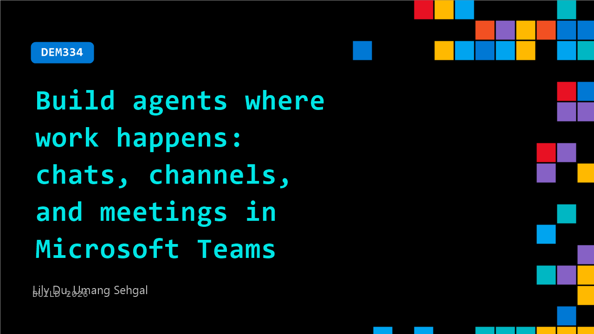

# DEM334: Build agents where work happens: chats, channels, and meetings in Microsoft Teams

**Session code:** DEM334  
**Date:** Wednesday, June 3, 2026 / 11:50 AM - 12:15 PM PDT (Duration 25 minutes)  
**Watch on-demand:** <https://build.microsoft.com/en-US/sessions/DEM334>

---

## Speakers

- **Lily Du** - Software Engineer 2, Microsoft
- **Umang Sehgal** - Senior Product Manager, Microsoft

## About the session

Agents are moving beyond simple chat experiences. With the Teams SDK, developers can build agents that participate directly in the flow of work across chats, channels, and meetings. In this session, you’ll learn how to leverage Teams capabilities and create agents that automate tasks, surface insights, and take action in context without pulling users out of Teams.

Seating for this session is first-come, first-served. Add it to your schedule to plan your day and arrive early to secure a spot.

## AI summary

**Introduction and Challenges of Agent Communication:** The video begins by explaining the difficulty of maintaining effective communication between agents and users in a group chat environment compared to one-on-one interactions (00:06:17–00:06:36). Long-form text that works well in direct chats becomes overwhelming and ineffective in group settings where multiple conversations occur simultaneously. To address this issue, the speaker introduces three key pillars necessary for creating successful collaborative agents and teams: manners, privacy, and polish (00:06:38–00:06:46).

**Pillar One - Manners:** The first pillar focuses on teaching agents conversational etiquette similar to human social norms—understanding when to respond, when to create threads, or when to react with emojis (00:06:47–00:07:22). Lily announces several enhancements under "manners," such as emoji reactions, quoted replies, and threaded replies (00:08:26–00:09:41). Emoji reactions allow agents to acknowledge messages nonverbally, quoted replies let them reference older messages unambiguously, and threaded replies keep discussions organized. These features were demonstrated live with the NSYS agent showing polite, contextual responses using emojis and threads in a real group chat scenario (00:09:43–00:11:02).

**Pillar Two - Privacy:** The second pillar highlights privacy and trust as foundations of effective teamwork between humans and agents (00:11:11–00:11:17). New functionality includes targeted messages—enabling agents to privately message individuals without cluttering group chats—and bidirectional private communication, wherein users can send confidential queries to agents using slash commands (00:11:46–00:12:10). This capability is demonstrated in the NSYS system, where the agent privately alerts Umang about a potential issue related to a feature rollout, allowing focused, secure collaboration before posting public updates (00:12:16–00:13:34). The speaker emphasizes that this bidirectional privacy fosters genuine trust and discretion in multi-user environments.

**Pillar Three - Polish:** The third pillar covers the presentation and clarity of agent communication to ensure professionalism and readability (00:13:46–00:14:04). Key features include adaptive cards and Markdown support. Adaptive cards transform agent responses into interactive, trackable messages with embedded buttons and structured actions, eliminating long unformatted text blocks (00:13:57–00:14:28). Markdown improves text formatting for better scanning and comprehension, allowing tables, bolding, and code blocks directly in chat (00:14:42–00:14:52). In a follow-up demo, the NSYS agent uses adaptive cards for approval workflows and structured rollback operations, maintaining clarity and accountability while resolving a deployed feature incident (00:15:00–00:17:26).

**Demo Recap and Closing Summary:** The final section summarizes all demonstrated capabilities. The speakers recap emoji reactions, quoted replies, and threaded replies for conversation management (00:17:31–00:17:48). They reinforce privacy features like targeted messages and slash commands, followed by adaptive cards and Markdown support for polished communication (00:17:50–00:19:01). Additional features mentioned include source citations, response streaming, feedback buttons, and AI sensitivity labels. The presenters encourage developers to explore the full SDK and new Teams capabilities to build collaborative agents optimized for chats, channels, and meetings (00:19:13–00:20:00). They conclude with an invitation for further learning through related sessions and documentation, expressing excitement about what builders will create next.

## Session tags

- **Session type:** Demo
- **Level:** (300) Advanced
- **Topic:** Agents & apps
- **Tags:** Agents, Developer, Skills, Enterprise
- **Location:** Gateway Pavilion, Level 2, Theater C
