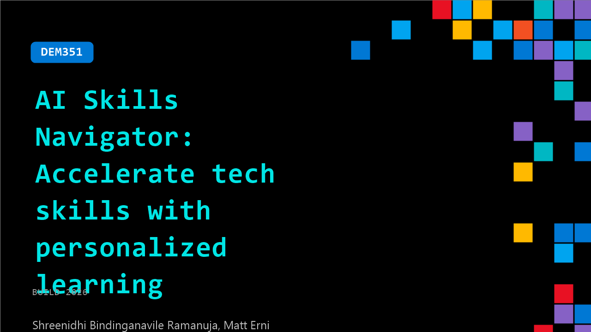

# DEM351: AI Skills Navigator: Accelerate tech skills with personalized learning

**Session code:** DEM351  
**Date:** Tuesday, June 2, 2026 / 5:00 PM - 5:25 PM PDT (Duration 25 minutes)  
**Watch on-demand:** <https://build.microsoft.com/en-US/sessions/DEM351>

---

## Speakers

- **Shreenidhi Bindinganavile Ramanuja** - PRINCIPAL SOFTWARE ENG MGR, Microsoft
- **Matt Erni** - Senior Technical Program Manager, Microsoft

## About the session

Learn more about how AI Skills Navigator integrates with Copilot and supports continuous learning at scale to help you stay ahead of rapidly evolving AI capabilities. Join us to hear how AI is transforming skill building for developers by making it more personalized, efficient, and impactful than ever. Learn based on your preferences including short sessions, podcast-style summaries, or alongside your team.

Seating for this session is first-come, first-served. Add it to your schedule to plan your day and arrive early to secure a spot.

## AI summary

**Introduction and Context:** The session opens with Matt Ernie, Senior Technical Program Manager at Microsoft Global Skilling, welcoming viewers and setting the stage for a discussion about transforming how people work with AI (00:00:00–00:00:36). He contrasts last year’s focus on workforce transformation with today’s emphasis on work transformation, highlighting the need to redesign workflows so AI can deliver measurable outcomes. Matt introduces the *AI Skills Navigator*—Microsoft’s unified upskilling destination that brings together Microsoft Learn modules, LinkedIn Learning paths, trusted YouTube content, and skilling credentials (00:00:39). He explains that this resource, integrated with the Learning Agent in Microsoft 365 Copilot, supports contextual learning in the flow of work. To demonstrate its value, Matt introduces his co-presenter, Sri, who will lead a scenario-based walkthrough.

**Demonstration Setup and Personalization:** Sri assumes the role of an engineering lead at a company called Zava, responsible for upskilling his team to deliver a production-grade AI agent (00:01:35). He begins from the AI Skills Navigator homepage, showing how users can browse without signing in, with content automatically categorized by role and skill level (00:02:16). Upon signing in, Sri describes the light onboarding experience, which includes selecting roles (e.g., AI Engineer, Data Scientist) and learning preferences such as “visual,” “hands-on,” or “interactive” styles (00:03:22). These choices personalize the “For You” page to deliver targeted resources—like generating tests in AI or evaluating generative AI models—ensuring learners receive relevant content tailored to their professional goals (00:04:08). He also demonstrates the “Explore Content” section, featuring curated collections organized by levels, expert contributors, and multiple modalities including Microsoft Learn paths, credentials, and videos (00:04:50).

**Team Skilling Sessions and Playlist Creation:** Moving to collaborative learning, Sri introduces the *Team Skilling* feature, which allows managers to curate playlists for their teams with the assistance of an AI agent (00:05:42). By describing his objective—to upskill developers on building agents using Microsoft 365 Copilot, Microsoft Graph, and SharePoint connectors—Sri demonstrates how the system automatically generates a structured 4-week plan with about 8 hours of learning per week (00:06:22). The AI curates modules into sections covering agent design, Graph grounding, evaluation, and telemetry concepts. Once finalized, the playlist is shared with Matt, simulating a collaborative team scenario (00:07:18). This feature showcases how AI can accelerate structured curriculum creation aligned with organizational goals.

**Learning Experience and Interactive Coaching:** As the assigned developer, Matt opens the shared playlist within Microsoft Teams and explores multiple modes of learning (00:08:33). He accesses a Learn module on Copilot Studio agent building but opts to consume it as a podcast-style audio summary—a dynamic output generated from text-based modules (00:09:06). He also highlights curated YouTube sessions and hybrid skilling courses that blend virtual training with guided discussion via an AI coach (00:11:07). The course assistant provides nudges, recap suggestions, and knowledge checks, helping learners assess progress. Matt demonstrates the coach’s contextual awareness in answering questions relevant to the learner’s position in the curriculum. This interactivity illustrates how AI-supported instructional design simulates real-time mentorship (00:12:34).

**AI Integration in Microsoft 365 and Credentials:** Matt and Sri then discuss the newly released *Learning Agent in Microsoft 365 Copilot*, designed to bring learning directly into the work environment (00:14:00). The agent leverages “Work IQ” data and personal profiles to recommend activities, resources, and tasks, integrating sources like LinkedIn Learning and enterprise content. It supports on-demand learning requests—such as finding applied skills or AI prompting material—tailored to each user’s workflow (00:15:25). The demonstration continues with the applied skills assessments, which validate practical expertise through hands-on labs (00:17:02), transitioning naturally into Microsoft credentials available within AI Skills Navigator, from “Copilot and Agent Administration Fundamentals” to “Azure AI Apps and Agents Developer Associate” (00:18:00). Matt emphasizes how such credentials convert learning into recognized achievements that showcase verified competency.

**Progress Tracking and Conclusion:** To close the session, Sri revisits the team leader view that displays combined progress across assigned playlists (00:19:16). He demonstrates how the dashboard allows leaders to identify team members’ progress, detect blockers, and adapt learning strategies across multi-week sprints (00:20:04). The presenters summarize the video, reiterating that AI Skills Navigator provides Microsoft’s central hub for applied skilling—featuring content from Microsoft Learn, certifications, skilling sessions, and AI-assisted playlist generation (00:21:13). They encourage viewers to register, personalize their profiles, and join the upcoming “Skills Fest” event taking place June 8–12 as a next step in advancing their AI learning journey (00:22:21). The session concludes with appreciation for participants and a call to action to begin leveraging AI-driven skilling in daily workflows.

## Session tags

- **Session type:** Demo
- **Level:** (100) Foundational
- **Topic:** Agents & apps
- **Tags:** AI, Copilot, Personalization
- **Location:** Festival Pavilion, Theater A
