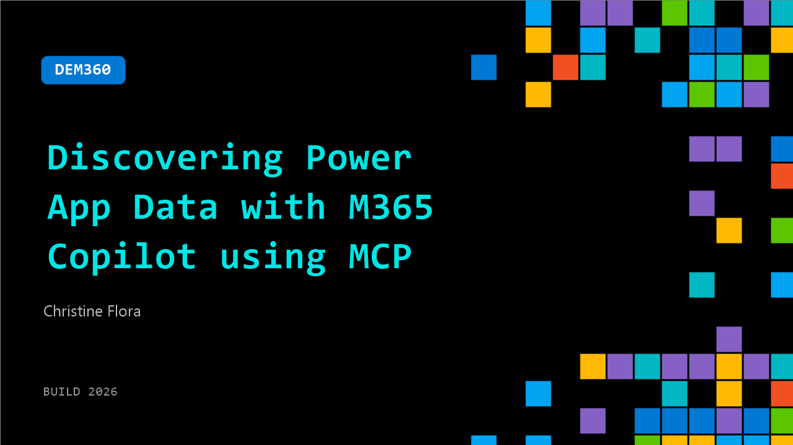

# DEM360: Discovering Power App Data with M365 Copilot using MCP

**Session code:** DEM360  
**Date:** Wednesday, June 3, 2026 / 12:50 PM - 1:15 PM PDT (Duration 25 minutes)  
**Watch on-demand:** <https://build.microsoft.com/en-US/sessions/DEM360>

---

## Speakers

- **Christine Flora** - CTO / BizApps Practice Director, Microsoft MVP

## About the session

With millions of users world-wide, Power Apps and Dataverse now sit atop critical business data, but developers face challenges with discoverability and schema understanding. This session introduces Power Apps Model Context Protocol (MCP), which empowers M365 Copilot to access app metadata, Dataverse schemas, relationships, and permissions. Learn how MCP enables Copilot to answer natural-language queries, aggregate data, and deliver real-time insights, plus best practices for Copilot-ready apps.

Seating for this session is first-come, first-served. Add it to your schedule to plan your day and arrive early to secure a spot.

## AI summary

**Introduction and Session Goals:** The session opens with Christine Flora welcoming attendees to the DM360I presentation and thanking them for joining during the lunch hour 00:00:00–00:00:09. She introduces herself as a Microsoft MVP specializing in business applications who has over 15 years of experience in Power Apps and the Power Platform. Christine explains that the talk will cover the fundamentals of Power Apps, the value of the Model Context Protocol (MCP) for Microsoft 365 (M365), and how these technologies help users discover and interact with business data 00:00:31–00:00:48. The agenda includes an overview of Power Apps, a live demo building a custom MCP tool with Visual Studio Code and AI assistance, and guidance on prerequisites and setup as the feature enters public preview 00:01:31.

**Understanding Power Platform and MCP:** Christine provides context for those new to Power Platform, describing it as a suite that enables both business users and professional developers to automate processes, analyze data, and create AI-driven solutions 00:02:18–00:02:51. She distinguishes between “citizen developers” who use low-code tools and professional developers who integrate advanced workflows through GitHub, VS Code, Copilot, and other tools 00:03:29–00:03:51. The MCP, she explains, operates like a “universal translator” that makes an app’s data discoverable and actionable across M365 applications such as Word, Excel, and Teams 00:03:58–00:04:11. This integration allows contextual data to support intelligent agents and copilots, extending how users interact with enterprise data in day-to-day productivity environments.

**Demonstrating the Power Apps-MCP Integration:** Christine proceeds to demonstrate an equipment maintenance app built in Power Apps 00:05:14–00:05:30. The app tracks assets, inspections, purchases, and work orders. Using the Power Platform Maker Portal, VS Code, and AI coding assistants, she extends the app with an MCP layer that seamlessly connects to M365 00:06:02–00:06:13. In her demo, Christine queries data directly from Copilot in M365 without entering the Power App, showing how MCP allows real-time access and modification of business information from within Word, Outlook, or Excel 00:08:08–00:09:13. She emphasizes that users can stay within their current workflow, preview live data, and even perform create, read, update, and delete (CRUD) actions without changing application context.

**Building Custom Tools and UI Components:** The next section focuses on enhancing the MCP experience through custom tool creation 00:10:47–00:11:01. Christine showcases two advanced UI extensions: an equipment work order dashboard and a timeline visualization for upcoming and overdue maintenance 00:11:28–00:13:32. Built using natural language prompts, these components demonstrate how to transform data into interactive, visual dashboards within M365. She walks through using the Power Platform Maker Portal to link data tables, define JSON structures, and export them into VS Code 00:16:00–00:17:48. With AI assistance (Claude or GitHub Copilot), she generates Fluent UI HTML templates that render fully interactive dashboards for her MCP tool 00:19:00–00:20:02.

**Publishing and Deploying to M365:** Christine concludes by outlining how to publish and deploy the custom MCP tool into M365 applications 00:22:53–00:23:11. After saving and publishing the app in Power Apps, creators can download a declarative agent package in ZIP format that represents the MCP component 00:23:26–00:24:16. This file can be uploaded to Microsoft Teams or other M365 services using the “Manage Apps” interface. She notes that administrators may need to configure appropriate permissions or publishing policies. Once uploaded, the AI-powered agent becomes discoverable across the M365 ecosystem, allowing users to interact with the Power App’s data context directly from their familiar tools. Christine ends her session emphasizing the simplicity of integrating Power Apps with M365 through MCP and encouraging attendees to experiment as the feature expands beyond preview 00:25:04–00:25:31.

## Session tags

- **Session type:** Demo
- **Level:** (200) Intermediate
- **Topic:** Agents & apps
- **Tags:** Community, MVP
- **Location:** Gateway Pavilion, Level 2, Theater C
