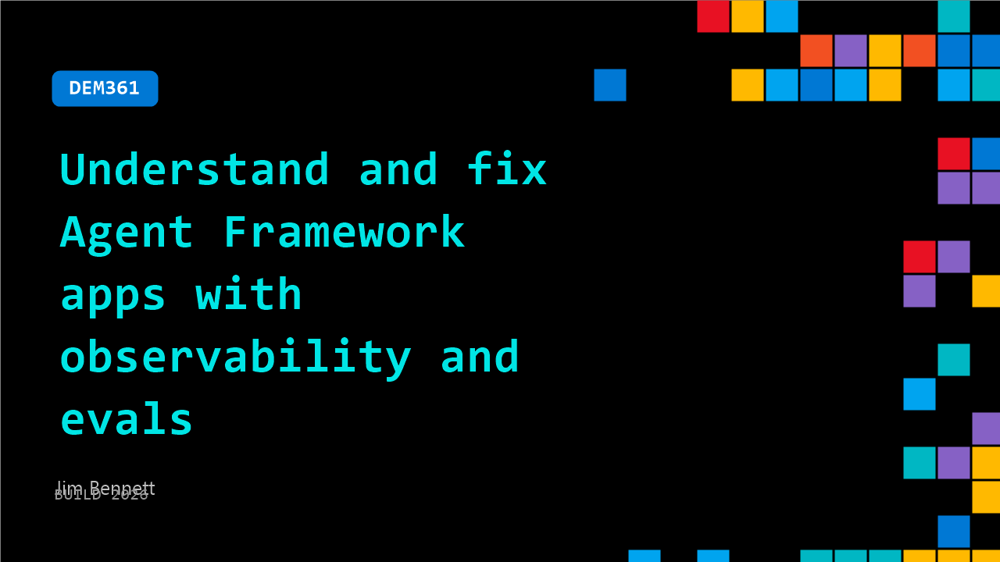

# DEM361: Understand and fix Agent Framework apps with observability and evals

**Session code:** DEM361  
**Date:** Wednesday, June 3, 2026 / 3:30 PM - 3:55 PM PDT (Duration 25 minutes)  
**Watch on-demand:** <https://build.microsoft.com/en-US/sessions/DEM361>

---

## Speakers

- **Jim Bennett** - Principal Developer Experience Engineer, Arize AI

## About the session

Your AI apps are getting more complex, with multiple agents, tools, and different orchestration patterns. This makes them harder to understand, debug, and test. This session shows you how to visualize the decisions your LLMs are making in complex Microsoft Agent Framework applications, using open standards and open source tooling to provide you with instrumentation and observability. You'll also see how you can use another LLM as a judge to evaluate how well your AI app is working.

Seating for this session is first-come, first-served. Add it to your schedule to plan your day and arrive early to secure a spot.

## AI summary

**Introduction and Session Overview:** The video begins with 00:00:02 Jim Bennett, a Microsoft MVP, introducing himself and explaining that he will discuss how developers can understand what their AI agents are doing under the hood. He starts by asking the audience who has heard of AI and who is actively building agents (00:00:12–00:00:33), revealing that few people actually know whether their agents work correctly or what they do internally. This sets the stage for a hands-on session focused on demystifying agent frameworks and adding observability.

**Understanding AI Agents and Frameworks:** Jim demonstrates a simple agent (00:00:48–00:02:23), describing how it’s composed of an LLM, instructions, and tools such as vendor and policy lookup utilities. He explains that his agent runs on Microsoft Foundry and is designed as a procurement evaluator that automatically approves or denies purchase requests based on internal data. The agent’s code is minimal, but the decision-making happens inside a black box—developers simply run “agent.run” and hope it behaves correctly. Jim emphasizes that users have no visibility into which tools are triggered, in what order, or how decisions are made.

**Adding Observability with Open Telemetry and Open Inference:** Moving into improvement strategies (00:03:25–00:05:12), Jim introduces the concept of observability through Open Telemetry, a framework commonly used in web applications to track performance and errors. He explains how Open Inference extends Open Telemetry for AI, allowing developers to collect and visualize semantic telemetry data from LLMs. Using the Phoenix open source back end (00:05:19–00:07:00), he demonstrates a workflow that exposes detailed traces of agent operations — showing tool calls, token counts, inputs, and model responses. This makes it possible to understand every decision the framework makes and enables developers to strip sensitive data or manage telemetry pipelines using standard industry processors.

**Testing with Evals and AI Judges:** Jim transitions to the question of reliability and testing (00:07:27–00:13:14). He argues that deterministic unit tests don’t work for LLMs due to non-deterministic outputs. Instead, developers can use “evals,” which are AI-driven audits that assess whether the model’s decisions are grounded in available data. He illustrates a prompt-driven evaluation where the LLM acts as a judge, reviewing agent outputs for approval rationale grounded in evidence from tools. Through Phoenix, he shows how evals produce simple deterministic scores (supported/unsupported) and reveals that his agent is only correct around half the time. Using these results, developers can pinpoint logic or model flaws, enabling automated testing cycles similar to standard test-driven development workflows.

**Model Selection and Self-Improving Agents:** Jim then demonstrates how telemetry and evals combine for self-improvement (00:14:05–00:16:29). He compares results from GPT-4.1 and GPT-5.4, showing improved effectiveness from 50% to 90% simply by changing the model. He explains how this data-driven testing can feed into self-improving loops using coding agents such as GitHub Copilot or Claude. These agents can analyze telemetry data, run evaluations, tweak prompts, alter tool descriptions, and iterate several cycles automatically to reach optimal performance. Jim cautions that AI agents, like humans, will never achieve 100% accuracy, but developers can aim for stable models performing near 90% effectiveness using these improvement loops.

**Conclusion and Resources:** In closing (00:16:36–00:18:23), Jim recaps the session: agents are inherently black boxes, and adding observability through Open Inference reveals their internal workings. Using evals enables systematic AI testing, laying the foundation for self-improving systems. He encourages the audience to experiment with Phoenix, which is free and open source, and provides QR codes for downloading the code and connecting with him on LinkedIn. Despite his Azure credits expiring, Jim assures participants they can run everything locally and invites further questions to continue exploring agent monitoring and evaluation techniques.

## Session tags

- **Session type:** Demo
- **Level:** (300) Advanced
- **Topic:** Agents & apps
- **Tags:** Community, MVP
- **Location:** Gateway Pavilion, Level 2, Theater C
