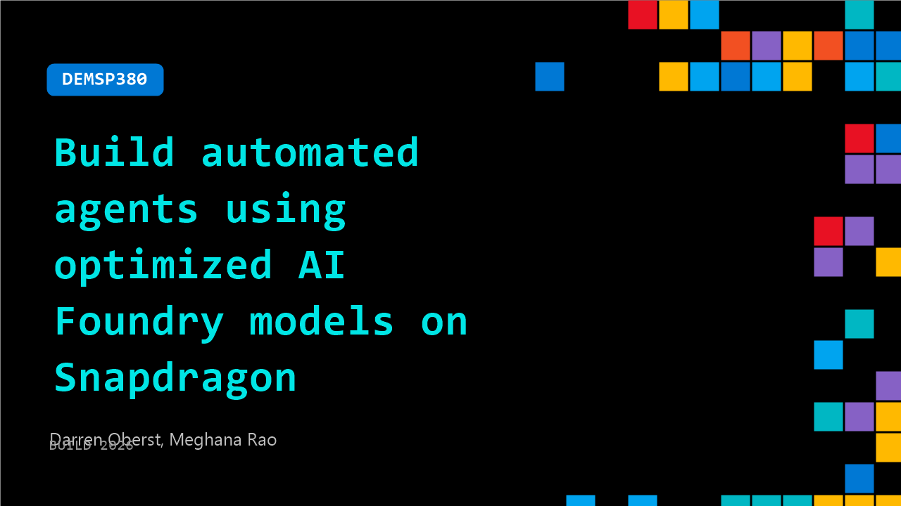

# DEMSP380: Build automated agents using optimized AI Foundry models on Snapdragon

**Session code:** DEMSP380  
**Date:** Tuesday, June 2, 2026 / 1:40 PM - 2:05 PM PDT (Duration 25 minutes)  
**Watch on-demand:** <https://build.microsoft.com/en-US/sessions/DEMSP380>

---

## Speakers

- **Darren Oberst** - Co-Founder, CTO, LLMware.ai
- **Meghana Rao** - Staff Product Manager, Qualcomm Inc

## About the session

Build performant, secure local agents customized for enterprise use cases on Snapdragon X Series PCs. Using GenAI models optimized for the Qualcomm Hexagon NPU architecture, this session empowers developers to build automated, scheduled agentic AI workflows that unlock true NPU acceleration at the edge.

Seating for this session is first-come, first-served. Add it to your schedule to plan your day and arrive early to secure a spot.

## AI summary

**Introduction and Motivation:** At the start of the session 00:00:01–00:00:13, the presenters introduce the goal of demonstrating how to build automated AI agents using optimized models available in Microsoft Foundry for Snapdragon PCs. They highlight how many enterprise workflows today rely on cloud-based chat models that respond to prompts, but such setups do not easily handle complex, recurring, or multi-step workflows. The discussion 00:00:36 emphasizes the importance of running models locally, especially in secure enterprise environments, and introduces the idea of scheduled, prompt-free, automated agents powered by LLMware’s Model HQ and Windows ML APIs for Snapdragon-based devices.

**Learning Goals and Enterprise Use Case:** The speakers outline the four key takeaways 00:01:26–00:02:11: creating multi-step workflows powered by small language models, building industry-specific automation, achieving optimized on-device performance via the Snapdragon NPU, and setting scheduled automation runs. To illustrate this, they choose the Jira workflow as a concrete example 00:02:14–00:03:03, discussing how enterprises use multiple Jira instances to track feature requests, bugs, and user stories. LLMware’s Model HQ assists in integrating and extracting key insights from these siloed datasets using a drag-and-drop, no-code design interface, simplifying creation of agentic workflows on structured data.

**Architecture and Demo Preview:** Before the live demonstration, a brief explanation is given of the Model HQ architecture 00:03:36–00:04:17. At the center sits the no-code application integrated with Microsoft Foundry and external model repositories, running on Snapdragon PCs through Windows ML and Onnx runtime APIs supported by Qualcomm execution providers for optimal local performance. A preview video 00:04:18–00:05:00 shows what the live demo will cover, giving participants a quick overview of building and running automated workflows. Technical issues with toggling screens are briefly encountered but later resolved as the presenters transition to the live demo portion.

**Live Demonstration of Agent Creation:** The main presenter, Darren, begins walking through the live configuration 00:06:51–00:09:04. He integrates three components: the Jira API, Windows Foundry Local, and an email client to automate the end-to-end process. Using the Foundry Local NPU model optimized for Snapdragon X2, Darren shows real-time summarization of Jira issues and highlights that the workflow can be scheduled to deliver daily reports directly to inboxes without token costs or cloud dependencies. The demo illustrates Model HQ's local execution speed and privacy advantages due to on-device processing. The presenter demonstrates drag-and-drop workflow creation 00:10:24–00:11:05 and emphasizes how even non-technical users can build workflows, leveraging Snapdragon’s NPU for accelerated inference.

**Programmatic Extension and Integration:** The speakers continue to showcase how no-code agents can be extended programmatically 00:13:05–00:16:00, describing the ability to expose functionalities as Windows services accessible via API endpoints. By enabling local host access, users can call agents asynchronously, get execution IDs, retrieve outputs, and schedule operations without any cloud dependency. The SDK demonstration 00:15:03 shows how to invoke and manage agent processes programmatically, streamlining automation for repeated enterprise tasks. The team demonstrates pulling zip folders of outputs and explains that these agents can later be deployed at scale on servers, transforming local setups into distributed systems for broader organizational use.

**Conclusion and Q&A:** In the final section 00:20:02–00:24:23, audience questions focus on scalability and hardware optimization. The presenters confirm support for over 200 models, including cloud calls for complex reasoning or multimodal tasks that can be selectively integrated with local workflows, achieving a hybrid setup. They highlight Snapdragon X2’s advantages—up to 80 TOPS acceleration—offering higher-speed local inference on large models. Concluding, they invite attendees to the Qualcomm booth to explore further use cases and emphasize the benefits of embracing local AI for cost efficiency, privacy, and performance. The session closes with encouragement to try hands-on agent building and extend the innovation from hardware through no-code software capabilities in Snapdragon-powered AI PCs.

## Session tags

- **Session type:** Demo
- **Level:** (200) Intermediate
- **Topic:** Agents & apps
- **Tags:** AI, Compute, Agents, Developer, Local AI, Microsoft Foundry, Windows Developer, Agents on Windows, Foundry Local
- **Location:** Gateway Pavilion, Level 2, Theater B
