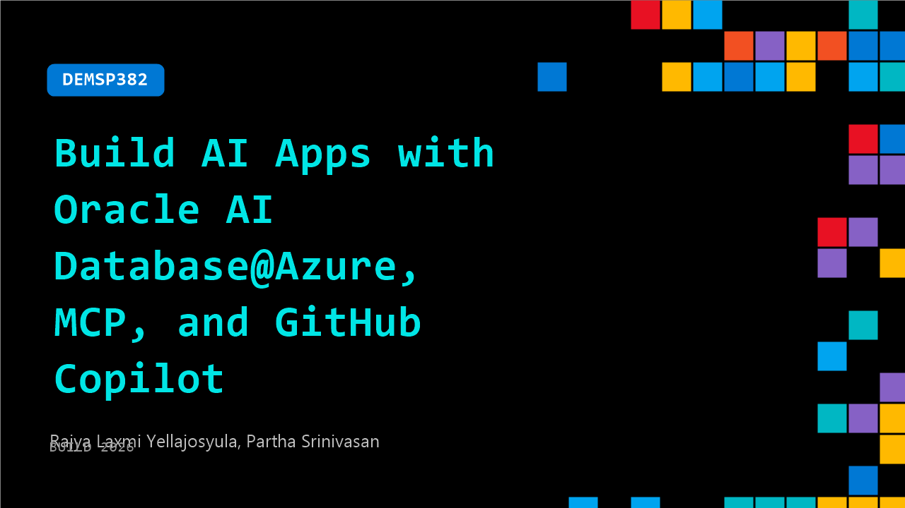

# DEMSP382: Build AI Apps with Oracle AI Database@Azure, MCP, and GitHub Copilot

**Session code:** DEMSP382  
**Date:** Wednesday, June 3, 2026 / 2:30 PM - 2:55 PM PDT (Duration 25 minutes)  
**Watch on-demand:** <https://build.microsoft.com/en-US/sessions/DEMSP382>

---

## Speakers

- **Rajya Laxmi Yellajosyula** - Senior Technical PM - AI, Microsoft
- **Partha Srinivasan** - Senior Principal Product Manager, Oracle

## About the session

Learn to build a secure enterprise AI workflow by combining Oracle Database@Azure, Oracle AI Database, Microsoft Fabric, GitHub Copilot, and Oracle MCP. Explore using MCP and Copilot to orchestrate workflows across Oracle and Fabric using natural language without heavy custom integration. From database provisioning to fraud detection, this demo demonstrates a practical multi-cloud approach for building intelligent, scalable, and enterprise-ready applications.

Seating for this session is first-come, first-served. Add it to your schedule to plan your day and arrive early to secure a spot.

## AI summary

**Introduction and Overview:** The session opens with an introduction thanking attendees and outlining the topic of discussion — building applications using Oracle Database integrated with Microsoft Azure and MCP servers from both Oracle and Microsoft, utilizing the power of GitHub Copilot 00:00:03–00:00:24. The speaker discusses different developer types, such as traditional app developers, ML engineers, data engineers, and forward deployment engineers, and highlights common challenges faced in accessing and managing data efficiently 00:00:37–01:00:00. Oracle Database on Azure is introduced as a native service available through the Azure Marketplace, enabling seamless integration in development environments 00:01:16–01:01:24.

**Challenges and Solutions:** The speaker explains the hurdles developers encounter, particularly with database connectivity, manual wiring, API learning, and schema discovery, along with issues arising from data silos between Oracle and Microsoft systems 00:01:39–00:02:08. To overcome these, Oracle and Microsoft have invested in technologies that streamline integration. Three technologies are highlighted, including Oracle MCP servers accessible via the OCI portal and Microsoft AI Catalog, as well as Fabric MCP servers that enhance connectivity to Microsoft Fabric 00:02:33–00:03:17. GitHub Copilot is positioned as the central tool that unifies these services, simplifying workflow and automation for developers.

**Demo 1 – Fraud Detection System:** The first demo demonstrates a fraud detection application 00:03:22–00:04:08. Using synthetic customer and account data from an autonomous Oracle AI Database on Azure, the process involves provisioning a database and connecting it through Fabric and Visual Studio. The speaker shares how GitHub Copilot facilitated debugging and setup within minutes, showcasing automation and AI-assisted problem resolution 00:05:03–00:05:30. The database tables are created and validated, synthetic data generated automatically, and schema confirmed using Oracle’s SQL CL utility 00:06:08–00:07:45. This section emphasizes how natural language prompts through MCP servers quickly translate to SQL queries and how Copilot automates tasks like index tuning and performance optimization that normally require manual intervention 00:08:33–00:09:11.

**Demo 2 – Data Replication and Analytics:** In the second part, data is exported from Oracle to Microsoft Fabric for advanced analytics 00:09:19–00:10:04. The process uses secure Azure mechanisms and can leverage Oracle Golden Gate Connector for enterprise-grade replication. Once transferred, the data is verified in Fabric using Fabric MCP server tools and transformed into notebooks ready for ML and Spark analytics workloads 00:10:06–00:11:02. At this stage, the demo is handed to Raji, who introduces how Oracle AI Database at Azure offers options such as Exadata and Exascale for enterprise operations 00:11:16–00:12:00. Through OCI Golden Gate or Fabric mirroring, real-time Oracle data integration within Fabric is demonstrated using the fictional company Java Media 00:12:02–00:13:00.

**Data Engineering and Machine Learning Workflow:** Raji then builds a data pipeline that converts raw ("bronze") data to refined ("gold") using Fabric MCP server extensions integrated with VS Code 00:13:31–00:17:00. The automation creates notebooks to validate and write data back to the lake house, all executed securely through API connections. The demonstration progresses to machine learning, where an ML engineer uses the Prophet model to forecast Java Media’s viewership metrics 00:19:03–00:20:00. Results are stored in Fabric and displayed as delta tables, emphasizing how MCP servers cut weeks of manual ML model development down to hours using intuitive AI prompts 00:20:12–00:21:00.

**Business Insights and Conclusion:** The final section focuses on enabling business-oriented outcomes. Using Fabric MCP servers and REST APIs, developers can create semantic models and data agents to assist business users in interacting with data via conversational insights and Power BI dashboards 00:21:05–00:22:09. These tools not only generate forecasts and metrics but also support role-based access controls and integration into Microsoft Stores for broader application use 00:22:59–00:23:19. Closing remarks emphasize the unification of Oracle and Microsoft’s ecosystems through the Fabric IQ layer, enabling actionable insights from transactional Oracle data across business workflows 00:23:23–00:24:10. Finally, Partha invites attendees to explore more demos in the exhibition booth and mentions available blog resources and giveaways for participants 00:24:50–00:25:45.

## Session tags

- **Session type:** Demo
- **Level:** (300) Advanced
- **Topic:** Agents & apps
- **Tags:** AI, Azure, Vector Embeddings, API, Agents, MCP, Data
- **Location:** Festival Pavilion, Theater A
