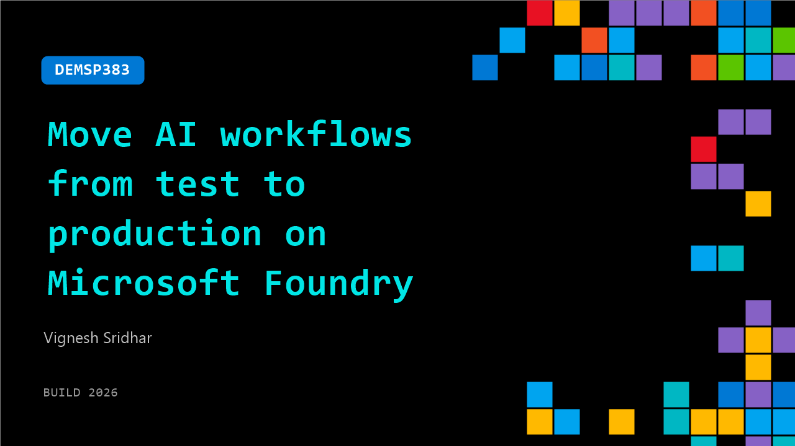

# DEMSP383: Move AI workflows from test to production on Microsoft Foundry

**Session code:** DEMSP383  
**Date:** Tuesday, June 2, 2026 / 1:40 PM - 2:05 PM PDT (Duration 25 minutes)  
**Watch on-demand:** <https://build.microsoft.com/en-US/sessions/DEMSP383>

---

## Speakers

- **Vignesh Sridhar** - Applied AI, Fireworks AI

## About the session

Power use case-specific enterprise AI systems with high-performance inference from Fireworks AI integrated with Microsoft Foundry. In this live demo, see how teams move from test to production by running high‑performance inference directly on Foundry. Walk through an end‑to‑end workflow that shows how unified infrastructure improves latency, reduces cost, and simplifies deployment for real enterprise AI use cases.

Seating for this session is first-come, first-served. Add it to your schedule to plan your day and arrive early to secure a spot.

## AI summary

**Introduction and Overview:** The video begins with Vignesh from Fireworks AI welcoming everyone to the session 00:00:00 and explaining that he will present an overview of Fireworks AI, its capabilities, and how developers can use open-source models via Microsoft Foundry to build AI workflows 00:00:11–00:00:22. He introduces Fireworks AI as a platform for high-performance inference on open-source models, highlighting its founding team from PyTorch and Vertex AI and the platform’s day-zero support for leading open-source models like Kimi and GLM 5.1. The system handles massive scale—serving about 30 trillion tokens per day and 180,000 requests per second—while providing options for users to bring and deploy their own models through Foundry using the Fireworks serving stack optimized for low latency and high throughput 00:00:45–00:01:07.

**Technical Capabilities and Azure Integration:** Vignesh explains that Fireworks AI integrates natively with Azure, enabling developers to manage workloads directly on Foundry 00:01:08–00:01:14. The Fireworks serving stack dynamically optimizes model performance using workload-aware techniques like adaptive caching and quantization and leverages their custom inference engine, Fire Retention, to balance latency and throughput requirements 00:01:19–00:01:52. Through abstraction, users are provided with production-ready endpoints for seamless deployment. On Foundry, Fireworks AI offers day-zero access to new open-source models that are optimized for enterprise-scale workloads, including support for custom weights and post-training registration workflows 00:02:05–00:02:49.

**Use Cases and Model Comparison:** The presentation highlights common industry use cases such as code completion, review bots, customized chatbots, and transcription or summarization workflows 00:03:01–00:03:09. Vignesh shows how developers can experiment with multiple models through A/B testing on Foundry, selecting the best performing one to create and serve as an agent 00:03:16–00:03:24. Fireworks AI continuously adds new models to its portfolio, ensuring users can access the latest open-source innovations on launch day 00:03:35–00:03:45. He then transitions to a live walkthrough on Microsoft Foundry, starting from the landing page and discovering Fireworks AI models available for immediate use 00:03:48–00:04:28.

**Deployment Workflow and Model Testing:** The demo section explains how users can deploy models like Kimi K 2.6 for testing specific tasks 00:04:29–00:05:03. Multi-tenant serverless endpoints allow quick testing and evaluation before moving to dedicated single-tenant deployments optimized through provision throughput calculations that determine required resources for production-scale workloads 00:05:27–00:06:36. He demonstrates testing models in a playground, comparing performance and latency between deployed models like Minimax and Kimi 2.6, showing how developers can interact with each model, inspect response quality, and compare outputs side by side to select the most suitable one for their use case 00:07:01–00:08:29.

**Evaluation and Production Deployment:** After selecting the best model, users can convert it into an agent and evaluate its performance using Foundry’s matrix configurator 00:08:42–00:09:39. Vignesh demonstrates configuring evaluation metrics such as intent resolution, coherence, fluency, and relevance for datasets with ground truth comparisons 00:09:49–00:10:54. He reviews completed evaluations showing metric scores and explains how developers can iterate and refine their agents for improved performance prior to production 00:11:01–00:11:28. Once optimized, users can publish agents either as Foundry web apps or integrate them directly into code projects using API endpoints and Python snippets 00:11:34–00:12:14.

**Fine-Tuning and Closing Remarks:** In closing, Vignesh explains advanced workflows for fine-tuning where developers can bring their own weights or base models to Fireworks AI via Foundry 00:12:44–00:13:27. Using frameworks like SFT or RFT, models can be customized for specific use cases and redeployed through the same inference-serving workflow. He concludes by thanking the audience and inviting questions 00:13:32–00:13:41. The session ends with Manesh expressing gratitude for the presentation and sharing a brief announcement about the next upcoming session, encouraging participants to stay or have a great day 00:13:58–00:14:26.

## Session tags

- **Session type:** Demo
- **Level:** (200) Intermediate
- **Topic:** Agents & apps
- **Tags:** AI, Azure, Microsoft Foundry
- **Location:** Gateway Pavilion, Level 2, Theater C
