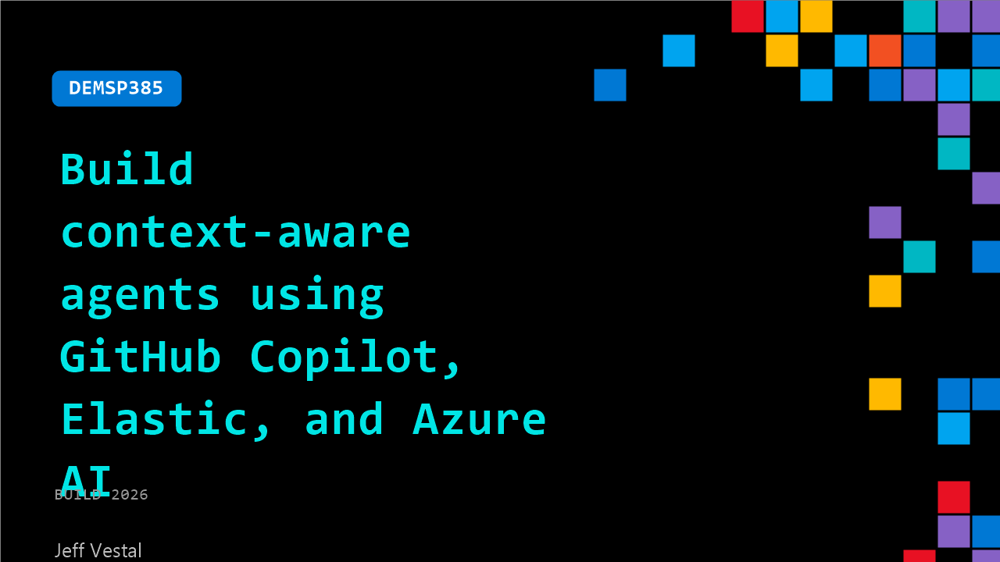

# DEMSP385: Build context-aware agents using GitHub Copilot, Elastic, and Azure AI

**Session code:** DEMSP385  
**Date:** Tuesday, June 2, 2026 / 2:10 PM - 2:35 PM PDT (Duration 25 minutes)  
**Watch on-demand:** <https://build.microsoft.com/en-US/sessions/DEMSP385>

---

## Speakers

- **Jeff Vestal** - Sr. Principal AI Specialist, Elastic

## About the session

Your AI reviewer has amnesia; it knows your code, but forgets the 2 AM outage from last month. We’ll demo giving Copilot a memory. Using Elastic Agent Builder and Workflows, we build an agent that reviews PRs against production telemetry and incident history. See it in action: an agent identifies a regression pattern, cites a past incident via OTel traces in Elasticsearch, and helps a dev fix it in VS Code via Copilot Agent Mode and the Elastic MCP server. Powered by Azure AI Foundry.

Seating for this session is first-come, first-served. Add it to your schedule to plan your day and arrive early to secure a spot.

## AI summary

**Introduction and Objective:** The presenter begins by greeting the audience and gauging familiarity with Elasticsearch 00:00:02. The session focuses on using Elasticsearch within a code review workflow to automatically identify whether a new pull request (PR) might reintroduce problems from previous incidents 00:00:14. Instead of only validating that code compiles or passes tests, the goal is to determine if a change could recreate past production issues. This enhanced review process ties together postmortem incident data, open telemetry traces, and Elasticsearch intelligence to flag potentially risky changes automatically before merging 00:00:26.

**System Workflow Overview:** The presentation transitions to explain how the automation works. When developers push a PR, standard GitHub Actions trigger the usual validation steps but also invoke a new Elastic Workflow 00:01:02. This, in turn, calls Elastic Agent Builder—the platform’s agent execution environment. The agent conducts semantic searches in Elasticsearch, comparing the proposed code changes against telemetry data and postmortems for incident similarities 00:01:20. When matches are found, it comments on the PR with context from these findings, suggesting whether to proceed or adjust. Further integration with tools like VS Code and Copilot allows developers to interact with recommendations and automatically apply safe fixes guided by the system 00:01:42.

**Demonstration: Pull Request Detection and Feedback:** The presenter demonstrates with a sample e-commerce app, Wayfinder, where a small refactoring in the inventory reservation function leads to a code review run 00:02:24. Though syntactically valid, the Elastic PR agent identifies that the proposed change reintroduces a race condition previously responsible for production gateway timeouts on April 7th 00:04:12. The feedback comment includes detailed telemetry evidence showing latency spikes, specific root causes, and example traces. The agent provides not only a warning but a recommended fix and coverage of the incident history, empowering the developer to adjust code confidently before merging.

**Elastic Agent Builder and Semantic Tools:** The walkthrough continues inside Kibana’s agent interface 00:06:20. The speaker explains that agents are configured with “skills” (contextual knowledge like recognizing race conditions) and “tools” (functional access to Elasticsearch search, semantic matching, and ESQL queries) 00:07:56. Using a workflow, the PR review can automatically collect environment variables from GitHub and feed them into Elasticsearch for correlation against vectors generated from incident embeddings 00:09:52. Unlike keyword matching, the system employs vector-based semantic search using model embeddings, enabling it to reason about contextual code issues and map them against historic failure patterns.

**Developer Interaction through Queries and Copilot:** The presenter then demonstrates how developers can directly converse with the agent for pre-PR analysis 00:12:00. By asking whether certain endpoints or concurrency modifications match known incident patterns, the agent retrieves correlated data, root-cause explanations, and postmortem summaries, often pinpointing exact production failures 00:13:06. Through integrated MCP servers, VS Code, and GitHub Copilot, developers can keep their workflow inside the IDE. Copilot can automatically apply code updates based on the agent’s recommendations, as shown when it refactors the database statement to prevent threading issues and confirms correctness through local stress testing 00:16:15.

**Conclusion and Key Takeaways:** The session concludes by recapping how integrating postmortems, telemetry, and RCA data into Elasticsearch allows engineering teams to move from reactive to proactive code review 00:17:08. Developers can inject varying levels of observability data—whether production incidents or dev-stage metrics—to create agents that foresee repeat failures. The outcome is a more resilient, context-aware review process that safeguards production stability automatically within developers’ daily tools. The presenter thanks the audience and invites them to visit the Elastic booth for hands-on demonstrations and giveaways 00:17:46.

## Session tags

- **Session type:** Demo
- **Level:** (300) Advanced
- **Topic:** Agents & apps
- **Tags:** AI, Observability, Agents, GitHub Copilot, Visual Studio Code, Microsoft Foundry, Foundry Agents, GitHub Actions
- **Location:** Gateway Pavilion, Level 2, Theater C
