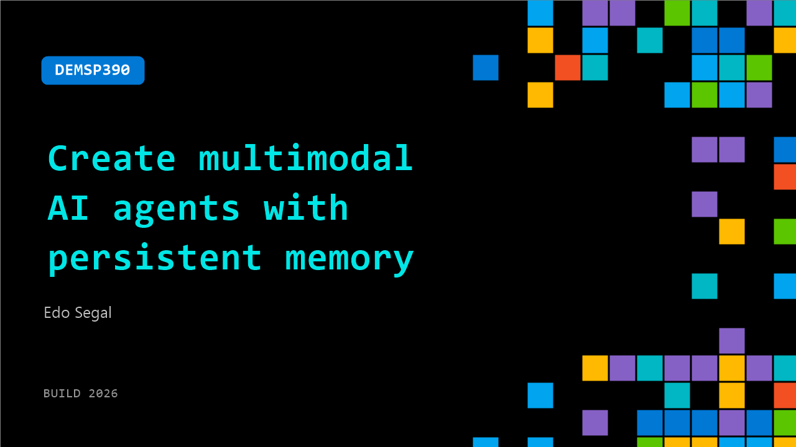

# DEMSP390: Create multimodal AI agents with persistent memory

**Session code:** DEMSP390  
**Date:** Wednesday, June 3, 2026 / 3:00 PM - 3:25 PM PDT (Duration 25 minutes)  
**Watch on-demand:** <https://build.microsoft.com/en-US/sessions/DEMSP390>

---

## Speakers

- **Edo Segal** - CTO, Napster

## About the session

Your users reach you through your website, your app, your store, your support line. And whether they were in touch five minutes or five days ago, every channel starts from zero, every time. Multimodal AI agents with persistent memory close that gap, and you can have them up and running now. In this session, Napster CTPO Edo Segal builds a working video AI agent live using the Napster Omniagent API. You'll leave with the architecture, the code patterns, and a clear next step to build your own agent that lives across every surface your organization touches.

## AI summary

**Introduction and Outlook:** The session opens with a welcome to Build 2027 00:00:00, highlighting how exciting this year’s event is compared to prior builds. The speaker emphasizes the breadth of Microsoft’s innovation across hardware and cloud technology 00:00:08–00:00:17, and sets forward-looking expectations for next year’s conference, predicting that attendees will interact with AI “agents” that behave like people, not just chatbots. The mood is visionary as the audience is invited to imagine advanced, lifelike digital assistants integrated into daily experiences.

**Napster’s AI Vision and Foundry Integration:** The presentation transitions to an introduction from Napster 00:00:44, where the team showcases a “crew of AI agents” that help users accomplish their tasks 00:00:48–00:01:17. These agents do not physically exist but are fully digital and AI-driven. The speaker explains how Foundry enables creation of multimodal AI personas—video, voice, and text—through a few clicks. Napster’s product stack includes hardware solutions such as “The View,” a holographic display that extends user interaction, and kiosks suitable for busy public environments 00:01:38–00:01:56. Attendees are urged to visit the booth to see these experiences firsthand.

**Omni Agent API and Microsoft Azure Collaboration:** The next segment dives into the technical foundation—the Omni Agent API 00:03:38, which unifies modalities (text, video, phone, chat) under one agent able to persist memory and maintain relationships with users—creating a new paradigm of “human emulation” 00:04:00–00:04:16. This innovation builds relational intelligence between humans and their AI counterparts. Later, Microsoft’s representative joins to announce Napster’s public preview as a native Azure offering 00:04:38–00:05:05. The integration offers unified billing through Azure Marketplace, easy provisioning via the Azure portal, and seamless linkage between Napster’s experiential layer and Foundry’s intelligence layer—streamlining enterprise-level deployment.

**Live Demo and Developer Workflow:** The speaker then demonstrates development of an Omni Agent 00:06:03–00:07:06, showing how a developer can simply add prompts and API keys to create an intelligent assistant that understands site code directly from a Git repository. The process automates everything locally via an MCP server embedded in JavaScript—what they call “Edge MCP”—enabling local cognition in real time 00:07:28–00:08:09. This allows agents to perform tasks directly through the DOM without external calls. Igor and others elaborate how AI models like Opus 4.8 make it possible to predict user behavior across a full code base and automatically create Azure-hosted visual agents within minutes 00:09:12–00:10:38.

**Engineering Innovations and Real-World Applications:** The presentation then highlights Napster’s breakthrough in reducing video-agent costs by 20x—down to one cent per minute—enabling widespread deployment of video avatars on websites 00:11:18–00:12:00. The discussion reaffirms a shift toward human-like interfaces where users interact through conversation rather than code. Technical diagrams show how apps, agents, and Edge MCP servers form a three-layer system—the app (truth), the bridge (action), and the agent (persona)—leading to seamless browser control and state awareness 00:13:06–00:14:00. This enables AI coworkers capable of performing actual business functions—from helping customers in retail stores to assisting patients at hospitals—all using the same underlying framework 00:15:18–00:15:58.

**Demo Wrap-Up and Closing Remarks:** To conclude, the team shows a real-time demo query—searching for OLED TVs under $2000—illustrating how the Edge MCP server enables dynamic interactions and context awareness 00:16:40–00:18:20. Participants see live capability calls and state updates of an AI-agent browser control system operating autonomously. The session ends with an invitation to scan QR codes for tokens, prompts, and participation in a hackathon with prizes 00:19:02–00:19:40. The speakers thank partners Microsoft, product managers, and engineers for enabling this next-generation AI experience, signaling the dawn of practical, multimodal digital coworkers.

## Session tags

- **Session type:** Demo
- **Level:** (300) Advanced
- **Topic:** Agents & apps
- **Tags:** AI, API, Agents, Enterprise
- **Location:** Gateway Pavilion, Level 2, Theater B
