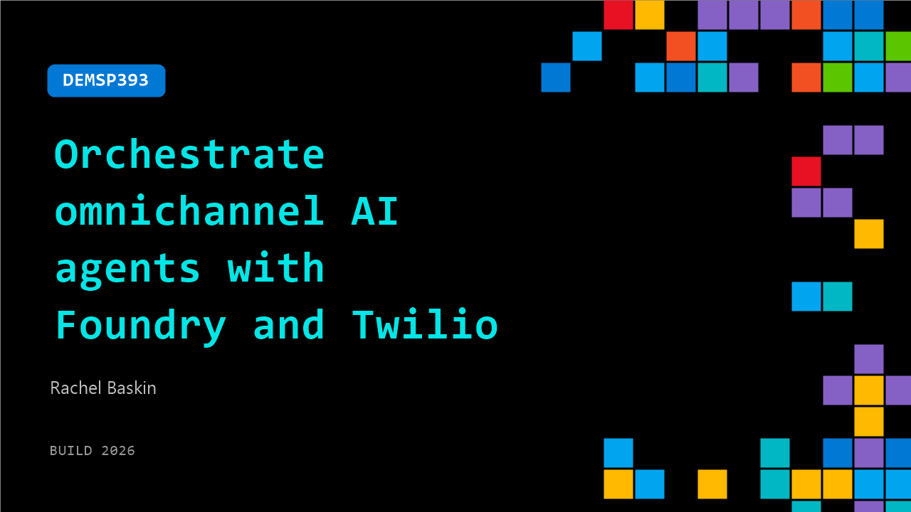

# DEMSP393: Orchestrate omnichannel AI agents with Foundry and Twilio

**Session code:** DEMSP393  
**Date:** Tuesday, June 2, 2026 / 5:00 PM - 5:25 PM PDT (Duration 25 minutes)  
**Watch on-demand:** <https://build.microsoft.com/en-US/sessions/DEMSP393>

---

## Speakers

- **Rachel Baskin** - Product Manager, Twilio

## About the session

Customer conversations often lose context across channels, making it difficult to build cohesive AI agents. Learn how to close the gap with Microsoft Foundry and Twilio. Use Foundry to establish models, voice, and agents on Azure. Add Twilio for cross-channel memory, real-time orchestration, and conversation intelligence, all wired by the Agent Connect SDK. See a demo and learn patterns for building scalable, real-time workflows.

Seating for this session is first-come, first-served. Add it to your schedule to plan your day and arrive early to secure a spot.

## AI summary

**Introduction and Context:** The video begins with Rachel, a product manager at Twilio, greeting the audience and introducing the topic of building omnichannel AI agents using Twilio and Microsoft Foundry 00:00:09–00:00:20. She highlights the rising global investment in AI, noting Gartner’s reported 44% year-over-year increase. Despite this growth, over half of surveyed leaders report getting little value from AI, and only 6% of brands have improved customer experience scores. Rachel points out this gap between AI spending and actual ROI, setting the stage for why Twilio and Foundry are working together to enable more practical, integrated AI solutions 00:01:00.

**Challenges in AI Agent Development:** Rachel explains that the biggest challenge companies face is “memory loss” in customer interaction systems 00:01:20. Traditional support systems forget customer history across channels, forcing users to repeat information and causing poor experiences. She emphasizes how this lack of persistent context affects both virtual and human agents. Additionally, she notes that deploying omnichannel AI agents capable of maintaining context, memory, and functioning reliably at scale is technically complex 00:02:15. These difficulties inspired Twilio to collaborate with Microsoft Foundry and develop Twilio Agent Connect to simplify building and deploying enterprise-ready agents 00:02:48.

**Introducing Twilio Agent Connect and Foundry Integration:** Rachel describes the integration between Twilio and Microsoft Foundry as a way to unify Twilio’s communication layer with Foundry’s intelligence models 00:03:43. Twilio powers the real-time conversation management and data continuity, while Foundry provides model governance, optimization, and reasoning through its AI tools. Twilio Agent Connect acts as the open-source SDK that bridges them, offering a simpler path from concept to production with fewer engineering overheads 00:04:05. This collaboration ensures the creation of a fully functional omnichannel AI solution where every communication—voice, text, or chat—shares persistent customer memory across sessions.

**Architectural Overview and Hosted Agents:** Initially, Twilio Agent Connect used container-based deployments via Azure services 00:04:19. Rachel details how container apps allowed developers full control but were not ideal for long-lived, per-user sessions typical of AI agents. To solve scalability and security isolation issues, Microsoft introduced “hosted agents,” a new compute model built for persistent, secure, stateful sessions 00:05:22. Hosted agents come with automatic sandboxing, predictable scaling, cost-efficiency (including scale-to-zero), and enterprise-level monitoring and evaluation tools. This new serverless architecture eliminates infrastructure management while maintaining performance for intelligent conversational systems 00:07:20.

**Live Demo: Deploying and Connecting a Voice and SMS Agent:** Rachel transitions to a live demonstration 00:08:30, walking through deploying Twilio Agent Connect with Azure hosted agents using the open-source GitHub repository. She shows how deploying requires minimal setup via a single command that provisions resources automatically. Then she illustrates how Twilio phone numbers and messaging conversations are connected to webhooks within the API management service, linking them to the AI agent 00:11:05. In the demo, she conducts a simulated airline customer interaction: a phone call where the AI instantly recognizes the customer’s flight and updates a seat 00:13:01. Later, she follows up by texting the same number to add a checked bag, demonstrating that the system remembers previous interactions and context seamlessly across channels 00:15:00.

**Q&A and Closing Remarks:** In the final segment, Rachel answers audience questions about extending business logic, customizing prompts, and using Twilio Conversation Relay versus the new native integration 00:17:16. She explains that developers can modify agent behavior, connect custom knowledge bases, and choose models directly through the hosted agent environment or GitHub examples. The discussion also touches on deployment strategies for multi-tenant scenarios and improvements enabled by direct websocket connections for faster voice responsiveness 00:19:25. Rachel concludes by encouraging viewers to explore the open-source repository for hands-on experimentation and further learning, emphasizing that this integration marks a step forward in making enterprise-grade omnichannel AI systems easier to deploy and scale 00:21:10.

## Session tags

- **Session type:** Demo
- **Level:** (200) Intermediate
- **Topic:** Agents & apps
- **Tags:** AI, Azure, API, Agents, Developer, Foundry IQ, Microsoft Foundry, Software Development Company, Foundry Control Plane, Foundry Agents, Data, ISV, AI Toolkit, Personalization, App Integration, Open Ecosystem, Developer Frameworks, Skills, Dev Tools, Enterprise
- **Location:** Gateway Pavilion, Level 2, Theater B
