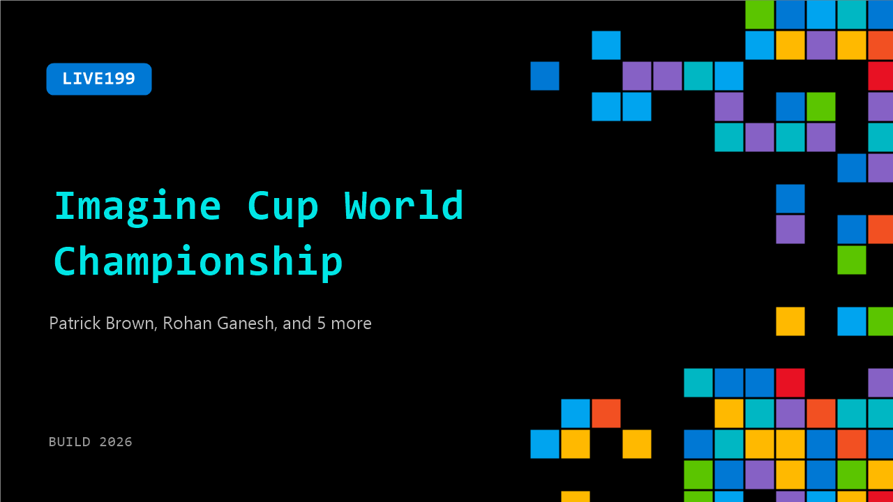

# LIVE199: Imagine Cup World Championship

**Session code:** LIVE199  
**Watch on-demand:** <https://build.microsoft.com/en-US/sessions/LIVE199>

---

## Speakers

- **Patrick Brown** - Founder, CopyFlag
- **Rohan Ganesh** - Co-Founder, Hardware Lead, SpoilSafe
- **Surya Kukkapalli** - Founder, Revora Health
- **Troy McBride** - Software Lead, SpoilSafe
- **Vivaan Sawant** - CEO, SpoilSafe
- **Advika Vuppala** - Co-Founder, SpoilSafe
- **Hans Yang** - VP Startups, Microsoft

## About the session

The final moment is here. Three startups. One stage. This year’s finalists take the stage pitching their solutions as they compete to become the 2026 Imagine Cup World Champion, win $100,000 USD, and a mentorship session with Microsoft Chairman and CEO, Satya Nadella. This is where ideas meet execution and where student founders show what it looks like to build with scale in mind.

## AI summary

**Opening and Founders' Reflections:** The video begins with brief introductions from previous Imagine Cup participants sharing their work and experiences. One founder explains that their company, Caduce, is focused on improving insurance reimbursement documentation for healthcare providers (00:00:33), while another describes Prada Health, a telehealth addiction clinic leveraging AI to improve quality of care (00:00:38). They credit mentorship sessions, especially one with Satya Nadella, for helping them refine their business approach. The reflections emphasize how the competition accelerated their understanding of scaling systems and deploying their ideas. One founder expresses hope that new teams will gain just as much from participating in the Imagine Cup and Microsoft Build experiences (00:01:04).

**Introduction to Imagine Cup Finals:** Host Donna Sarkar takes the stage to welcome the audience to Microsoft Build (00:01:31). She celebrates Imagine Cup’s 24-year history of supporting global student founders by connecting them with mentorship, startup ecosystems, and advanced technology resources (00:01:45). Donna highlights this year’s collaboration with Microsoft for Startups, GitHub Education, and Replit, which helped participants refine and ship their solutions intentionally. From over a thousand submissions, three startups—CopyFlag, Spoilsafe, and Revora Health—rose to the top to compete in the World Championship round (00:03:06). Donna introduces the prestigious judging panel and announces that the winning team will receive $100,000 and a mentorship session with Satya Nadella (00:03:01).

**Finalist Introductions and Projects Overview:** The video transitions to short documentary-style vignettes introducing each finalist and their projects. Patrick, founder of CopyFlag, recounts losing significant income due to copyright infringement, which inspired him to create an AI-powered protection platform for independent creators (00:03:16). Spoilsafe’s team discusses global food waste inefficiencies and presents their sensor-based AI system designed to predict spoilage across supply chains, improving distribution and sustainability outcomes (00:04:17). The founders of Revora Health explain their platform for connecting patients with physical therapists quickly and affordably, leveraging AI to personalize care and reduce provider fatigue (00:05:21).

**Live Demonstrations:** During the live portion of the event, each team presents their demo to the audience and judges. CopyFlag showcases how users can upload content for fingerprinting and AI-driven search to detect and remove stolen works (00:06:45). It features real-time alerts, predictive models like “Horizon,” and pattern mapping for repeat offenders, turning reactive copyright responses into predictive defense mechanisms. Spoilsafe’s founders demonstrate how their sensors gauge environmental conditions like temperature and humidity to predict spoilage for specific foods, providing actionable decisions that help warehouse teams prevent waste (00:08:21). Revora Health’s team illustrates an intuitive interface where users interact with an AI assistant named Clara to assess injuries and receive dynamically updated therapy plans shared with physical therapists in real time (00:09:43).

**Founder Insights and Mentorship Session:** Hans Yang, Vice President at Microsoft for Startups, hosts a discussion to uncover lessons from the finalists (00:11:23). Surya from Revora shares that trust in healthcare is built from the ground up and emphasizes co-designing with therapists to create validated, practical solutions (00:12:11). Rohan from Spoilsafe reflects on a pivotal customer insight—“We don’t need more data, we need actions”—that shifted their focus from selling visibility to selling confidence (00:13:07). Patrick from CopyFlag discusses transforming personal loss into an innovative venture that helps creators visualize and combat unseen forms of digital theft (00:14:03). Hans praises their clarity, drive, and problem-solving acumen, underscoring their symbolic role as model founders.

**Announcement and Conclusion:** As the excitement peaks, Donna and Hans congratulate the teams and acknowledge their mentors for helping shape their journeys (00:15:03). Hans reveals a surprise announcement: Microsoft has increased the grand prize from $100,000 to $150,000 (00:16:07). Finally, amid cheers from the audience, CopyFlag is declared the 2026 Imagine Cup World Champion (00:16:19). The program concludes by celebrating innovation, resilience, and the spirit of global entrepreneurship that Imagine Cup continues to foster.

## Session tags

- **Session type:** Broadcast Stage
- **Topic:** Agents & apps
- **Tags:** Azure, Agents, GitHub, Foundry IQ, Microsoft Fabric, Microsoft for Startups, Azure Copilot
