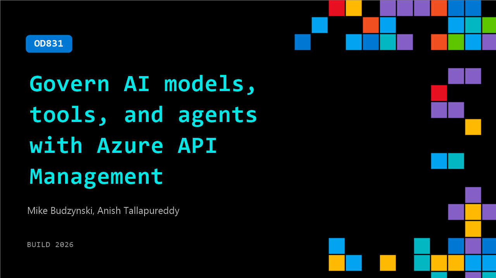

# OD831: Govern AI models, tools, and agents with Azure API Management

**Session code:** OD831  
**Watch on-demand:** <https://build.microsoft.com/en-US/sessions/OD831>

---

## Speakers

- **Mike Budzynski** - Principal Product Manager, Microsoft
- **Anish Tallapureddy** - Principal Product Manager, Microsoft

## About the session

AI workloads don’t behave like traditional APIs. They combine models, tools, and agents across providers, making routing, cost control, safety, and observability harder in production. Learn how to use Azure API Management’s AI Gateway to expose endpoints, route requests, and apply policies. Through demos, go from a single request to a production-ready setup with guardrails and telemetry.

## AI summary

_No AI summary available._

## Session tags

- **Session type:** Pre-recorded
- **Topic:** Agents & apps
- **Tags:** Azure, Security, API, Governance, Tracing, Guardrails, Production Systems
