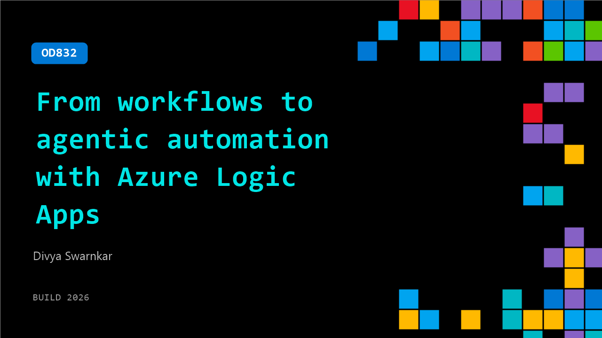

# OD832: From workflows to agentic automation with Azure Logic Apps

**Session code:** OD832  
**Watch on-demand:** <https://build.microsoft.com/en-US/sessions/OD832>

---

## Speakers

- **Divya Swarnkar** - Principal Product Manager, Microsoft

## About the session

Learn how to build and operationalize agentic business processes with Azure Logic Apps Automation, a new offering purpose-built for agentic business process automation. Discover how to orchestrate workflows, APIs, Microsoft Foundry agents, and human decisions across enterprise systems. Through demos, see how to design, develop, and operationalize agentic workflows with reliability, observability, and governance built in.

## AI summary

_No AI summary available._

## Session tags

- **Session type:** Pre-recorded
- **Topic:** Agents & apps
- **Tags:** Azure, Agents, Developer, Development pipeline
