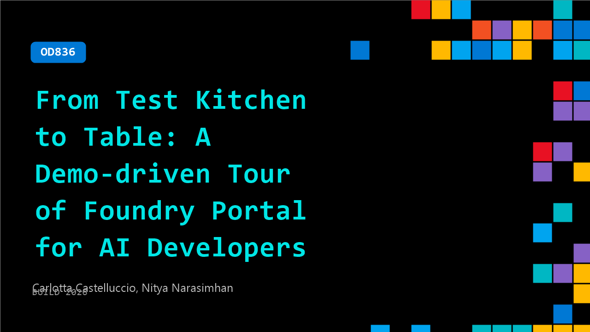

# OD836: From Test Kitchen to Table: A Demo-driven Tour of Foundry Portal for AI Developers

**Session code:** OD836  
**Watch on-demand:** <https://build.microsoft.com/en-US/sessions/OD836>

---

## Speakers

- **Carlotta Castelluccio​** - Sr AI Advocate, Microsoft
- **Nitya Narasimhan** - Senior Developer Advocate, Core AI, Microsoft

## About the session

Follow a live journey from rapid experimentation in the Foundry portal's playground to production-ready agent deployment. Discover how the portal's UI streamlines workflow design, model management, and monitoring, making it easy for developers to discover, build, iterate and manage their AI solutions in a manner that complements their code-first mindset. By mapping each portal capability to familiar developer tasks, we'll also reinforce how the portal enhances the code-first experience with richer observability features to give them a more comprehensive understanding of system behaviors that may not be visible through code alone.

## AI summary

_No AI summary available._

## Session tags

- **Session type:** Pre-recorded
- **Topic:** Agents & apps
- **Tags:** Developer, Microsoft Foundry, Agent Observability, Production Systems
