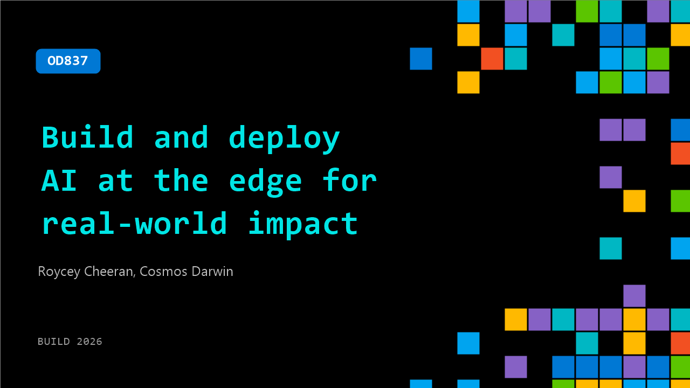

# OD837: Build and deploy AI at the edge for real-world impact

**Session code:** OD837  
**Watch on-demand:** <https://build.microsoft.com/en-US/sessions/OD837>

---

## Speakers

- **Roycey Cheeran** - Senior Product Manager, Microsoft
- **Cosmos Darwin** - Principal Product Manager, Microsoft

## About the session

What happens when AI leaves the datacenter and enters the physical world? Experience what's next as we unveil the public preview of Azure Local on small form factor devices with Foundry Local built in. Learn how Azure Local brings cloud-consistent infrastructure to compact edge hardware, and how Foundry Local delivers AI models where latency and connectivity demand it — on the factory floor, in the field, and wherever humans and robots work side by side — no round trip to the cloud required. Walk away with a clear blueprint for shipping smarter AI systems to the edge using Azure Local and Foundry Local.

## AI summary

_No AI summary available._

## Session tags

- **Session type:** Pre-recorded
- **Topic:** Agents & apps
- **Tags:** Azure, Local AI, Foundry Local, Azure Local, Enterprise
