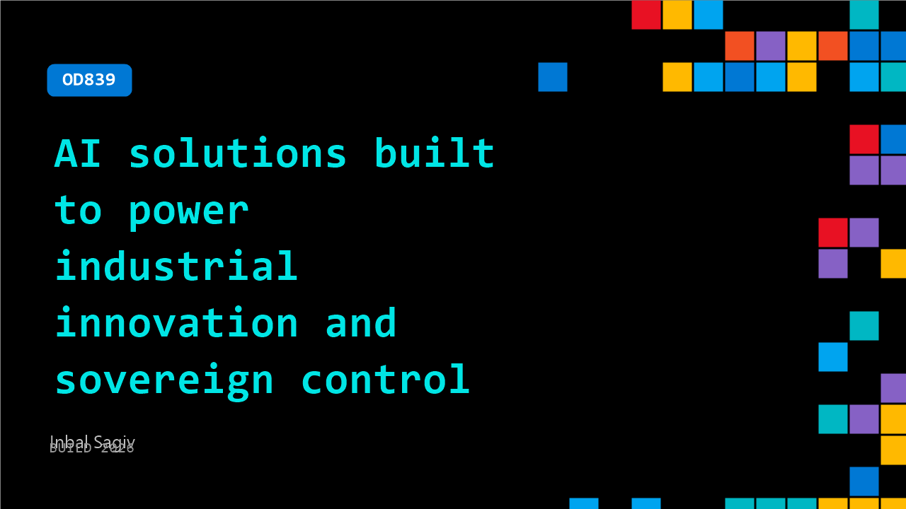

# OD839: AI solutions built to power industrial innovation and sovereign control

**Session code:** OD839  
**Watch on-demand:** <https://build.microsoft.com/en-US/sessions/OD839>

---

## Speakers

- **Inbal Sagiv** - Group Product Manager, Microsoft

## About the session

Learn how Microsoft Foundry brings AI to industrial and sovereign environments with Foundry Local on Azure Local. This session shows how organizations can build and run AI applications directly on Azure Local infrastructure with low latency, local data control, and support for connected or fully disconnected operations - while maintaining a consistent developer and governance experience through Azure Arc.

## AI summary

_No AI summary available._

## Session tags

- **Session type:** Pre-recorded
- **Topic:** Agents & apps
- **Tags:** Azure, Security, Local AI, Governance, Foundry Local, Azure Local, Enterprise
