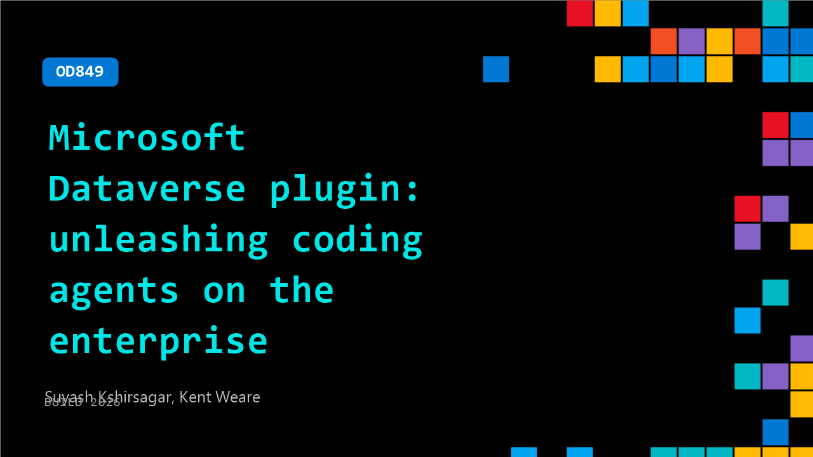

# OD849: Microsoft Dataverse plugin: unleashing coding agents on the enterprise

**Session code:** OD849  
**Watch on-demand:** <https://build.microsoft.com/en-US/sessions/OD849>

---

## Speakers

- **Suyash Kshirsagar** - Principal Software Engineering Manager, Microsoft
- **Kent Weare** - Principal Product Manager, Microsoft

## About the session

Coding agents are powerful, but without domain tooling they hallucinate and produce broken solutions. The Dataverse plugin solves this by giving AI agents guardrailed access to tables, columns, relationships, views, security and solutions. See how a natural language request triggers multi-step provisioning, data imports and validation. All executed autonomously. We demo the plugin architecture, MCP server integration and patterns that make agent-driven Dataverse development reliable at scale.

## AI summary

**Introduction and Purpose:** The session opens with hosts Kent Weare and Suyash Kshirsagar welcoming viewers to "Talk to Your Terminal Using Dataverse Plugin for Coding Agent Sessions" (00:00:00–00:00:16). Kent explains that while business data lives inside Microsoft Dataverse, obtaining value from it still often requires navigating portals and issuing formal queries. The new Dataverse Skills plugin aims to simplify this by letting developers, analysts, and administrators describe their intent in natural language and have it automatically executed as governed Dataverse operations (00:00:21–00:00:55). The demonstration will show how three distinct roles — a builder, a DevOps analyst, and a systems admin — can use this single plugin to accelerate their workflows.

**Builder Workflow – Maya’s Scenario:** In the first demo, Maya, a business user new to Dataverse, wants to connect to her environment and create a data model for a coffee roasting business (00:01:12–00:01:17). Without knowing her organization URL, she installs the Dataverse Skills plugin, connects using Microsoft sign-in, and has the agent automatically detect and verify her environment (00:01:26–00:02:06). Using a single natural-language prompt, Maya generates a full data schema for tracking bean batches, roasts, orders, and quality checks, complete with lookups, relationships, and a pre-built solution container (00:02:13–00:03:40). She then uses subsequent prompts to load actual spreadsheets into her Dataverse tables, rely on business keys to resolve relationships, and validate imported data. Thanks to the Dataverse plugin’s skill orchestration, Maya completes a full working app setup, including validation queries and data consistency checks, entirely through conversational steps (00:03:53–00:05:37).

**Analyst Workflow – Riya’s Scenario:** The next segment features Riya, a DevOps analyst at Zava Coffee, showing how operational users use the same plugin to access CRM data directly from their terminals (00:05:46–00:06:12). After connecting to Dataverse naturally via prompt-based authentication, Riya queries CRM entities like accounts, contacts, and opportunities with simple language, replacing the need for technical FetchXML or manual portal work (00:06:22–00:06:58). Examples include finding "Carlos’s open opportunities over $100,000 closing this quarter" and "cafes in Portland that haven’t reordered in 30 days" — operations that ordinarily take many minutes are now completed instantly by the agent’s skill system (00:07:03–00:08:50). Riya also adds notes, marks activities complete, and logs calls on behalf of others with plain English prompts, while the plugin automatically determines record owners, related entities, and relationships (00:09:00–00:11:44). This segment demonstrates how data retrieval, updates, and task tracking follow identical conversational patterns across users and contexts.

**Administrator Workflow – Amara’s Scenario:** The final demonstration shows Amara, a system administrator, using the same Dataverse plugin for complex configuration, security, and governance tasks (00:12:02–00:12:14). After confirming her privileges, Amara issues prompts to define business units for multiple regions, create roles for sales, warehouse, and leadership users, set field-level security for sensitive fields, and assign access team templates, all expressed in natural language (00:13:18–00:15:05). The agent automatically performs prerequisite actions such as enabling field security, binding profiles, and packaging all resources into a secure, versioned solution. Amara then validates her configuration through impersonation checks that confirm read/write capabilities across roles and units, followed by sharing records cross-region using team templates without manual ID entry (00:16:14–00:17:37). She finalizes by enabling and verifying auditing of sensitive fields so reads and writes are fully logged. In minutes, Amara accomplishes multi-layer Dataverse administration that previously required manual and error-prone portal steps (00:18:01–00:19:03).

**Conclusion and Call to Action:** Kent and Suyash close the session by reinforcing the power of a unified conversational interface across roles and disciplines (00:19:08–00:19:16). They emphasize that builders, analysts, and administrators can all work faster and more securely using the same Dataverse plugin, which turns natural language directly into managed operational outcomes. Viewers are invited to scan the on-screen QR code for more details and hands-on access (00:19:19–00:19:32), marking the end of the demonstration and highlighting Microsoft’s vision for AI-assisted Dataverse management.

## Session tags

- **Session type:** Pre-recorded
- **Level:** (300) Advanced
- **Topic:** Agents & apps
- **Tags:** Agents, Developer, GitHub Copilot, Visual Studio Code, MCP, Data, App Developers, GitHub Copilot CLI, DevTools, Developer Technologies, Developer Frameworks, Developer Languages
