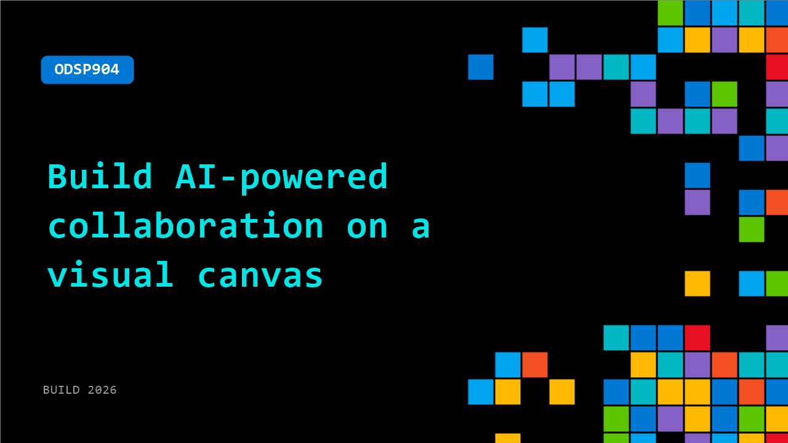

# ODSP904: Build AI-powered collaboration on a visual canvas

**Session code:** ODSP904  
**Watch on-demand:** <https://build.microsoft.com/en-US/sessions/ODSP904>

---

## Speakers

_Not listed._

## About the session

Visual collaboration is evolving as AI becomes part of the workflow—not just the output.
See how to go from prompt to diagram in seconds, generate and organize boards with AI, and connect AI agents to the Lucid MCP server to create and update documents programmatically.
Learn how to build AI-driven collaboration workflows on a shared canvas, making work visible, structured, and automatable across teams and tools.

## AI summary

_No AI summary available._

## Session tags

- **Session type:** Pre-recorded
- **Level:** (100) Foundational
- **Topic:** Agents & apps
- **Tags:** AI, Automation, Developer, MCP, AI Toolkit
