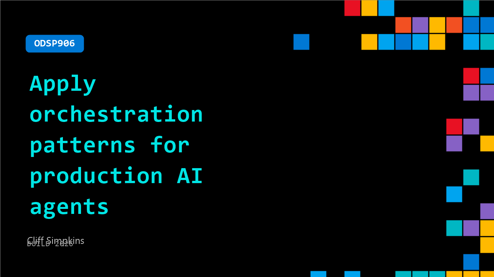

# ODSP906: Apply orchestration patterns for production AI agents

**Session code:** ODSP906  
**Watch on-demand:** <https://build.microsoft.com/en-US/sessions/ODSP906>

---

## Speakers

- **Cliff Simpkins** - Sr Director, DevRel, UiPath

## About the session

Moving your agent from demo to production requires a platform that can support and enable it. You will learn about enabling robots, humans, and agents to come together in a scalable and secure way. UiPath demos the latest innovations, including new business orchestration design canvases, native coding agent support, and expanded agentic testing capabilities. You don't have to choose between the developer experience and the power of an enterprise platform.

## AI summary

**Introduction to UiPath and Session Overview:** At 00:00:00, Cliff Simpkins begins the session by welcoming viewers and introducing UiPath as Microsoft’s preferred enterprise automation platform built on Azure. He explains that the next 20 minutes will cover what UiPath does, why it matters for developers, and a highlight reel from their recent developer conference. Simpkins describes UiPath’s relevance for builders, emphasizing three developer-facing pillars: Maestro as the execution layer that makes agentic production-ready automation possible; native integration with GitHub Copilot through NPM installation for UiPath skills and CLI; and built-in Azure security and compliance inheritance for enterprise deployment. He positions UiPath as an evolution from robotic process automation (RPA) to a full orchestration runtime capable of integrating agents, robots, human reviews, and exceptions in a governed, auditable environment (00:01:15–00:02:04).

**UiPath Maestro Platform and Microsoft Ecosystem Integration:** From 00:02:06 through 00:04:25, Simpkins describes Maestro—the orchestration engine at UiPath’s core that manages AI agents, human approvals, and system integrations across durable, observable processes. Three modeling canvases are introduced: Maestro BPMN for business workflows, Maestro Flow for developer-centric orchestration, and Maestro Case for dynamic enterprise processes. He demonstrates how UiPath fits within the Microsoft-first enterprise workflow where Teams, Outlook, SharePoint, and Copilot collaborate with UiPath’s orchestration layer to handle complex tasks like claims and approvals. He highlights two new Microsoft integrations: conversational UiPath agents that operate directly in Microsoft Teams, and GitHub Copilot gaining full UiPath context by installing its skills and CLI, enabling developers to build and deploy agentic automations seamlessly inside Visual Studio Code.

**Developer Conference Highlights and Coding Agent Innovations:** At 00:04:27, Simpkins transitions to UiPath’s developer conference keynote from Bengaluru. Raghu Malpani introduces how automation development has transformed—40% of code now generated by AI and 85% of developers using coding agents. The session underscores developer leverage across the software lifecycle, compressing timelines dramatically. Alexandru Roman demonstrates agent-assisted debugging using Claude Code, which autonomously investigates, hypothesizes, and repairs failed automation queues (00:05:50–00:07:24). Roman illustrates agents creating repositories, UI elements, and deploying fixes rapidly, then showcases cross-platform use by switching to Gemini CLI for queue-based automations. These demonstrations prove UiPath’s flexibility—agents can work across environments with full governance and extensibility.

**Exploring Maestro Flow and Enterprise Process Modeling:** Beginning at 00:08:12, Vikram Kakumani and Milo Shields introduce Maestro Flow—the new visual canvas for developers. Built atop Maestro’s enterprise-grade runtime, Flow provides a schema natively understood by coding agents for complete file manipulation. Shields demonstrates creating a billing dispute process by combining manual and Outlook triggers, classification agents, and advanced error handling, including PII and harmful content detection guardrails (00:09:15–00:12:01). He details trace views, real-time approvals, Slack notifications, and seamless integration with Git version control. Flow’s evaluation framework enables end-to-end testing for orchestrations, blending developer enjoyment with enterprise rigor. Kakumani then moves to Maestro Case as a solution for modeling complex, non-linear business workflows like loan origination, where rule-based or agent reasoning dynamically activates various stages without predefined paths (00:13:35–00:16:05).

**Agentic Testing and Autonomous QA Capabilities:** From 00:16:12, Anvita Dekhane introduces UiPath’s Test Cloud—an AI-driven agentic testing suite that transforms manual QA into autonomous validation. She outlines three advancements under autonomous software testing: UiPath Autopilot for running manual tests independently; exploration mode for dynamic test coverage and case mapping; and UiPath Delegate—a digital coworker removing administrative overhead. Tester Amol Awate demonstrates Delegate executing tests at Accrual Bank, emailing managers, filing bugs in Jira, and updating test results directly in context (00:17:57–00:19:20). His workflow showcases UiPath Skills integration with applications and test tools, emphasizing a seamless, low-effort QA cycle across enterprise systems.

**Closing Remarks and Developer Resources:** Concluding at 00:19:23, Simpkins reviews UiPath’s expanded orchestration and coding agent ecosystem. He confirms availability of the CLI and skills with GitHub Copilot support and early access for Maestro Flow. Developers building AI agents for enterprise environments with auditability and cross-system collaboration are encouraged to begin with a simple install of the UiPath CLI and skills. The session closes with guidance to access SDKs, documentation, and community resources via uipath.com/developers, reaffirming UiPath’s mission to empower developers building secure, governed, agentic automations within familiar tools like Visual Studio Code.

## Session tags

- **Session type:** Pre-recorded
- **Level:** (300) Advanced
- **Topic:** Agents & apps
- **Tags:** AI, MS Teams, Agents, Developer, GitHub Copilot, GitHub, Azure DevOps, Enterprise
