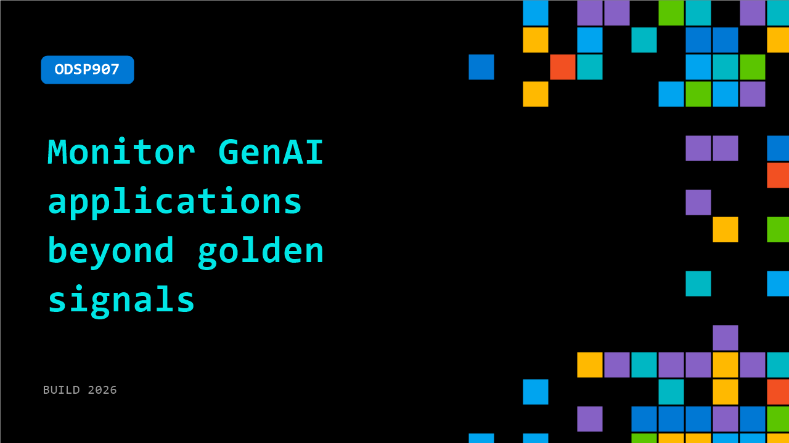

# ODSP907: Monitor GenAI applications beyond golden signals

**Session code:** ODSP907  
**Watch on-demand:** <https://build.microsoft.com/en-US/sessions/ODSP907>

---

## Speakers

_Not listed._

## About the session

The golden signals of monitoring (Latency, Errors, Traffic, Saturation) remain foundational, but for GenAI applications they leave critical blind spots. A 200 OK with low latency doesn't tell you the response hallucinated, leaked PII, or cost more than what it should.

## AI summary

**Introduction to GenAI Monitoring:** The video begins with a welcome to "Beyond Golden Signals: Monitoring in the Age of Generative AI" 00:00:01. The presenter explains how generative AI (GenAI) systems differ from traditional software, identifying four fundamental shifts: non-deterministic behavior, variable cost structures, new attack vectors, and subjective quality 00:00:15. These differences make legacy monitoring strategies insufficient, prompting the need for new observability frameworks tailored to AI-driven systems.

**Revisiting the Golden Signals (LETS):** The speaker introduces the traditional "Golden Signals"—Latency, Errors, Traffic, and Saturation (LETS)—as the foundation of monitoring 00:00:37. For latency, traditional metrics such as median, P95, and P99 are useful, but GenAI requires more granular tracking across multiple pipeline stages like RAG retrieval time, LLM response time, and total request duration 00:00:45. Error tracking must go beyond HTTP status codes to include model errors such as context length limits and safety filter triggers 00:02:00. Traffic monitoring shifts to segmenting by model, feature, and user type to manage dynamic demand and rate limits 00:02:41. Finally, saturation now emphasizes GPU utilization and API rate limits as primary bottlenecks in AI systems 00:04:05.

**New Dimension 1 - Cost Monitoring:** As the first new dimension of AI observability, cost monitoring is highlighted as a necessity 00:04:34. GenAI brings unpredictable cost dynamics due to model use and token-based billing. The video identifies three primary sources of cost escalation: token creep, where larger context windows inflate costs; model drift, where switching to more expensive models increases expenditure; and uncached calls, which repeat identical costly prompts unnecessarily 00:05:10. A strong cost attribution system based on tagging—by feature, user, model, and endpoint—is recommended to identify cost drivers, enable chargeback accuracy, detect abuse, and maintain budget control 00:06:26.

**New Dimension 2 - Safety and Security:** The discussion transitions to safety and security monitoring 00:07:37. The GenAI threat landscape includes critical risks like PII leakage and data exfiltration, high-risk attacks such as prompt injection and jailbreaking, and medium-risk issues like denial-of-wallet and model extraction 00:07:53. Effective monitoring requires metrics that detect non-traditional security breaches—tracking prompt injection rates, PII detection rates, moderation scores, and jailbreak attempts 00:08:26. These indicators help identify misuse or malicious manipulation of large language models before they cause widespread damage.

**New Dimension 3 - Quality Monitoring:** The final new dimension—quality monitoring—addresses the most subjective yet critical aspect of GenAI 00:08:59. Traditional uptime metrics cannot measure whether AI outputs are helpful, accurate, or complete. Quality assessment is difficult due to lack of ground truth, contextual dependency, hallucinations, and user satisfaction variability 00:09:17. Six quality metrics are proposed: hallucination rate, relevance score, user satisfaction, answer completeness, retrieval quality, and response coherence 00:10:11. These enable a multidimensional understanding of performance beyond binary success indicators.

**Conclusion and Platform Overview:** In closing, the speaker unifies the traditional LETS framework with the three new dimensions—Cost, Safety, and Quality—to form a comprehensive GenAI observability model 00:10:45. This integration enables visibility into system health, financial control, security posture, and model performance 00:11:02. Datadog’s LLM Observability platform is introduced, offering monitoring for latency, errors, token usage, costs, quality metrics, and security compliance in one interface 00:11:28. The session concludes by reaffirming that traditional metrics still matter, but alone they offer an incomplete picture—true GenAI monitoring must address hallucinations, data leakage, and uncontrolled spending simultaneously 00:12:27.

## Session tags

- **Session type:** Pre-recorded
- **Level:** (100) Foundational
- **Topic:** Agents & apps
- **Tags:** AI, Automation, Azure, Azure Monitor, Cost Management, Platform Engineering, Semantic Kernel, Vector Embeddings, Agents, Developer, Microsoft Foundry, MCP, AI Toolkit, Agent Observability, Containment, Agentic Security, Skills, Claws, Openclaw, Agentic SDLC, Dev Tools
