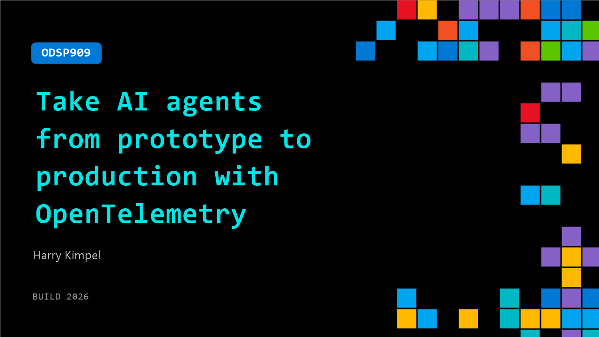

# ODSP909: Take AI agents from prototype to production with OpenTelemetry

**Session code:** ODSP909  
**Watch on-demand:** <https://build.microsoft.com/en-US/sessions/ODSP909>

---

## Speakers

- **Harry Kimpel** - Principal Developer Relations Engineer, New Relic

## About the session

Shipping an AI agent is easy. Trusting it in production is hard. In this session, build a multi-agent travel planner using the Microsoft Agent Framework, then instrument it end-to-end with OpenTelemetry and New Relic. You'll learn how to trace agent decisions, monitor response quality, catch prompt injection attacks, and build CI/CD quality gates—so your AI systems are observable, secure, and ready for real customers.

## AI summary

**Introduction and Problem Statement:** At 00:00:06, Harry Kimpel from New Relic welcomes viewers and poses a question often asked by developers: why do AI agents behave unpredictably in production despite performing well during testing? He contrasts traditional web services, which follow clear request-response paths and allow debugging through logs, with AI agents that do not follow fixed code paths. These agents autonomously decide actions, invoke tools, and sometimes delegate tasks to sub-agents, creating complex reasoning chains. Kimpel highlights the inherent difficulty in pinpointing where issues occur within these opaque systems and stresses that without observability, teams remain blind to the cause of anomalies, leading to confusion between random flukes and systemic failures. This inability to “see inside” AI systems is identified as the core challenge the talk aims to address.

**Building the Wanda AI Application:** Around 00:02:00, Kimpel introduces a practical example by proposing the creation of “Wanda AI,” a travel planning startup. The idea is to build an AI-powered system that takes a user’s travel preferences and generates personalized itineraries. Investors appreciate the demo but need assurance that the agent’s recommendations are valid, performant, and debuggable. He establishes that these are fundamentally engineering issues solvable through observability. To build the system, Kimpel selects a technology stack comprising the Microsoft Agent Framework for orchestration, OpenTelemetry for instrumentation, and New Relic as the observability backend. Together, these layers will make the AI’s internal workings measurable and understandable.

**Agent Framework and Instrumentation:** Starting at 00:03:23, Kimpel explains the Microsoft Agent Framework, which allows the structured definition of agents and their tools within a multi-agent system. The Wanda AI setup includes a Flask web app for input, a primary travel planning agent to handle reasoning, and tool modules like destination search, weather forecast, and itinerary builder. While the framework effectively models human-like problem-solving steps at language-model speed (00:05:04), the code remains opaque without observability. To resolve this, he integrates OpenTelemetry—the open standard for tracing, metrics, and logs. The Agent Framework’s built-in OpenTelemetry support simplifies instrumentation, enabling automatic emission of traces with timestamps and status codes. Once enabled (00:06:36), every agent invocation becomes a trace that visualizes the reasoning flow in tools like New Relic.

**Visualizing and Extending Observability:** At 00:07:01, Kimpel reviews an actual Wanda AI trace in New Relic. It shows 48.2 seconds total duration with clear breakdowns—destination selection taking 322 ms, weather forecast 1.17 s, and itinerary builder nearly 39 s—immediately exposing performance bottlenecks. Built-in telemetry reveals “what” happened but not “why,” prompting the addition of custom spans and metrics for enriched context (00:07:55). These custom spans might track business-relevant data like destination categories, enabling advanced filtering and insight into user preferences. Custom metrics like itinerary counts and cache hit rates provide statistical visibility. He continues with logging best practices, explaining that simple print statements are insufficient. With OpenTelemetry, logs can include trace and span IDs, allowing direct correlation between log entries and traces (00:09:10). In New Relic, this linkage enables developers to click from an error log straight to the corresponding trace, identifying root causes in under a minute instead of manually matching entries across different tools.

**Quality Gates and Security Controls:** Beginning at 00:10:12, Kimpel emphasizes production-readiness through quality assurance and security. He introduces evaluation tests that act like AI behavior unit tests, scoring outputs against expected results for realism, relevancy, and format correctness. Wired into CI/CD pipelines (00:11:02), these evaluations automatically block deployments if quality drops below thresholds. For security, particularly prompt injection defenses (00:11:28), he details two protection layers. Microsoft Foundry guardrails operate at the platform level, catching explicit and indirect attacks. Application-level detection examines incoming requests for malicious patterns. Both layers are instrumented via OpenTelemetry, making injection attempts, patterns, and guardrail activations observable in New Relic dashboards. This turns security—a traditionally opaque aspect—into data that can be monitored and analyzed alongside performance metrics.

**Conclusion and Next Steps:** In the closing section (00:13:29), Kimpel revisits the initial query about unpredictable AI behavior. The solution, he reiterates, lies in observability: enabling visibility into agents through integrated tracing, logging, and quality controls. He summarizes the build of Wanda AI using Microsoft Agent Framework, OpenTelemetry, and New Relic, emphasizing that the same approach can be applied universally to agent-based systems. Key takeaways include starting telemetry early, adding custom instrumentation for business context, correlating logs, enforcing quality gates, and monitoring security layers (00:14:51). The session closes by pointing viewers to the Microsoft “What the Hack” repository (00:15:01), specifically hack number 073 focused on New Relic agent observability, providing hands-on exercises and full source code for reproducing the presented scenario. Kimpel ends by encouraging teams to “ship observable AI,” reinforcing observability as the foundation for reliable and secure AI deployment.

## Session tags

- **Session type:** Pre-recorded
- **Level:** (100) Foundational
- **Topic:** Agents & apps
- **Tags:** AI, Observability, Reliability, Monitor, Agents, MCP, Foundry Agents, Azure DevOps, Agent Observability, Developer Frameworks, Agentic SDLC
