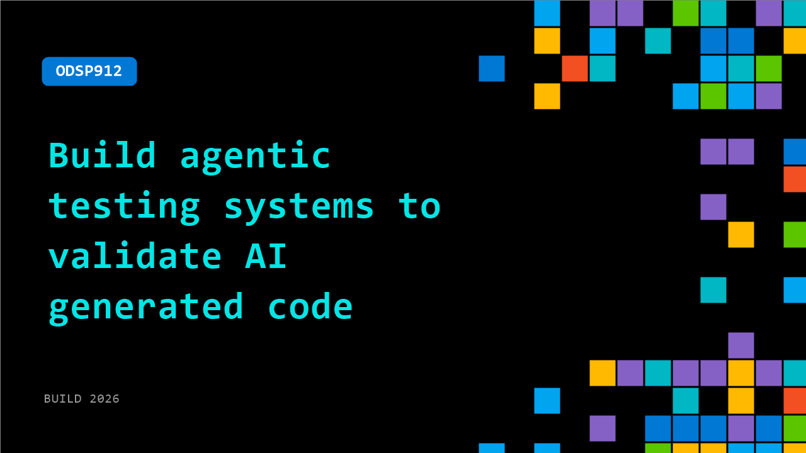

# ODSP912: Build agentic testing systems to validate AI generated code

**Session code:** ODSP912  
**Watch on-demand:** <https://build.microsoft.com/en-US/sessions/ODSP912>

---

## Speakers

_Not listed._

## About the session

AI is driving rapid expansion of software, but vibe coding lacks the rigor needed for reliability. Traditional tests can’t keep pace with agent-generated logic. To scale, we must move beyond manual checks to Agentic Testing: using autonomous agents to validate autonomous systems. Explore patterns for creating autonomous test agents, detecting failures across workflows, and continuously verifying behavior. Take away practical approaches to make AI-driven software reliable and production ready.

## AI summary

**Introduction and Context:** The session begins with a greeting at 00:00:00 as the speaker, a Developer Relations Manager at Tesma AI, welcomes everyone to Microsoft Build 2D6 and introduces the focus of the talk—agent testing. The discussion frames how modern AI agents can now write, run, break, and patch code, but emphasizes that their ability to test code reliably before production remains limited. The real challenge, as stated at 00:00:30–00:00:40, is not speed but trust—ensuring that testing performed by autonomous agents can be verified and relied upon without human intuition.

**The Testing Gap and Introduction of Keynes CLI:** At 00:00:52–00:01:11, the speaker introduces the solution: Keynes CLI, Tesma AI’s new command-line tool designed to close the validation gap in the agent testing process. This product allows agents to perform testing like a careful engineer, ensuring reliable outputs. The talk underscores that the focus should shift from how fast we build code to how effectively we validate it. Keynes CLI acts as a deterministic validation layer between development and shipping, giving developers and AI systems a way to verify applications originally built by autonomous agents.

**Capabilities and Core Features of Keynes CLI:** Beginning around 00:02:00–00:04:07, the presentation dives into the capabilities of Keynes CLI. It integrates natively with various agent systems such as Cloud Codex, Gemini, and Copilot, allowing tests to be described using natural language prompts. The tool automatically runs validation across browsers, devices, and environments, enabling developers to release features confidently. Out-of-the-box functionality includes intent-based control without the need for manual test scripts, XPaths, or selectors; resilient runs that persist through complex journeys; and built-in bug discovery using vision-based waits. It automatically generates Playwright test scripts from natural language inputs and stores test cases in markdown format that can be replayed or integrated into CI/CD pipelines. Keynes CLI also provides auto-heal functionality to update test cases after UI changes and outputs structured ND JSON artifacts readable by agents.

**Usage Options and Integration Examples:** By 00:04:28–00:07:01, the speaker explains three key methods to use Keynes CLI: directly from the command-line interface, through an SDK for CI/CD pipelines or custom agents, and by enabling agent integration using the provided agent MD file. A demonstration follows showing how the tool can be installed from NPM and used in interactive mode to execute objectives. The live demo showcases automating tasks such as completing a checkout flow and pasting an order ID into Google, with Keynes CLI autonomously dividing the tasks into workflows and performing them step-by-step using a local browser interface.

**Demonstration and Live Workflow Execution:** At 00:06:00–00:11:10, the session illustrates Keynes CLI executing an automated workflow. It completes the order placement, extracts the order ID, and successfully performs subsequent tasks like inserting that ID into a Google search. Each action is visible in real-time terminal logs and browser interactions. After test completion, users can exit and save sessions, review generated Playwright scripts, and access shareable log links that contain the full trace and visual evidence of the test’s steps. These outputs allow validation before merging features, and any detected bugs are automatically flagged for review.

**Agent Collaboration and Closing Insights:** In the final portion beginning around 00:12:36–00:13:03, the speaker demonstrates Keynes CLI’s ability to operate collaboratively with AI agents in headless mode, producing results, completion statuses, and shareable proof logs. The demo underscores how agents equipped with Keynes CLI can autonomously generate, execute, and verify end-to-end test cases during development. The tool’s structured outputs and validation proofs help developers build trusted applications in the agent-driven era, ultimately bridging the trust gap between automation and confident product release.

## Session tags

- **Session type:** Pre-recorded
- **Level:** (300) Advanced
- **Topic:** Agents & apps
- **Tags:** AI, Automation, Reliability, Resiliency, Monitor, Agents, Developer, Deployment Pipelines, Scaling, Agent Observability, DevTools, Agentic Security, Developer Technologies
