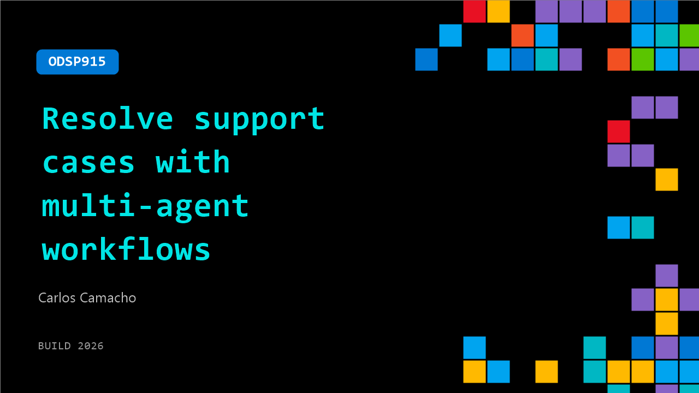

# ODSP915: Resolve support cases with multi-agent workflows

**Session code:** ODSP915  
**Watch on-demand:** <https://build.microsoft.com/en-US/sessions/ODSP915>

---

## Speakers

- **Carlos Camacho** - Principal Software Engineer, Red Hat

## About the session

See how a multi-agent system diagnoses and resolves support cases across partner ecosystems. This demo showcases the Agentic Partners Integration AI quickstarts, built on Azure and Red Hat OpenShift AI (ARO) with MCP and open-source components. Learn how agents share context, orchestrate actions, and automate resolution. Leave with a reference architecture and patterns to build your own agentic workflows.

## AI summary

**Introduction and Objective:** The video begins with Carlos and Sharon from Red Hat greeting viewers 00:00:01 and explaining that they will demonstrate how to deploy an MCP server from the MCP catalog and use it in a multi-agent application that diagnoses and resolves support cases across partner ecosystems. They emphasize that the session will be brief, fully live, and focused on facilitating support resolution across various partners within one ecosystem 00:00:27. The goal is to show an open-source, multi-agent system that enables automated workflows to diagnose and fix problems efficiently.

**System Architecture Overview:** The presenters describe the layers of the system starting with the user access layer 00:00:52, a PatternFly-based web app that allows interaction through a chat interface. They then explain the orchestration and security layer 00:01:06, which manages authentication, authorization, and auditing. Next, Carlos details the routing agent 00:01:17, responsible for directing user requests to the appropriate troubleshooting agents. The communication between agents is facilitated by A2A, and all agents are developed using ADK for modular integration within the ecosystem 00:01:31.

**Deploying the Azure MCP Server:** Sharon explains the process of using the OpenShift AI MCP Catalog 00:01:41 to deploy a pre-built MCP server. The catalog offers ready-to-deploy servers that can be configured and launched with minimal effort. In this demo, they choose to deploy the Azure MCP server to their Red Hat OpenShift cluster 00:01:51. She mentions that users only need to specify deployment name, project, and Azure tenant details. The catalog automatically manages container images, configurations, and authentication through managed identity 00:02:06. Importantly, the deployment requires no custom coding—just selecting and deploying from the catalog and consuming it like any other workload 00:02:17. Once configured, users click “Deploy the Azure MCP server” and wait for the operator to complete the process 00:02:27.

**Demonstration of Multi-Agent Workflow:** After deployment, Carlos logs into the quickstart environment 00:02:39 using a user account with access to several agents, including the Azure support agent. He begins by asking questions related to Azure services, such as details on the Well-Architected Framework for AKS 00:03:00. The routing agent identifies the intent, delegates execution to the Azure support agent, and displays the output generated by underlying MCP tools 00:03:08. Each query triggers two phases: intent detection and MCP tool execution 00:03:20. He further queries best practices for Azure web application development 00:03:30, showing similar routing and execution flow that produces a markdown file answer 00:03:51.

**Auditing, Security, and Access Control:** The video highlights built-in auditing capabilities 00:04:16. All application events are logged using OpenTelemetry, giving visibility into user activity and request permissions 00:04:21. The audit trail records whether specific requests were allowed or denied and helps trace group-based access rights. Carlos illustrates this by switching to a user named Josh 00:04:48, who lacks permission to any agents. When Josh attempts to submit a request, the routing agent denies it 00:04:55, and the event appears in the audit logs and traces 00:05:04. This confirms that access control and auditing are active and reliable.

**Conclusion:** To conclude, the presenters note that users without assigned departments or agent access, such as Josh 00:05:13, will not have requests processed, validating the system's layered security design. They end the demo by summarizing the simplicity and robustness of deploying MCP servers through the Red Hat AI MCP Catalog and integrating them into secure, multi-agent workflows for support resolution 00:05:20. The session closes with a brief thank-you to the audience 00:05:22.

## Session tags

- **Session type:** Pre-recorded
- **Level:** (200) Intermediate
- **Topic:** Agents & apps
- **Tags:** AI, Azure, Observability, Platform Engineering, Vector Embeddings, Agents, Developer, MCP, Data, OSS, App Developers, ISV, Open Ecosystem, Agentic Security
