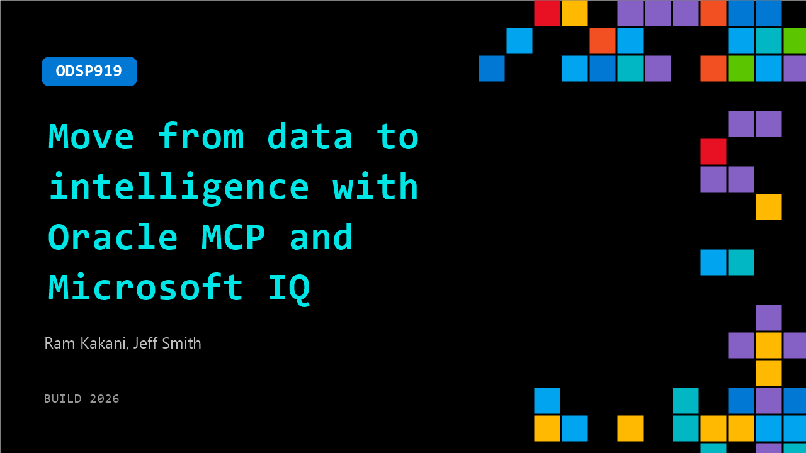

# ODSP919: Move from data to intelligence with Oracle MCP and Microsoft IQ

**Session code:** ODSP919  
**Watch on-demand:** <https://build.microsoft.com/en-US/sessions/ODSP919>

---

## Speakers

- **Ram Kakani** - Principal PM Manager, Microsoft
- **Jeff Smith** - Distinguished Product Manager, Oracle

## About the session

Make the leap from disconnected data to intelligent, AI-driven workflows by combining Oracle managed MCP Servers with Microsoft IQ. See how MCP enables connectivity to Oracle Database@Azure, while Microsoft IQ—Work IQ, Fabric IQ, and Foundry IQ—bring context, reasoning, and orchestration to enterprise data. Together, they power agentic experiences with Oracle handling infrastructure and operations, accelerating time to value, and delivering enterprise-grade solutions at scale.

## AI summary

_No AI summary available._

## Session tags

- **Session type:** Pre-recorded
- **Level:** (200) Intermediate
- **Topic:** Agents & apps
- **Tags:** AI, API, Agents, MCP, Data, App Integration
