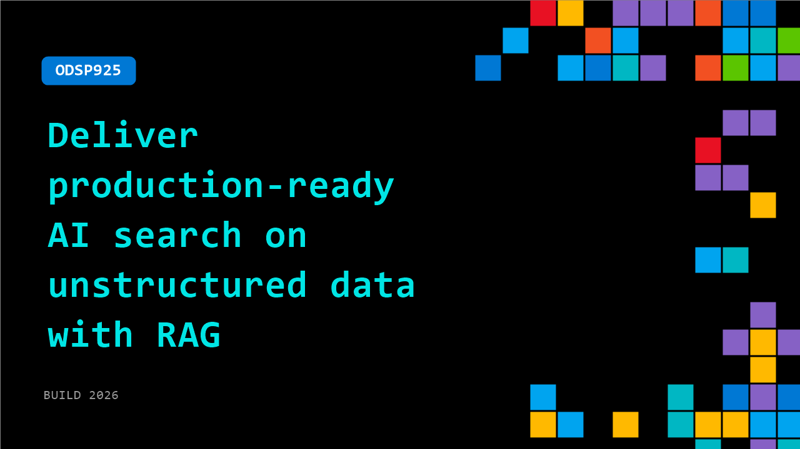

# ODSP925: Deliver production-ready AI search on unstructured data with RAG

**Session code:** ODSP925  
**Watch on-demand:** <https://build.microsoft.com/en-US/sessions/ODSP925>

---

## Speakers

_Not listed._

## About the session

RAG is easy to prototype but difficult to run in production. This session shows how to move from proof of concept to production-ready AI search on unstructured data. Build a simple RAG pipeline, then explore patterns for scaling with agentic RAG, graph-based retrieval, and entity recognition. Learn how to choose the right approach for performance, relevance, and maintainability from real-world examples.

## AI summary

**Introduction and Context:** The video opens with Ed Charbeneau from Progress Software introducing himself (00:00:01–00:00:08) and outlining the session’s focus—an introduction to Retrieval Augmented Generation (RAG). He explains that the session will explore why RAG is important, how it compares to other generation methods, and introduce Progress Agentic RAG. Ed begins by emphasizing the modern need to make sense of vast amounts of data now produced daily, referencing earlier predictions from 2016 and how the amount has grown exponentially by 2026 (00:00:38–00:01:11). He sets the stage for how machine learning and artificial intelligence have become essential tools for interpreting the data we generate.

**Understanding Augmented Generation:** Before defining RAG, Ed explains Context Augmented Generation (00:01:45–00:02:10). He describes how additional data is placed within the model’s context window—such as YouTube transcripts via the Gemini button—to enable conversational querying of content. He then introduces "Cache Augmented Generation" (00:02:31–00:02:57), where projects like Copilot in Visual Studio Code use vector memory to store data and assist coding tasks through semantic search. These examples lay groundwork for understanding how different augmentation forms expand AI’s capabilities by enriching context before generation.

**Core Principles of Retrieval Augmented Generation:** Ed transitions to explaining Retrieval Augmented Generation (00:03:21–00:03:59) as a specialized version of contextual augmentation utilizing a vector database for semantic retrieval. Unlike keyword searches, RAG operates through semantic similarity, enabling AI to find related information conceptually rather than by exact phrasing (00:03:42–00:04:02). It also includes citation capabilities for transparent results tracking, ensuring users can trace answers to original documents and verify authenticity. Ed highlights how data is embedded into vector formats, sometimes chunked into smaller segments for efficient retrieval and storage. This approach supports generative AI search where natural language queries can interpret broad, unstructured datasets—like PDFs, videos, and web pages—similar to relational databases, marking a significant advancement in business data accessibility (00:05:05–00:05:19).

**Architecture and Industry Challenges:** Ed delves into the complexity of end-to-end RAG architectures (00:05:27–00:06:08), noting the necessity of integrating multiple components—UI, embedding models, document providers, and evaluation systems—often from different vendors. He describes challenges enterprises face when maintaining in-house RAG stacks, particularly issues with scalability, cost prediction, and lack of agentic features like re-ranking and metric evaluation (00:06:19–00:06:46). Referencing industry discussions, he explains how businesses are shifting toward solutions that incorporate intelligent agents for data quality management and retrieval optimization.

**Introducing Progress Agentic RAG:** Ed presents Progress Agentic RAG (00:06:50–00:07:57), a RAG-as-a-Service platform built to resolve those enterprise issues. The system supports ingestion of numerous file types—video, audio, chat logs—and automatically manages structured and unstructured data. Embedded agents handle tagging, entity extraction, and embedding generation while hybrid search mechanisms combine keyword, semantic, and graph searches. An evaluation metric named REMi continuously monitors system quality and stability. Administrators can oversee the platform through a user dashboard, deploy HTML widgets for rapid search interface creation, or use SDKs in .NET, JavaScript, and Python, alongside REST APIs, to build customized agents and applications.

**Demonstration and Conclusion:** Ed concludes with a hands-on demonstration of integrating Progress Agentic RAG with .NET and Blazor (00:08:29–00:13:41). He walks through creating a financial dashboard that ingests PDF statements and visualizes extracted data in charts using the C# SDK and Blazor Server. The demo includes live search queries to showcase retrieval—like fetching Apple’s revenue from 2024—and converting searches into widgets for embedding in web pages. He highlights the flexible customization potential through the chart-augmented answer object, mapping JSON-structured results into interactive UI elements powered by the Telerik Blazor components. Ed closes the session by pointing viewers to progress.com and a QR code for additional resources and the downloadable demo, thanking the audience for learning about Retrieval Augmented Generation (00:13:55–00:14:18).

## Session tags

- **Session type:** Pre-recorded
- **Level:** (100) Foundational
- **Topic:** Agents & apps
- **Tags:** AI, Agents, Developer, Developer Technologies
