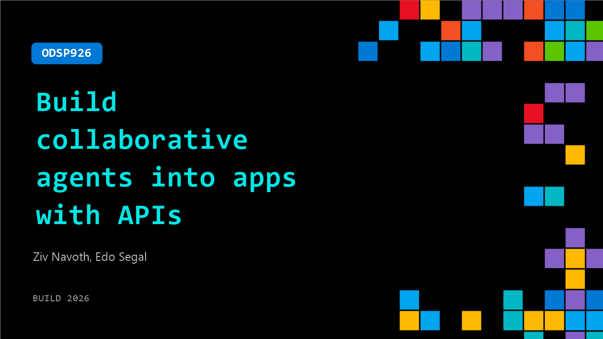

# ODSP926: Build collaborative agents into apps with APIs

**Session code:** ODSP926  
**Watch on-demand:** <https://build.microsoft.com/en-US/sessions/ODSP926>

---

## Speakers

- **Ziv Navoth** - Chief Product Officer, Napster
- **Edo Segal** - CTO, Napster

## About the session

PwC research found the top barrier to AI agent impact isn't the technology; it's connecting agents across applications and workflows to truly operate like coworkers. Most organizations deploy agents in isolation, then wonder why value stalls. This session explores how APIs serve as the relationship layer between AI models and encourage meaningful adoption, using Napster's Omniagent API as a working example of how to move agents from standalone tools to embedded, cross-functional collaborators.

## AI summary

**Introduction and Context:** At the beginning of the session (00:00:00–00:00:47), Edo Segal welcomes attendees to the Napster Companion API presentation, highlighting its purpose for developers interested in integrating video multimodal agents into their applications. He explains that previous challenges around deploying such intelligent, interactive systems stemmed largely from cost and complexity. After three years of optimization, the team has engineered a solution that drastically lowers operational costs while making deployment simple — so developers can add a video-based, human-like AI layer to their apps in just a day. Segal emphasizes that this innovation enhances user experiences and human connections at scale and notes that leading companies are already using these agents.

**Technical Architecture and Cost Efficiency:** Ziv Navoth takes over (00:00:51–00:03:04) and first addresses the critical issue of affordability. He reveals that the Omniagent API runs at merely one cent per render minute when developers use their own large language models — about twenty times cheaper than competing solutions. This enables real-time multimodal video agents to become viable production tools instead of costly prototypes. Navoth then outlines the Azure-native infrastructure supporting the API: an SDK using HTTPS and WebRTC via Azure’s Front Door load balancer, AKS-managed core pods, private endpoints, and scalable orchestration layers that connect to custom or provided Azure OpenAI deployments. Key benefits include single-bill Azure integration, retention of standard governance and security policies, and flexible support for multiple LLM providers. He highlights Siemens as a major adopter, with field technicians using voice and video interactions for equipment servicing and similar setups empowering training and customer support applications.

**Agent Creation and Configuration:** The next section (00:03:04–00:05:00) dives into the build process. Navoth explains that provisioning an Omniagent is straightforward — done directly from the Azure portal with no separate billing. Using the dashboard or REST API, developers can configure agents by assembling four modular elements: the Omniagent persona (face, voice, personality), knowledge (data and documents), FAQs (consistent responses), and tools (actions triggered on behalf of users). Together, these form the agent’s complete intelligence. Two creation options are shown: “New Omniagent” for a functional role-based digital persona or “New Digital Twin” for recreating a specific person’s likeness, voice, and style. Users can start from Napster’s library of stock personas or build entirely new characters. In this session, they demonstrate building “Vera,” a field service specialist, adding her photo and initializing her digital avatar before linking her datasets and operational assets.

**Live Example and Demonstration:** After defining Vera, the walkthrough continues (00:05:00–00:07:11) with live configuration steps. Knowledge bases containing manuals and diagnostic data are attached, FAQs for safety and service routines are extended, and new tools like customer lookup are added. The agent is then tested in the playground environment, where Vera interacts naturally with Marcus, a field technician. When Marcus reports compressor issues, Vera recalls prior service history, identifies a recurring high-pressure switch problem, and autonomously orders replacement parts and schedules follow-up inspection. This realistic demo illustrates Omniagent’s multimodal capacity — voice, video, context-aware reasoning, and integration with backend tools — functioning seamlessly within a dynamic workflow.

**Deployment Across Channels:** Once testing completes (00:07:11–00:08:49), Navoth details the deployment capabilities. Each agent operates across multiple user channels such as web, mobile, phone, and text. On the web, agents render through WebRTC to appear as embedded video concierges or sales assistants; in native apps, communication occurs via low-latency WebSocket voice streaming; and for telephony, the same logic handles SIP and VoIP calls, allowing continuous coverage — even after hours. Text-based exchanges integrate through messaging APIs with shared memory, meaning user sessions persist across mediums. Conversations begun on a website can continue seamlessly via phone or chat without users restating context. This unified continuity represents the Omniagent’s “Omni” characteristic — consistent behavior and memory synchronization wherever customer engagement occurs.

**Monitoring, Insights, and Closing Notes:** The final segment (00:08:49–00:09:59) introduces monitoring and auditing procedures. Every interaction across all channels is logged for inspection, showing transcripts, tool activity, memory events, and user identity — enabling full traceability and analytics. Teams can measure outcomes like resolved requests or executed actions, refine prompts, and redeploy improvements. Navoth concludes by summarizing three key takeaways: first, Omniagent is available now through Azure and can be spun up from the portal; second, the quickstart enables a running agent within 15 minutes using existing Azure OpenAI resources; and third, developers attending Microsoft Build can visit the team’s booth to co-create a “digital co-worker” in person. The video closes emphasizing the simplicity, scalability, and production-grade readiness of multimodal AI agents within modern enterprise environments.

## Session tags

- **Session type:** Pre-recorded
- **Level:** (300) Advanced
- **Topic:** Agents & apps
- **Tags:** AI, Azure, API, Agents, Foundry Agents, Developer Technologies
