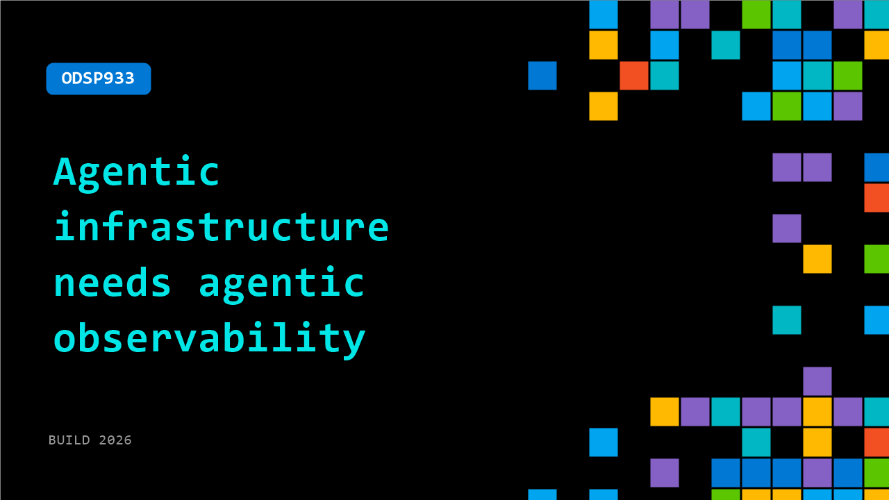

# ODSP933: Agentic infrastructure needs agentic observability

**Session code:** ODSP933  
**Watch on-demand:** <https://build.microsoft.com/en-US/sessions/ODSP933>

---

## Speakers

_Not listed._

## About the session

Observability pipelines were built for a world where engineers manually standardized logs, traces, and metrics. That model is breaking down as AI generates services and infrastructure faster than pipelines can keep up. Explore a new model where observability layers reason over telemetry and adapt as systems evolve. Agent-driven workflows continuously interpret and normalize data, raising new questions around guardrails, validation, and autonomy.

## AI summary

**Introduction – The End of Human-Centric Observability:** At the beginning of the talk 00:00:01–00:00:49, Jimmy Herbert introduces a fundamental shift in the world of software operations. He recalls how observability tools were historically designed for human operators to debug and understand systems through logs, traces, dashboards, and alerts. That model, he argues, is breaking down because the consumers of observability are no longer people but intelligent agents capable of writing and executing code autonomously. As he declares, “agentic infrastructure needs agentic observability,” marking the thematic foundation for the rest of his presentation. He clarifies that this is not a product pitch but a systemic diagnosis of what’s failing in traditional observability since AI entered the software lifecycle 00:00:49–00:01:20.

**Problem One – Logs and Understanding Agent Reasoning:** Herbert begins diagnosing the first major issue—logging. Traditional logs were designed for discrete, human-readable events like "request completed" or "database failed" 00:01:30–00:01:50. But intelligent agents generate something different: decision breadcrumbs, or as he terms it, "reasoning trails." These trails involve document retrievals, relevance scoring, retries, and contextual reevaluation, all across long time horizons 00:01:55–00:02:31. The challenge shifts from asking “what happened?” to “why did the agent decide this?” Current observability platforms aren’t designed to answer such questions because they assume deterministic systems with reconstructable narratives. In reality, similar inputs now yield different outcomes, and understanding the reasoning path has become more critical than tracking technical execution 00:02:45–00:03:10.

**Problem Two – Traces, Sampling, and the End of 200 OK:** The second major issue Herbert identifies concerns traces and sampling strategies. He explains that traditional application performance monitoring (APM) assumes a deterministic world; however, “sampling breaks and status codes lie” 00:03:14. A random trace from an agentic workflow provides little insight because crucial reasoning steps may be excluded. Tail-based sampling also fails, since retaining thousands of spans in memory is computationally unscalable 00:03:37–00:03:54. Herbert provocatively points out that a “200 OK means nothing” in this new world; it only confirms that nothing crashed, not that the outcome was correct 00:04:00–00:04:20. He describes how agents can hallucinate or misinterpret data despite producing successful infrastructure responses. Moreover, the explosion of telemetry from agentic systems threatens cost models and forces undesirable trade-offs between complete visibility and affordability 00:04:44–00:05:18.

**Problem Three – Sensitivity, Instrumentation, and Human Limits:** Moving into the third challenge 00:05:27–00:06:11, Herbert dives into the growing sensitivity of telemetry. Modern AI workloads embed prompts, personal data, and proprietary business logic within traces and logs. What once were technical artifacts now contain deeply private information, transforming telemetry into a liability rather than a cost item. Simultaneously, the practice of manual instrumentation collapses under the pace of AI-generated artifacts 00:06:08–00:06:22. He argues for observability that instruments itself automatically and can keep pace with systems evolving faster than humans. This leads to a stark realization: traditional observability engineering has been optimized around human cognitive limits—reducing data complexity, simplifying dashboards, and filtering noise—but these optimizations now constrain AI agents that thrive on more data, more context, and more completeness 00:06:42–00:07:11.

**Agentic Architecture – Rebuilding Observability:** Herbert then discusses how observability must evolve into an architecture designed for data abundance rather than scarcity 00:07:16–00:08:01. He introduces Groundcover’s approach, emphasizing three principles: BYOC (Bring Your Own Cloud) to keep sensitive data under customer control, zero instrumentation for low operational friction, and unified visibility for both human- and AI-written code 00:08:47–00:09:46. Central to this architecture is a separation between the model and the analytic engine. The LLM should handle understanding intent and orchestration, while deterministic back-end analytics handle computation 00:09:50–00:10:30. This division allows investigation to move from manual navigation to AI-driven goal-based diagnosis—agents can autonomously find the problem, explain what went wrong, and even initiate corrective actions 00:10:47–00:11:40.

**Conclusion – Observability as the Agentic Operating System:** In his closing remarks 00:12:06–00:14:00, Herbert raises governance concerns: how much autonomy should these observability agents have, who approves their interventions, and who holds accountability for automated fixes gone wrong? Despite the uncertainties, he predicts that companies mastering “agentic observability” will hold a structural advantage. The overarching principle—“AI cannot fix what it cannot see”—encapsulates his thesis. Observability, he concludes, is transforming into the operating system for the agentic software development lifecycle (SDLC). It will become not merely a passive monitoring layer but an active, intelligent participant in understanding and maintaining modern software systems—a necessary foundation for any AI-driven infrastructure to function effectively.

## Session tags

- **Session type:** Pre-recorded
- **Level:** (200) Intermediate
- **Topic:** Agents & apps
- **Tags:** AI, Observability, Agents, Agent Observability
