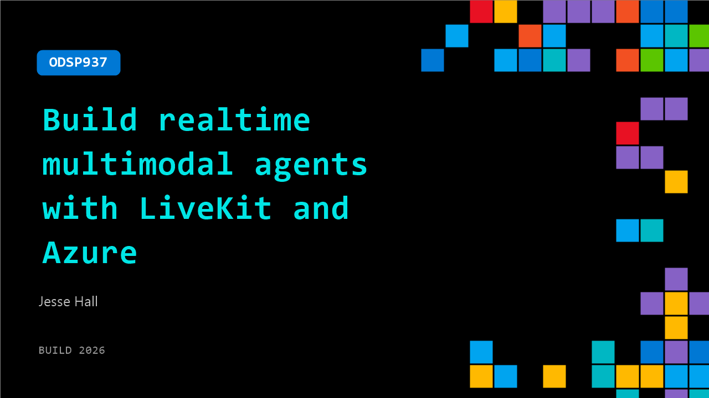

# ODSP937: Build realtime multimodal agents with LiveKit and Azure

**Session code:** ODSP937  
**Watch on-demand:** <https://build.microsoft.com/en-US/sessions/ODSP937>

---

## Speakers

- **Jesse Hall** - Staff Developer Advocate, LiveKit

## About the session

Multimodal agents demand low latency, network resilience, clean audio, and turn detection all at once. In this session Jesse Hall (Developer Advocate, LiveKit) walks through building a real-time voice agent end-to-end, using Azure's STT, LLM, and TTS models with LiveKit's real-time infrastructure. Get an in-depth look into how the stack fits together and watch the completed agent answer questions about Microsoft Build.

## AI summary

**Introduction to Real-Time Multimodal Agents:** The presentation opens with Jesse Hall introducing the concept of 00:00:00–00:00:05 real-time multimodal agents, distinguishing them from the single-modality text agents common today. He emphasizes that while latency in text-based systems is tolerable, it becomes critical in real-time interactions. The session’s focus is announced — exploring LiveKit, the cascaded pipeline, and how Azure integrates with LiveKit 00:00:27–00:00:37.

**Challenges in Building Real-Time Agentic Systems:** Jesse outlines several technical hurdles involved in constructing real-time multimodal agents 00:00:42–00:01:17. Although models have become easier to deploy, achieving low latency over uncontrolled networks is difficult. He details the steps of capturing the user’s voice, transmitting it, generating a reply, and returning audio within milliseconds. Considerations such as network conditions, voice activity and turn detection, interrupt management, and noise cancellation must all be optimized. Additionally, scalability is emphasized — the system should support potentially hundreds of thousands of concurrent users 00:01:52–00:02:00. Jesse stresses the importance of robust real-time media infrastructure and introduces WebRTC as a standard enabling low-latency communication 00:02:13–00:02:21.

**Introducing LiveKit and Its Architecture:** The speaker explains how LiveKit simplifies the complexity of real-time communication by providing an open-source media layer built on WebRTC 00:02:24–00:02:31. It supports not only voice but also video and data transfer, with SDKs available in Python and TypeScript, enabling agents to function across diverse devices — from phones and laptops to embedded systems and robotics 00:02:38–00:02:55. He notes that LiveKit is the transport layer utilized by ChatGPT’s voice mode 00:03:02. The foundational concept of the voice or “cascaded” pipeline is then introduced: speech passes through voice activity detection (VAD), speech-to-text, large language model processing, and text-to-speech conversion before returning to the user 00:03:04–00:03:42.

**LiveKit Infrastructure and Model Agnosticism:** Jesse provides a detailed walkthrough of the LiveKit architecture, showing how the client connects via WebRTC to the LiveKit server that handles real-time transport 00:03:48–00:04:11. Above this is the application layer containing the agent’s SDK, which links media to the models and custom business logic 00:04:20–00:04:42. LiveKit itself is model agnostic, allowing interchangeable use of various components for speech recognition (STT), large language processing (LLM), and voice synthesis (TTS) 00:05:05–00:05:26. This flexibility makes integration with Azure straightforward — developers can choose Azure’s STT, OpenAI through Azure for the LLM, and Azure’s TTS 00:05:30–00:05:41.

**Development Workflow and Best Practices:** Jesse emphasizes leveraging LiveKit’s MCP documentation server to access current and accurate resources for agent development 00:05:47–00:06:16. He explains that new updates are shipped weekly, so staying synced with documentation is crucial. Moving into a live demo 00:06:17, he demonstrates how to create a new agent through the terminal using the AgentStarterPython template and a ReactStarter template for the front-end 00:06:28–00:06:38. The setup involves creating the Agent.py file, importing LiveKit and Azure plugins, defining assistant behavior, greetings, VAD, and assigning session identifiers for front-end connectivity 00:06:41–00:07:56. Necessary environment variables from LiveKit Cloud and Azure are added to configure models, after which the agent is executed using simple commands 00:08:26–00:09:01.

**Demo Interaction and Conclusion:** The presentation concludes with a live voice interaction 00:09:10 between Jesse and the AI assistant. The synthesized computer voice greets attendees at Microsoft Build and lists technologies it can discuss, including Azure, Windows, Microsoft 365, GitHub, and AI projects 00:09:11–00:09:23. When Jesse asks about event dates, the agent accurately replies that Microsoft Build 2026 will be held June 2–3 in San Francisco, also available online 00:09:32–00:09:46. Jesse wraps up by encouraging experimentation with integrating Azure and LiveKit, highlighting how easily this real-time multimodal communication setup can be implemented and scaled 00:09:49–00:09:54.

## Session tags

- **Session type:** Pre-recorded
- **Level:** (300) Advanced
- **Topic:** Agents & apps
- **Tags:** AI, Azure, Agents, Developer
