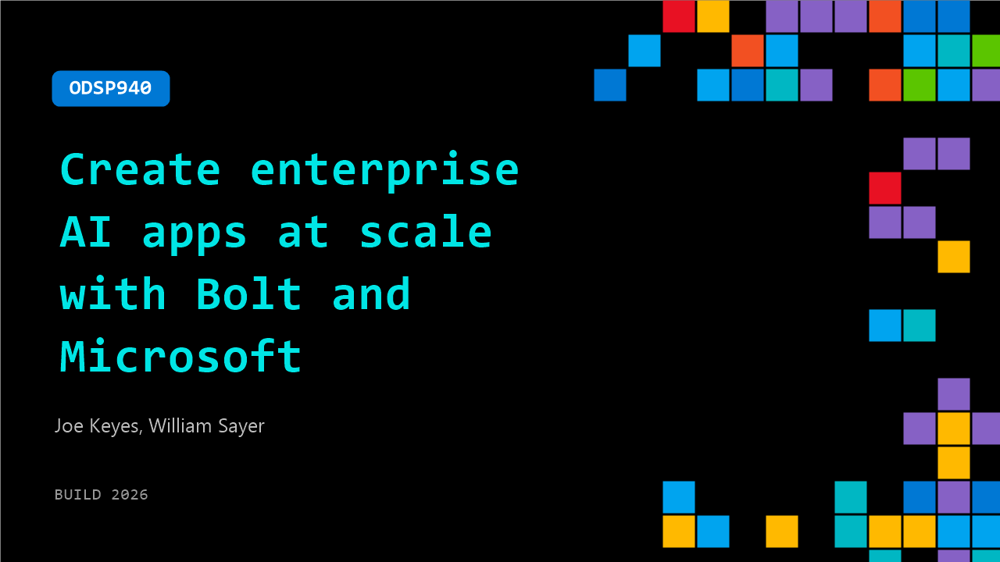

# ODSP940: Create enterprise AI apps at scale with Bolt and Microsoft

**Session code:** ODSP940  
**Watch on-demand:** <https://build.microsoft.com/en-US/sessions/ODSP940>

---

## Speakers

- **Joe Keyes** - Principal Solutions Engineer, Stackblitz
- **William Sayer** - Customer Enablement Lead, Stackblitz

## About the session

AI-powered app creation is changing what teams can build, but speed alone isn’t enough for the enterprise. See how Bolt integrates with Microsoft tools to move from context and conversation to secure, production-ready applications. Learn how to establish shared design systems, define approved assets and environments, and enable teams to iterate and ship features within governance guardrails—accelerating delivery without sacrificing security or code quality.

## AI summary

**Introduction and Vision:** At the start of the video 00:00:02–00:00:16, Will from Bolt introduces the purpose of the session—exploring how Bolt integrates with Microsoft workflows to transform ideas into secure, production-ready applications. He explains that prompt-driven development has empowered creators like designers and product managers to rapidly move from descriptions to functioning prototypes. However, as Will notes 00:00:35–00:01:13, enterprise teams need more than speed: they require governance, integration with established apps, and developer oversight. Bolt's collaboration with Microsoft addresses this, ensuring AI-generated apps fit within existing cloud environments, workflows, and security frameworks.

**Enterprise Integration and Feature Overview:** Will elaborates 00:01:37–00:01:55 on how Bolt operates within trusted Microsoft ecosystems such as Azure and Microsoft 365, enabling teams to create applications consistent with organizational standards. The generated code can be reviewed and extended before deployment. He emphasizes that developers remain in control of templates, environments, and deployment paths while non-developers benefit from Bolt’s rapid creation capabilities. The demo will cover three main components: organizational design systems, the Bolt Command Line Interface (CLI), and the Bolt Interface 00:02:33–00:03:12. Each enables different parts of a team to move faster while maintaining governance and consistency.

**Copilot and Bolt Collaboration Demo:** The video demonstrates how application creation begins before opening Bolt 00:03:34–00:06:27. Starting in Microsoft Copilot, Will shows how a team transforms a conversation or idea for a travel website template into a structured project brief. Copilot generates layout suggestions, SEO elements, and design goals, then passes the prompt directly to Bolt. When Bolt builds the project, it automatically creates a front-end template with hero carousel, SEO optimizations, and image-based layouts. Through interactive tagging of the Bolt Agent, Will demonstrates iterative collaboration, including modifying the layout to emphasize destination photos. This flow—linking Copilot planning and Bolt execution—ensures continuous context without lost requirements or mismatched specifications.

**Developer Workflow and Design System Creation:** Joe takes over 00:06:36–00:12:01 to showcase Bolt from the developer’s perspective. Working in Visual Studio Code, he demonstrates how Bolt CLI allows developers to bundle existing component libraries and create organizational design systems. Using commands in Copilot, Joe builds and publishes a design system within Bolt, enabling teams to reuse approved components when generating new apps. He opens the resulting Storybook instance which visualizes reusable front-end components. Next, he uses his preloaded design system to prompt Bolt to build a travel destinations landing page, showing automatic code generation, dependency bundling through package.json, and potential integration with private NPM registries. The objective, Joe emphasizes, is to let teams build governed applications using shared assets while retaining code quality and oversight.

**Collaborative Enhancements and Advanced Functionality:** Will resumes 00:12:02–00:14:14 to show how Bolt simplifies teamwork and feature expansion. Through shared project URLs and live agent chat, multiple users can comment and queue fixes in real time. To demonstrate, he prompts Bolt to add user authentication and a trip planning modal using prebuilt components. The agent builds a secure email login system synced to a database and modal interface. Extending functionality further, Will creates a server function integrated with the OpenAI GPT‑5 model: when users input travel details and click “Save Trip,” Bolt generates an itinerary dynamically. Secrets and API keys are handled securely inside Bolt’s management settings. The workflow illustrates how both developers and creators can augment applications instantly while maintaining governance and secure processes.

**Conclusion and Organizational Impact:** Wrapping up 00:14:44–00:15:27, Will publishes the completed site with inbuilt database scanning, ensuring no vulnerabilities before live deployment. He summarizes the session’s lessons: organizations can use Bolt’s design systems, CLI, and interface to build apps more efficiently and securely. With the combined strengths of Microsoft 365 and Azure powering Bolt, enterprises now have a streamlined method to bring contextual data, validated environments, and scalable infrastructure into every application they create. Bolt accelerates ideation while preserving governance and quality, showcasing a unified future for AI-assisted enterprise software development.

## Session tags

- **Session type:** Pre-recorded
- **Level:** (200) Intermediate
- **Topic:** Agents & apps
- **Tags:** AI, Azure, Agents, Developer
