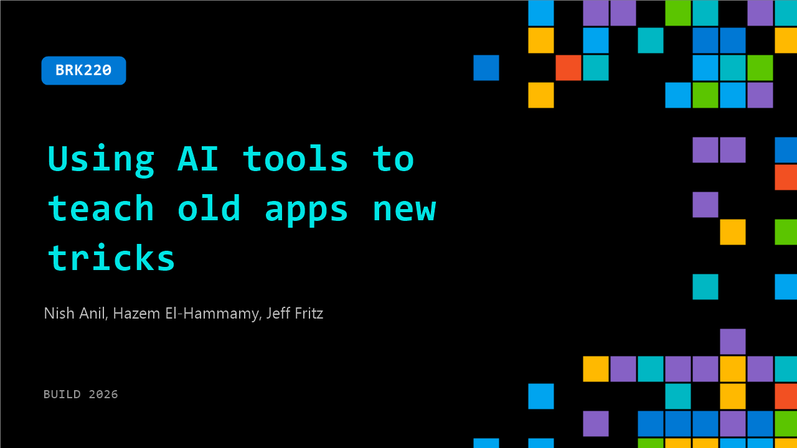

# BRK220: Using AI tools to teach old apps new tricks

**Session code:** BRK220  
**Date:** Wednesday, June 3, 2026 / 9:00 AM - 9:45 AM PDT (Duration 45 minutes)  
**Watch on-demand:** <https://build.microsoft.com/en-US/sessions/BRK220>

---

## Speakers

- **Nish Anil** - Principal Product Manager, Microsoft
- **Hazem El-Hammamy** - Senior Technical Program Manager, Microsoft
- **Jeff Fritz** - Principal Program Manager, Microsoft

## About the session

Modernizing apps isn’t just rewriting code—it’s untangling dependencies, tracing data flows, and making changes without breaking production. In this session, we’ll show how you can use agentic AI to take on the hardest parts of modernization: analyzing large codebases, mapping dependencies, planning upgrades, refactoring safely, while doing it all at scale. With GitHub Copilot modernization capabilities, you can move from legacy complexity to modernized apps in days, not months.

Seating for this session is first-come, first-served. Add it to your schedule to plan your day and arrive early to secure a spot.

## AI summary

AI is transforming application modernization by reducing manual work in upgrades, migrations, refactoring, and security improvements. Modernization is a major priority for IT leaders, with the document citing that 94% of IT leaders view app modernization as a top investment area. Successful modernization requires three core pillars: scale, customization, and governance. Azure Copilot and GitHub Copilot together provide an end-to-end modernization solution, connecting IT planning with developer execution. Azure Copilot supports estate-wide modernization planning, including app discovery, dependency mapping, ROI analysis, and migration wave planning. GitHub Copilot Modernization helps developers with code assessments, framework upgrades, migration planning, refactoring, replatforming, and execution within tools like VS Code and CLI. The platform supports many legacy and modern technologies, including .NET, Java, Windows, Linux, VMware, Oracle, SQL Server, Sybase, and mainframe systems. Mainframe modernization can reverse-engineer COBOL/JCL applications into documentation, architecture, business logic, and data mappings, then transform them into modern Java applications. Custom skills, rule books, and command center features let organizations apply their own standards, governance policies, reusable patterns, and portfolio-level oversight. A major benefit is parallel AI agents working across multiple applications at once, leading to significant reductions in modernization time and effort.

## Session tags

- **Session type:** Breakout
- **Level:** (300) Advanced
- **Topic:** Cloud platform & data
- **Tags:** App Mod, CP&D, Reserve
- **Location:** Festival Pavilion, Breakout 1
