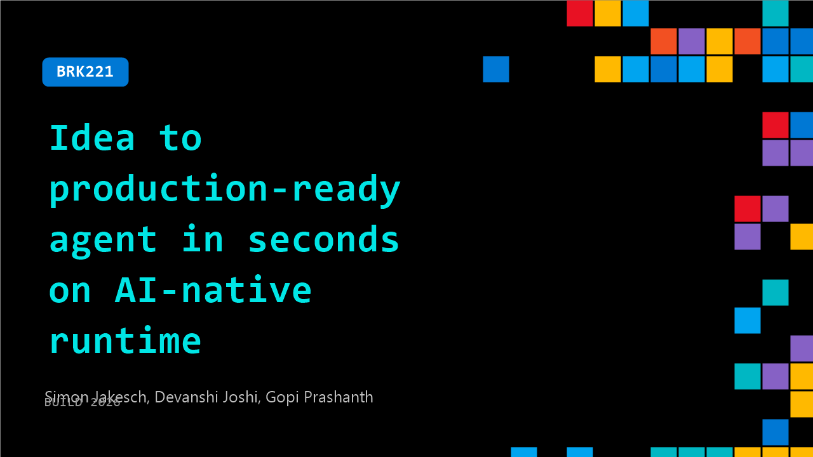

# BRK221: Idea to production-ready agent in seconds on AI-native runtime

**Session code:** BRK221  
**Date:** Wednesday, June 3, 2026 / 2:45 PM - 3:30 PM PDT (Duration 45 minutes)  
**Watch on-demand:** <https://build.microsoft.com/en-US/sessions/BRK221>

---

## Speakers

- **Simon Jakesch** - Product Manager & Token Churner, Microsoft
- **Devanshi Joshi** - Senior Product Marketing Manager, Microsoft
- **Gopi Prashanth** - Chief Scientist, Auger

## About the session

Agentic apps behave differently from traditional services. They make decisions, coordinate steps, and react to changing inputs. This session shows how to run agentic workloads on a fast, AI native runtime on Azure Container Apps. The focus is on reliability and speed so you can move from idea to production‑ready agents. We’ll cover patterns for deployment, configuration, safe scaling for bursty traffic, and observability so teams can run agentic systems in production without surprises.

Seating for this session is first-come, first-served. Add it to your schedule to plan your day and arrive early to secure a spot.

## AI summary

**Session Introduction and Overview:** The presentation opens with the host greeting the audience and setting the stage for the Microsoft Build event, emphasizing the energetic tone and inviting participation (00:00:00–00:00:23). Product Marketing Manager Devanshi Joshi introduces herself and the session's goal: demonstrating how to put AI agents into production within seconds using Azure Container Apps on an AI-native runtime (00:00:35–01:00). She is joined by Simon from the Microsoft product team and Gopi, a customer from Augur. The session outline highlights why agent deployments often fail, a hands-on demo of building from scratch, and how Azure Container Apps streamlines runtime decisions from infrastructure through optimization.

**Runtime Challenges and Key Requirements:** Devanshi discusses the common pitfalls in agentic AI projects, noting Gartner’s prediction that over 40% may be canceled by 2027 due to runtime—not model—issues (00:02:03). She outlines five critical runtime demands: cost control for runaway agent loops, security isolation to avoid untrusted code exposure, sub-second cold start performance, persistence for long-running agents, and seamless environment stitching (00:02:52–00:07:12). Each of these specifications represents a foundational expectation for modern agent runtimes, ensuring reliability across development and production. Her explanation sets the stage for Simon’s live demonstration of how Azure Container Apps delivers these runtime assurances at production scale.

**Live Demonstration of Azure Container Apps and Sandboxes:** Simon takes over to conduct a technical demo showcasing Azure Container Apps’ serverless scalability, sandboxing, and GPU flexibility (00:07:51–00:08:39). He shows multi-agent orchestration involving speech and text models, introducing three sandboxed agents—Aria, Nova, and an SRE agent—that communicate in real time via browser and voice connections. Through several interactions, he demonstrates Aria building a Tic Tac Toe game on port 80 (00:11:22–00:14:35), Nova retrieving meeting schedules and Teams messages, and the SRE agent monitoring infrastructure health. The demo validates cold start under 100 milliseconds, sandbox persistence, connector inheritance, and strong network isolation—key architectural features of Azure Container Apps sandboxes in public preview.

**Technical Deep Dive and Feature Expansion:** Simon further illustrates how sandboxes are organized into groups with connectors, volumes, and snapshots, demonstrating fast resume behavior and persistent memory capture (00:17:22–00:23:00). He quickly generates new sandboxes using preset templates, authenticates securely via GitHub tokens, and shows how Nova’s connectors inherit access to calendars and Teams without manual configuration. Persistent snapshots enable duplication and fast restoration of sandbox states for agent continuity. The sandbox experience concludes with a voice gateway connection example leveraging Twilio integrated with Azure Container Apps, linking AI agents to real-time communication scenarios (00:24:00–00:25:01).

**Product Announcements and Customer Use Cases:** Transitioning back, Devanshi announces Azure Container Apps Sandboxes and Container Apps Express as a fast, isolated compute infrastructure executing workloads securely by default (00:27:00–00:29:00). She explains how these capabilities support use cases across industries—from education technology environments to multi-tenant AI platforms—showcasing Sitecore AI and EdTech deployments. Gopi from Augur then presents how Augur is building autonomous supply chains using thousands of agents running on Azure Container Apps (00:31:00–00:40:30). He details Augur’s architecture: contextual agentic data integration across distributed systems, use of ACA to orchestrate real-time simulation pipelines, and augmentation through a unified world model called OSCO for scalable reasoning across enterprise supply chains.

**Closing Insights and Q&A:** Devanshi concludes the session summarizing that container apps and sandboxes are transforming AI agent production pipelines, now available in public preview (00:41:12). She notes Microsoft’s own adoption of these runtimes for technologies like GitHub Copilot, Foundry, and other Azure services. Attendees are directed to official product blogs and repositories for hands-on resources and code access. The presentation ends with audience questions clarifying the distinction between Container Apps Express and Sandboxes, and Gopi elaborating on OSCO’s design as an object-oriented world model embedded in Augur’s codebase (00:42:40–00:45:10). The speakers thank participants and close the Build session on an enthusiastic note, inviting further experimentation with Azure’s agent-focused compute innovations.

## Session tags

- **Session type:** Breakout
- **Level:** (300) Advanced
- **Topic:** Cloud platform & data
- **Tags:** App Mod, CP&D, Reserve
- **Location:** Building B, Level 3, BATS Improv
