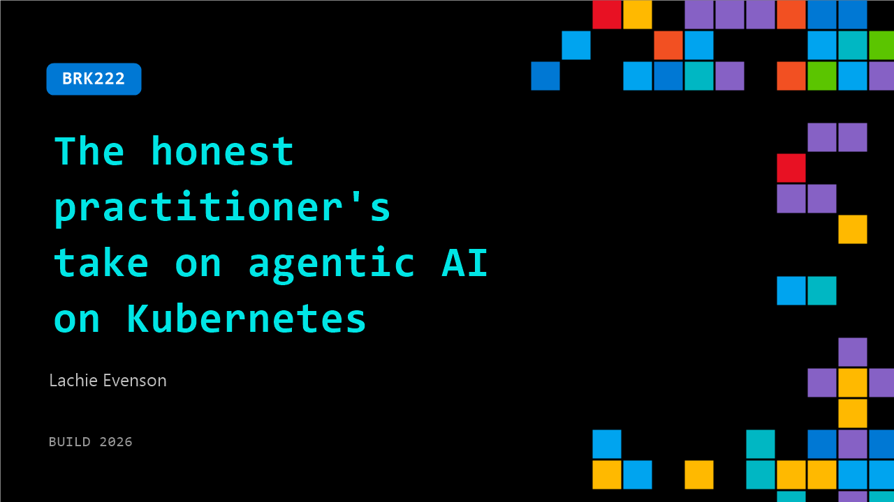

# BRK222: The honest practitioner's take on agentic AI on Kubernetes

**Session code:** BRK222  
**Date:** Tuesday, June 2, 2026 / 5:00 PM - 5:45 PM PDT (Duration 45 minutes)  
**Watch on-demand:** <https://build.microsoft.com/en-US/sessions/BRK222>

---

## Speakers

- **Lachie Evenson** - Principal Product Manager - Azure Cloud Native Ecosytem, Microsoft

## About the session

Agentic AI workloads don't behave like normal services. They're stateful, bursty, multi-step, and often span more than a single cluster. Most teams figure this out the hard way. This session is for developers building agentic AI in production. We'll show you how to get the most out of Kubernetes for training, inference, and agent orchestration, covering purpose-built tooling, managed options, open-source inference at scale, and AI-assisted dev tools that support real-world AI operations.

Seating for this session is first-come, first-served. Add it to your schedule to plan your day and arrive early to secure a spot.

## AI summary

**Opening and Session Overview:** Lachlan Evenson greets the audience with high energy at 00:00:02 and introduces the session titled "The Honest Practitioner's Take on Agentic AI on Kubernetes." He shares his decade of experience with Kubernetes and sets expectations for a 45-minute journey covering three main parts: understanding why Kubernetes is a foundation for AI workloads, identifying what works and what’s challenging, and exploring future directions in agentic AI systems. He aims to provide tactical insights, demos, and templates attendees can take back to their teams. Before diving into technical content, Lachlan recounts the excitement he felt achieving scale with containers and compares that to his current enthusiasm for agentic AI systems running on Kubernetes—a new frontier of creative possibility 00:01:30–00:02:20.

**Why Kubernetes for AI and Understanding the Trade-offs:** Beginning at 00:03:37, Lachlan explores why Kubernetes is often the right substrate for AI at scale. He contrasts fully managed AI platforms like Microsoft Foundry with self-managed Kubernetes setups on AKS, noting trade-offs between control and complexity. Managed platforms offer speed and simplicity, while Kubernetes provides openness, composability, and granular tuning—ideal for organizations requiring cost transparency, sovereignty, and multi-cloud flexibility. He compares AI workload needs to a "project management iron triangle" of quality, speed, and cost 00:06:01–00:07:34, elaborating that Kubernetes allows fine-tuning of these priorities. However, with that flexibility comes operational overhead, which AI systems can potentially help manage. Finally, he defines different workload profiles—from teams requiring composability at scale to platform engineers prioritizing open governance—and details how Kubernetes primitives like namespaces, GPU scheduling, and declarative management empower AI development 00:08:00–00:10:00.

**The AI Stack: From Inference to Training to Agentic Systems:** From 00:10:49 onward, Lachlan breaks down AI workloads into three categories—inference, training, and agentic systems—and how each fits onto Kubernetes. Inference workloads are short-lived and latency-sensitive, training jobs are long-running and throughput-bound, while agentic systems require stateful, multi-modal, long-context coordination. Kubernetes provides the base for all, but needs additional orchestration layers for scheduling, GPU utilization, scaling, and durable state management. At 00:14:24, he transitions into a layered model of the AI-on-Kubernetes stack, starting from the substrate and moving up to inference and serving with KAITO and AI Runway, then training and fine-tuning with Ray and Anyscale, and ending with agentic orchestration. The first product deep dive focuses on AI Runway and KAITO: AI Runway offers a Kubernetes-native interface for one-click model deployment; KAITO automates operational tuning and scaling. A live demo later (00:19:35–00:23:12) shows user Ralph deploying massive models like DeepSeek-R1, demonstrating automatic GPU fitting, cost estimation, and dynamic scaling—all accessible through an OpenAI-compatible API endpoint.

**Training, Fine-tuning, and the Role of Ray and Anyscale:** Starting at 00:23:32, the discussion shifts to training and fine-tuning. Lachlan introduces Ray, a distributed computation framework that complements AKS by providing distributed job scheduling, multi-node orchestration, and GPU partitioning. He announces the public preview of "Anyscale on Azure" (00:25:15), a managed Ray service jointly developed with Anyscale, integrated with Azure’s identity and billing ecosystem. Demonstrating how users can create, authenticate, and manage clusters entirely within the Azure portal, he showcases a full notebook-to-production pipeline where a product catalog model is fine-tuned using Ray, metrics are visualized, and deployment endpoints are automatically generated. This workflow reduces months of setup to minutes, illustrating Kubernetes’ and Ray’s synergy for production-ready AI training pipelines. Observability is built-in, ensuring teams maintain full visibility into GPU utilization and job dependencies across nodes 00:34:20–00:35:04.

**Agentic Systems and the Kubernetes Agent Reference Stack:** From 00:35:06, Lachlan dives into orchestrating AI agents—autonomous, multi-tool systems that extend automation beyond model serving. Using Skills, MCP, and OpenClaw as core examples, he explains that “skills” are reusable actions agents perform within a permissions framework, while MCP standardizes communication between agents and tools. Microsoft’s release of an AKS MCP server allows natural-language operations on Kubernetes, such as provisioning clusters directly via LLM interfaces. The newly released Kubernetes Agent Reference Stack (KARS) provides a sandboxed, secure environment for agent experimentation, leveraging Azure Linux, namespaces, and RBAC for isolation. A short demo (00:38:50–00:41:12) shows how users can launch OpenClaw—an open multi-agent orchestrator—on Kubernetes in minutes, establishing skills, security controls, and live conversational capabilities within the cluster.

**Announcements, Real-World Cases, and Closing Takeaways:** Near 00:42:12, Lachlan announces new AKS features: Automatic node pools for simplified scaling, Azure Container Linux for secure, minimal OS footprints, AKS on bare metal for virtualization-free performance, and Fleet for managing multi-cluster topologies. Real-world examples include the Royal Bank of Canada using KAITO in production to securely serve AI models with compliance boundaries, and Wayve using Anyscale on AKS to train autonomous driving systems that generalize globally. Internally, Microsoft also employs “AKS Claw,” an agentic SRE assistant, to assist engineers with operational troubleshooting. Lachlan concludes at 00:49:15 with actionable guidance: start with Kubernetes as the base, add an agent layer via MCP and OpenClaw, mix managed and open-source tools like KAITO and Ray appropriately, and prepare for multi-cluster scaling using Fleet. He ends by thanking the audience, encouraging feedback, and expressing genuine excitement to see what practitioners build next in the evolving space of agentic AI atop Kubernetes.

## Session tags

- **Session type:** Breakout
- **Level:** (300) Advanced
- **Topic:** Cloud platform & data
- **Tags:** Azure Kubernetes Service (AKS)​​, CP&D
- **Location:** Festival Pavilion, Breakout 1
