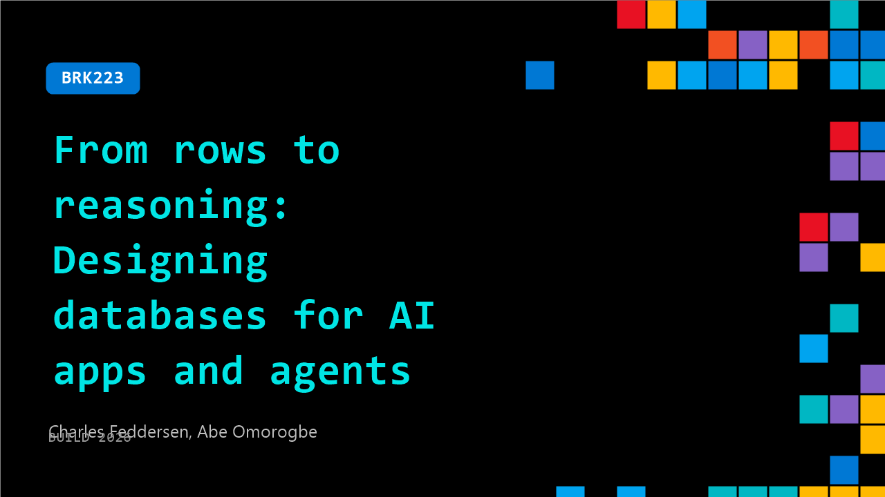

# BRK223: From rows to reasoning: Designing databases for AI apps and agents

**Session code:** BRK223  
**Date:** Tuesday, June 2, 2026 / 2:30 PM - 3:15 PM PDT (Duration 45 minutes)  
**Watch on-demand:** <https://build.microsoft.com/en-US/sessions/BRK223>

---

## Speakers

- **Charles Feddersen** - Partner Director of Program Management, Microsoft
- **Abe Omorogbe** - Product Manager, Microsoft

## About the session

AI applications and agents require data platforms designed for reasoning, not just transactions. Traditional architectures force developers to stitch data systems together, adding latency and complexity. In this demo‑rich session, we’ll show the latest innovations in SQL Database and Cosmos DB, then build an app on Azure HorizonDB, Azure’s new cloud‑native PostgreSQL service, to show how AI apps built directly in the database simplifies design and enables reasoning over operational data.

Seating for this session is first-come, first-served. Add it to your schedule to plan your day and arrive early to secure a spot.

## AI summary

_No AI summary available._

## Session tags

- **Session type:** Breakout
- **Level:** (300) Advanced
- **Topic:** Cloud platform & data
- **Tags:** Azure SQL, Azure Database for PostgreSQL, Azure Cosmos DB, CP&D, Data, Azure HorizonDB
- **Location:** Festival Pavilion, Breakout 2
