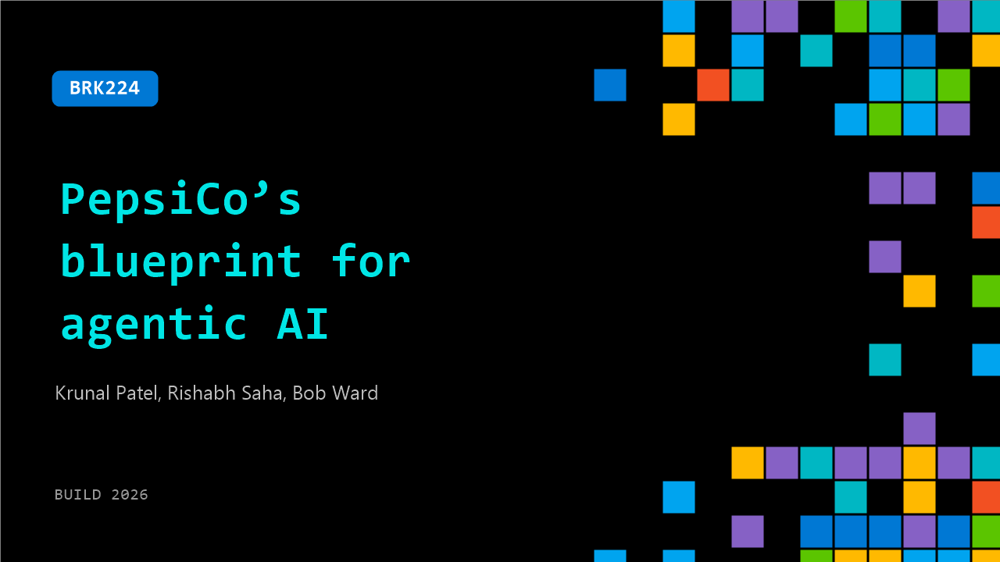

# BRK224: PepsiCo’s blueprint for agentic AI

**Session code:** BRK224  
**Date:** Wednesday, June 3, 2026 / 2:45 PM - 3:30 PM PDT (Duration 45 minutes)  
**Watch on-demand:** <https://build.microsoft.com/en-US/sessions/BRK224>

---

## Speakers

- **Krunal Patel** - Sr Manager AI solutions and Platform, PepsiCo
- **Rishabh Saha** - Chief Architect, Microsoft
- **Bob Ward** - Principal Architect, Microsoft

## About the session

Learn from Microsoft and PepsiCo engineers who modernized PepsiCo’s data foundation for agentic applications using Azure SQL, Cosmos DB, PostgreSQL, and Azure Databricks. Discover a practical build path for agentic RAG architecture, leveraging Azure SQL features like vector indexing and semantic search, to streamline app development and enable faster, repeatable patterns. Refresh your own data layer to reduce app development cycles while leveraging modern, repeatable patterns to ship faster.

Seating for this session is first-come, first-served. Add it to your schedule to plan your day and arrive early to secure a spot.

## AI summary

**Introduction and Context:** The session opens at 00:00:01 with Bob Ward welcoming attendees to Microsoft Build and reflecting on the array of new technologies showcased, especially around AI and data. He emphasizes the real value in seeing customers succeed with technological solutions. Bob introduces himself as a Principal Architect on the Azure Data team and outlines the focus of the presentation — a collaboration between Microsoft and PepsiCo to develop an AI-driven data solution. Before bringing PepsiCo representatives on stage, Bob discusses the foundational need for proper data infrastructure in AI projects, referencing Gartner studies at 00:00:40 that show AI initiatives often fail without high-quality, secure data. He illustrates the common “starting line” scenario of fragmented, siloed data and vendor sprawl, explaining how unified lakehouse architectures powered by Microsoft Fabric and Azure Databricks can lead organizations toward “data nirvana” with integrated governance, security, and AI readiness.

**Data Modernization and AI Readiness:** Continuing at 00:02:49, Bob describes the journey companies must take to unify their data. He explains that platforms like Microsoft Fabric and Databricks simplify the process of integrating data and making it AI-ready, emphasizing that curated, secure, high-quality data is essential. He outlines stages of extending AI use — from unified data to fine-tuned models to various deployment scenarios, including edge solutions using Foundry Local. As the presentation transitions, Bob showcases Azure database offerings at 00:05:17, describing SQL Hyperscale, PostgreSQL, Cosmos DB, and Horizon DB, highlighting their scalability, transactional integrity, and integrated vector search capabilities for AI. These tools together lay the foundation for PepsiCo’s innovations in data and AI integration before bringing the PepsiCo case study to the stage.

**PepsiCo’s Scale and Foundations for AI Transformation:** At 00:07:10, Rishab Saha from Microsoft and Krunal Patel from PepsiCo begin their presentation, starting with PepsiCo’s immense operational scale and the complexity that accompanies global data. They introduce the central challenge faced by key account managers (Cams): fragmented information across numerous systems and reports, described vividly between 00:09:04–00:10:00. Krunal imagines a world with unified, intelligent workflows and learning systems that evolve without continuous manual data input. The discussion moves to PepsiCo’s Enterprise Data Foundation (EDF), a robust governed data layer ensuring consistency, harmonization, and standardization across markets. Rishab explains EDF’s critical role in transforming data for dashboards into data for AI agents, supporting connected knowledge graphs and intelligent agents capable of reasoning and acting autonomously.

**Agent Architecture and Demonstrations:** The session deepens between 00:17:05–00:25:04 with examples of PepsiCo’s Cam 360 agent system. Using a persona named Priya, the presenters illustrate how multiple agents — orchestrator, analyst, tactical, lifecycle tracking, best practices, and conversational debrief agents — assist a human account manager. Each agent has distinct roles, from crunching data to maintaining account lifecycles. The data analyst (NERD) agent demo showcases a text-to-SQL translation pipeline built on Databricks and Genie, using Unity Catalog for access control and high-confidence query paths derived from real-user interactions. Krunal explains authentication layers, SQL generation, golden datasets, and observability mechanisms ensuring governance and accuracy. This section highlights how PepsiCo combined Microsoft technologies — LangSmith, Fabric, and Databricks — to create secure, automated data workflows that respond intelligently to natural language queries.

**From Preparation to Learning: Tracking and Compound Intelligence:** Between 00:27:32–00:36:00, Rishab introduces the tracking agent and explains how it transforms individual knowledge into institutional memory using Foundry IQ and Cosmos DB for learning signals and configurable categories. The fact builder agent consolidates these signals and knowledge bases into reliable facts, generating summaries with confidence scores and contextual data. The tracking agent interface allows users to instantly review prior interactions or customer histories through conversational queries while telemetry ensures real-time observability. This system embodies “compounding intelligence”—each meeting and debrief builds on previous insights, improving future decisions and capturing tribal knowledge into structured enterprise intelligence. Priya’s workflow now evolves from manual preparation to intelligent, automated understanding, saving time and increasing strategic focus.

**Key Lessons and Blueprint for Enterprise AI:** The final segment at 00:37:03–00:41:27 reviews lessons learned. Rishab and Krunal advise starting small, ensuring domain experts help validate data quality, and investing deeply in foundational data architecture before scaling agents. They reflect on how once initial agents were built, subsequent ones were far quicker due to solid foundations. They conclude with a blueprint for enterprise AI — secure infrastructure, unified and governed data, AI platforms ready with chosen models, and seamless user interaction layers. The PepsiCo example becomes a scalable model for any enterprise undergoing AI transformation. Closing at 00:41:15, they revisit Priya’s workflow: preparing for customers now takes minutes instead of hours, freeing teams to focus on strategy and relationships. The presenters affirm that AI’s role is not to replace people but to give time back so they can think, innovate, and be human.

## Session tags

- **Session type:** Breakout
- **Level:** (200) Intermediate
- **Topic:** Cloud platform & data
- **Tags:** Azure SQL, Azure Database for PostgreSQL, Azure Cosmos DB, CP&D, Data
- **Location:** Gateway Pavilion, Level 1, Cowell Theater
