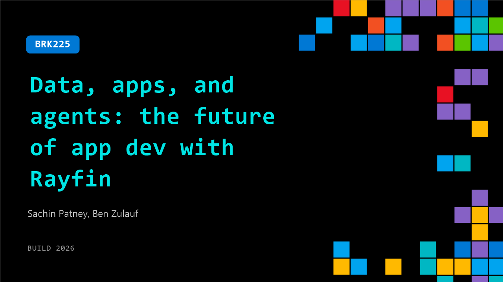

# BRK225: Data, apps, and agents: the future of app dev with Rayfin

**Session code:** BRK225  
**Date:** Wednesday, June 3, 2026 / 1:30 PM - 2:15 PM PDT (Duration 45 minutes)  
**Watch on-demand:** <https://build.microsoft.com/en-US/sessions/BRK225>

---

## Speakers

- **Sachin Patney** - General Manager, Microsoft
- **Ben Zulauf** - Principal PM Architect, Microsoft

## About the session

Apps are coming to the data platform. With Rayfin, your entire backend is expressed in code—and Rayfin translates it into the services it needs: databases, functions, and more. Write the code yourself, or describe your app and let agents generate it for you. Either way, deploy with the CLI as a secure, scalable solution. With native access to Fabric data, analytics, and AI, Rayfin eliminates backend stitching so teams move from idea to impact faster.

Seating for this session is first-come, first-served. Add it to your schedule to plan your day and arrive early to secure a spot.

## AI summary

**Introduction and Vision of Agentic Coding:** The session begins with Ben and Sachin welcoming the audience and introducing the concept of the future of app development with Raefen 00:00:00. Ben discusses how agentic coding is democratizing application development, sharing a story about his friend Brent who, without being a software engineer, started creating functional apps for his daughters’ soccer team using agentic tools 00:00:23–00:00:48. He emphasizes that such tools empower new makers while transforming professional developers into “super makers.” However, when moving from simple personal apps to enterprise-grade systems, issues like governance, authentication, and compliance emerge, highlighting the need for a more robust backend solution that bridges creativity with enterprise standards.

**Introducing Raefen – The AI Coding Backend:** Addressing these gaps, Ben introduces Raefen as a backend framework for the AI coding era 00:02:34. He explains how Raefen allows both humans and AI agents to define backend architecture in code through an SDK and CLI—covering databases, functions, storage, and access policies 00:02:49. Deployments to Microsoft Fabric require only a single command, automatically incorporating enterprise-level security and compliance. Ben then transitions to a demo scenario of “Zaba,” a home improvement retailer launching a new home delivery service 00:03:34. Using simple terminal commands, he scaffolds a frontend and backend simultaneously, sets up templates, provisions cloud resources, and connects them to Fabric. The demonstration shows rapid creation and deployment of a functional delivery app including driver workflow, confirmation signing, and real-time data recording in SQL databases 00:05:00–00:07:08.

**Deep Dive into Raefen’s Architecture:** Sachin then takes over to explain how Raefen works under the hood 00:08:07. He showcases how developers define entities, data models, and security policies directly within their code using decorators that translate into database schemas and constraints. Changes to code automatically trigger managed migrations, eliminating manual intervention. Sachin also outlines configuration details using YAML files where developers can specify SQL dialects—currently Microsoft SQL, with Postgres support planned 00:10:05. He introduces features like shared backends for multiple apps, flexible authentication options that will eventually include Gmail-style or anonymous access, and the ability to connect to external data through connectors that interact with existing Fabric data sources 00:12:36. Additionally, Raefen functions, written in TypeScript, can execute securely in Fabric sandboxed environments, making backend logic management seamless and secure.

**Templates and Data Integration in Applications:** Expanding further, Sachin discusses reusable templates for organizational consistency and rapid prototyping 00:14:27. Templates allow standard components, APIs, and libraries—such as charting or visualization tools—to be reused across teams. He introduces collaboration with the Power BI team to create a “data app” template built for analytic dashboards. Sujata then joins to demonstrate how this integration allows organizations to build analytics apps that unify applications and data workflows 00:15:48. Using React and Vega Lite, the data app template connects directly to semantic models, offering AI-assisted visualization and enterprise-ready aesthetics. In her live example, Sujata builds a customer satisfaction dashboard that combines analytics visuals with actionable functions, showing how new apps can bridge insight and operations within Fabric’s secure environment 00:19:13.

**Fabric Integration and Development Ecosystem:** Sachin returns to explain why Microsoft Fabric forms an ideal environment for deploying Raefen-based apps 00:22:11. Fabric ensures unified data management through OneLake—“the OneDrive for data”—which centralizes both analytical and application data under enterprise compliance rules. Applications inherit Fabric’s authentication, capacity management, and security policies by default. Developers can test apps locally or deploy using Fabric’s cloud capacity without worrying about infrastructure management. To support broader flexibility, Microsoft plans to open source part of Raefen’s runtime, allowing self-hosted deployments on varied infrastructures. This approach ensures both scalability and community participation, helping enterprises maintain control while fostering rapid innovation 00:25:05.

**Partnerships, Future Roadmap, and Conclusion:** To make Raefen accessible beyond traditional IDE users, Microsoft announced a partnership with Replit, represented by Carl, who demonstrates how non-technical users can build analytic dashboards directly within Replit using Raefen and Fabric integration 00:26:01. Carl shows how Replit’s agent automatically generates DAX queries and deploys production-ready dashboards with Fabric-backed data, adding enterprise security and governance. Ben returns to conclude by outlining Raefen’s roadmap—upcoming features include function support, RBAC, enhanced connectors, and integration with OneLake 00:28:32. The team envisions expansion into business-to-business and business-to-consumer use cases, real-time services, and simplified onboarding through social login and a free tier. Ben encourages developers to explore Raefen on GitHub, experiment via Replit’s private beta, and contribute feedback to shape the platform’s evolution. The talk closes with enthusiasm for how this ecosystem will empower every builder—from hobbyists to enterprises—to create secure, AI-enhanced applications at unprecedented speed 00:31:29.

## Session tags

- **Session type:** Breakout
- **Level:** (300) Advanced
- **Topic:** Cloud platform & data
- **Tags:** Microsoft Fabric, CP&D, Data
- **Location:** Festival Pavilion, Breakout 3
