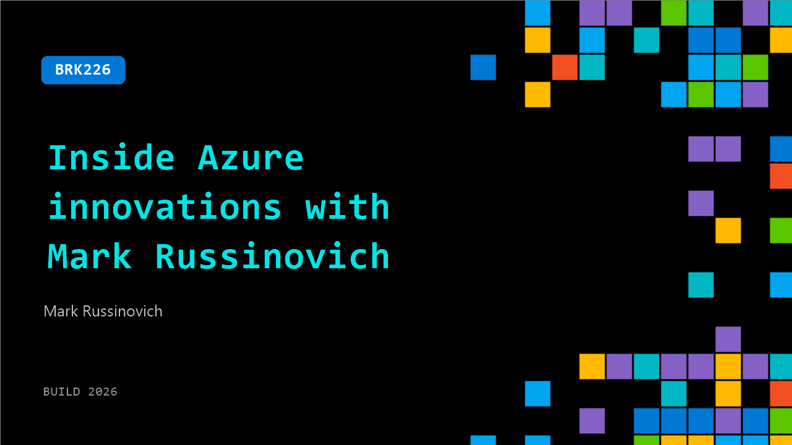

# BRK226: Inside Azure innovations with Mark Russinovich

**Session code:** BRK226  
**Date:** Wednesday, June 3, 2026 / 10:15 AM - 11:00 AM PDT (Duration 45 minutes)  
**Watch on-demand:** <https://build.microsoft.com/en-US/sessions/BRK226>

---

## Speakers

- **Mark Russinovich** - Chief Technology Officer, Deputy CISO, and Technical Fellow, Microsoft Azure, Microsoft

## About the session

Join Mark Russinovich, CTO, Deputy CISO, Technical Fellow of Microsoft Azure. Mark will take you on a tour of the latest innovations in Azure architecture and explain how Azure enables intelligent, modern, and innovative applications at scale in the cloud, on‑premises, and on the edge.

Seating for this session is first-come, first-served. Add it to your schedule to plan your day and arrive early to secure a spot.

## AI summary

**Introduction and Session Overview:** The talk opens with Marcus, CTO and Deputy CISO for Azure, welcoming the audience to "Inside Azure Innovations" and setting expectations for the session (00:00:07–00:00:37). He explains that the presentation covers Azure’s latest infrastructure advancements, from data centers to cybersecurity, and emphasizes that some features shown may still be in development and might never ship as presented. The goal is to provide a behind-the-scenes look at Azure’s technology stack, connecting innovation across hardware and software to intelligence and AI systems (00:01:02–00:01:06).

**Infrastructure and Data Center Innovation:** Marcus begins with Azure’s physical infrastructure, showcasing Fairwater data centers in Wisconsin and Atlanta (00:01:25–00:02:29). He gives a visual tour of the Atlanta site, under construction but already operational, highlighting its intricate cabling systems, liquid cooling, and server configurations. He recounts accidentally powering on a data cell during his visit, illustrating how active and iterative Azure’s engineering environment is. Azure Boost is then introduced as a central innovation—it uses offload cards to move data paths for storage and networking from CPUs to dedicated DPUs, boosting throughput significantly. Statistics show major improvements, including 400 Gbps networking and millions of IOPS for both local and remote storage (00:03:01–00:05:07).

**Networking and Bare Metal Instances:** The discussion shifts to Azure’s use of bare metal instances for GPU workloads, initially deployed for OpenAI at Fairwater (00:05:36–00:06:16). A demo shows SSH into a server proving that virtualized services are disabled, confirming true bare metal execution. Azure transitioned from InfiniBand to Ethernet-based MRC (Multi-Path Reliable Connection) networking, built collaboratively with OpenAI to make large multi-GPU training jobs resilient to congestion or switch failure. Marcus demonstrates how MRC maintains full 95 Gb/s throughput even after intentionally dropping one of four network switches (00:09:00–00:09:28). This leads to Remote Direct Memory Access (RDMA) over Azure Boost, which enables VM-to-VM memory transfers without the software networking stack, nearly doubling inference performance compared to TCP/IP, a key advancement for AI workloads (00:13:08–00:13:18).

**Serverless and Container Virtualization:** Marcus transitions to future infrastructure with serverless computing, emphasizing Azure Container Instances (ACI) as the foundation (00:13:32–00:14:00). He explains ACI’s use of Hyper-V isolation instead of OS-process-level isolation for tighter security. The concept of direct virtualization—placing containers directly on servers as peers to management VMs—is introduced to remove overhead while keeping robust isolation (00:16:19–00:16:31). A live demo showcases container live migration, where a workload moves between servers without interruption or data loss (00:18:00–00:18:38). Container use now spans GitHub Actions, Python, Excel, and Horizon DB, with full fleet migration targeted over two years to direct virtualization for efficiency and resilience.

**AI Systems and Context Optimization:** Azure’s AI orchestration system, Manifold, is introduced to manage GPU clusters and enable complex multi-modal, multi-hardware workloads across CPU, GPU, and ASIC resources (00:19:09–00:19:45). A demo proves Manifold’s capability to deploy isolated pods with precise GPU and CPU allocation over direct virtualization. Marcus then presents Azure Context Cache, a new preview allowing token KV caches to be retained between inference sessions across servers using Azure Storage (00:23:35–00:26:02). This improves cache hit rates to over 96%, cutting cost and latency. Lastly, memory snapshotting accelerates container launches by reusing pre-initialized states, demonstrated by an astonishing live deployment of 10,000 sandboxes in just two seconds (00:27:11–00:28:35).

**Security, Confidential Computing, and Future Hardware:** Marcus closes with advances in data protection through confidential computing (00:29:01–00:33:53). He demonstrates the first-ever confidential VM live migration between servers, preserving attested trust boundaries. Further innovations include Azure Integrated HSMs—hardware security modules embedded in every server, maintaining keys within FIPS 140-3 level boundaries for full lifecycle protection. The demo shows encryption performance surging from 640 to 18,800 operations per second without reducing security (00:37:09–00:38:05). Finally, Marcus introduces Project Mosaic, an experimental optical interconnect technology from Microsoft Research Cambridge using micro-LED fibers for low-power, high-speed data transmission. A live demonstration displays individual LED modulation forming letters, proving the concept’s real-time responsiveness (00:40:55–00:43:55). Marcus concludes by summarizing innovations across all layers—data centers, serverless, AI, and hardware—and invites feedback before closing the session (00:44:09–00:44:46).

## Session tags

- **Session type:** Breakout
- **Level:** (300) Advanced
- **Topic:** Cloud platform & data
- **Location:** Gateway Pavilion, Level 1, Cowell Theater
