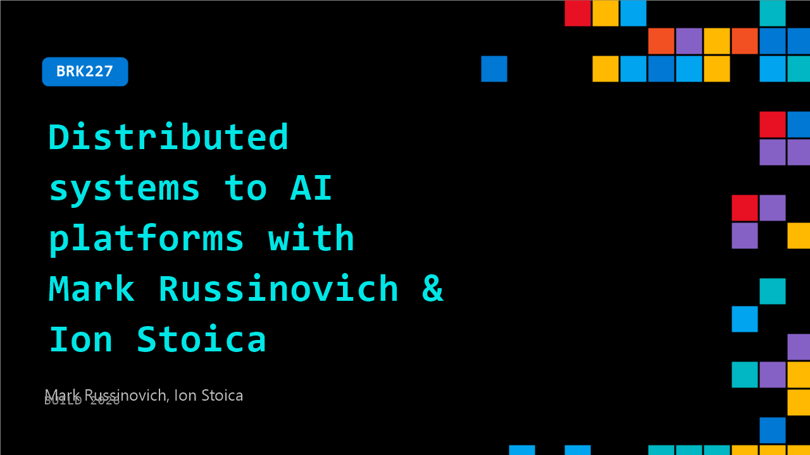

# BRK227: Distributed systems to AI platforms with Mark Russinovich & Ion Stoica

**Session code:** BRK227  
**Date:** Tuesday, June 2, 2026 / 3:45 PM - 4:30 PM PDT (Duration 45 minutes)  
**Watch on-demand:** <https://build.microsoft.com/en-US/sessions/BRK227>

---

## Speakers

- **Mark Russinovich** - Chief Technology Officer, Deputy CISO, and Technical Fellow, Microsoft Azure, Microsoft
- **Ion Stoica** - Professor & Xu Bao Chancellor Chair, University of California, Berkeley, University of California, Berkeley

## About the session

What will it take to build AI platforms for the agent era? Join Azure CTO Mark Russinovich and UC Berkeley professor Ion Stoica (co-creator of Apache Spark and co-founder of Databricks and Anyscale) to explore how AI infrastructure must evolve as systems become agentic, multimodal, and globally distributed. Get practical insights on next generation architectures, from training to real time serving, and why open source, security, and governance are now core platform concerns.

Seating for this session is first-come, first-served. Add it to your schedule to plan your day and arrive early to secure a spot.

## AI summary

_No AI summary available._

## Session tags

- **Session type:** Breakout
- **Level:** (200) Intermediate
- **Topic:** Cloud platform & data
- **Tags:** Next.js, Agent 365, Post Quantum Cryptography
- **Location:** Gateway Pavilion, Level 1, Cowell Theater
