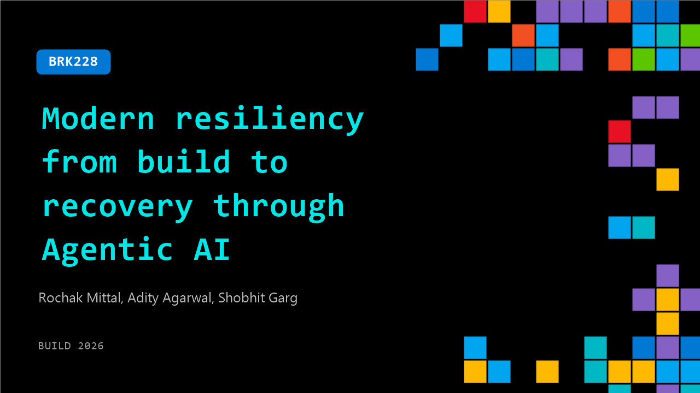

# BRK228: Modern resiliency from build to recovery through Agentic AI

**Session code:** BRK228  
**Date:** Wednesday, June 3, 2026 / 5:15 PM - 6:00 PM PDT (Duration 45 minutes)  
**Watch on-demand:** <https://build.microsoft.com/en-US/sessions/BRK228>

---

## Speakers

- **Rochak Mittal** - Partner Product Manager, Microsoft
- **Adity Agarwal** - Principal Product Manager, Microsoft
- **Shobhit Garg** - Senior Product Manager, Microsoft

## About the session

Resiliency failures rarely come from missing features; they stem from fragmentation. During incidents teams lose time jumping between repos, dashboards, runbooks, and chat tools. This session reframes resiliency as an agent-first practice spanning build, operate, troubleshoot, and recovery. See how an agentic AI assistant links workflows across IDEs, source repos, and collaboration tools speeding validation, operations, and recovery for a critical workload aligned with Azure’s agentic model.

Seating for this session is first-come, first-served. Add it to your schedule to plan your day and arrive early to secure a spot.

## AI summary

**Introduction and Core Principles:** The session begins with Abhimanyu, joined by Aditi and Shobhit, introducing the theme of resiliency and new agent capabilities designed to help users identify and mitigate gaps in their systems (00:00:05). They define resiliency as the ability of systems to stay operational despite unexpected failures. Failures, they note, are inevitable—ranging from availability zone outages to regional failures and data loss. Azure offers foundational tools such as availability zones, geo-replication, and strong backup mechanisms to ensure continued operation. The discussion then segments resiliency into three main pillars: infrastructure, data, and cyber resiliency (00:01:22), emphasizing that overall goals include minimizing downtime, preventing data loss, and enabling rapid recovery.

**Resiliency Lifecycle and Azure Capabilities:** The presenters outline the resiliency lifecycle, which encompasses the three stages of “Start Resilient,” “Get Resilient,” and “Stay Resilient.” Starting resilient means designing for continuity from day one using Azure's tools such as availability zones, region pairs, and the newly introduced Resiliency Agent within Azure Copilot (00:03:08). Existing workloads can improve through the “Get Resilient” phase using automated gap detection and prioritization features from Azure Advisor and AI-powered experiences that surface critical reliability recommendations. Finally, the presenters describe “Stay Resilient” as an ongoing effort involving periodic drills, monitoring, and recovery planning to maintain readiness against real-world disruptions (00:04:32).

**Unified Resiliency Management and Public Preview Announcements:** The speakers highlight the evolution from Azure Business Continuity Center to a unified “Azure Resiliency” platform announced at Ignite (00:05:11). This solution integrates infrastructure, data, and cyber resiliency management into a single interface, enabling centralized visualization, proactive risk tracking, and simplified remediation. They introduce the concept of service groups, which shift planning from individual resources to entire applications, reflecting a business-centric resilience model. New additions include the Resiliency Manager public preview—providing zonal resiliency management, automated goal assignments, continuous health checks, and simulated resiliency drills powered by Chaos Studio (00:07:00), allowing developers to test and improve their failover readiness through real-world failure simulations.

**Demonstration: Building Apps to “Start Resilient”** The “Start Resilient” demonstration shows how DevOps engineers can leverage the Resiliency Agent with Azure Copilot to generate resilient infrastructure-as-code templates directly from natural language instructions (00:10:03). In the demo, the agent interprets a developer’s prompt to build a zonally resilient Java payroll application that includes a VM scale set, a PostgreSQL database, and Key Vault integration. It automatically generates Bicep templates, checks service compatibility with availability zones, and outputs deployment-ready files. The agent then directly integrates with GitHub to create pull requests, showcasing how resiliency can be embedded at code authoring time rather than retrofitted later. This workflow demonstrates how Azure Copilot’s AI-guided experience eliminates the need for manual configurations while enforcing best practices (00:15:00).

**Retrofitting Existing Apps and Advanced Advisor Capabilities:** The “Get Resilient” phase focuses on brownfield applications already deployed on Azure (00:22:15). The demo of the “Ask HR” Java app shows how developers can group resources under a service group, assign zonal resiliency goals, and automatically assess posture compliance using the Resiliency Agent. Where gaps exist, the tool recommends and even applies configurations such as enabling high availability (HA) for PostgreSQL databases. Later, in Visual Studio Code, Azure MCP Server automates setup for vaulted backups and ransomware-protected recovery, ensuring data and cyber resiliency. A subsequent section reveals AI-powered prioritization in Azure Advisor, where recommendations are ranked based on factors such as blast radius, deadlines, and cost (00:33:23). The Advisor Experience generates a concise, actionable plan—from hundreds of recommendations down to the top five urgent fixes—helping teams optimize remediation through intelligent ranking and integration with existing workflows like Jira or ServiceNow (00:41:00).

**Staying Resilient and Final Announcements:** The closing section emphasizes the importance of continuous validation through simulated fault conditions. At Build, Microsoft announces the public preview of Azure Chaos Studio Workspaces launching June 11 (00:44:00), a new application-centric environment for resilience testing. This tool allows customers to safely rehearse outages—such as zone failures or cascading slowdowns—to ensure recovery workflows perform as expected. The presenters conclude by reiterating that resiliency is both an engineering discipline and a sustained practice, with the new agentic tools empowering organizations to design, validate, and evolve their resilience postures directly within their daily development and operational workflows. The session ends with an invitation for audience participation in the limited preview program and a live Q&A (00:44:24).

## Session tags

- **Session type:** Breakout
- **Level:** (300) Advanced
- **Topic:** Cloud platform & data
- **Tags:** Resiliency, Azure Copilot, OSS
- **Location:** Gateway Pavilion, Level 1, Cowell Theater
