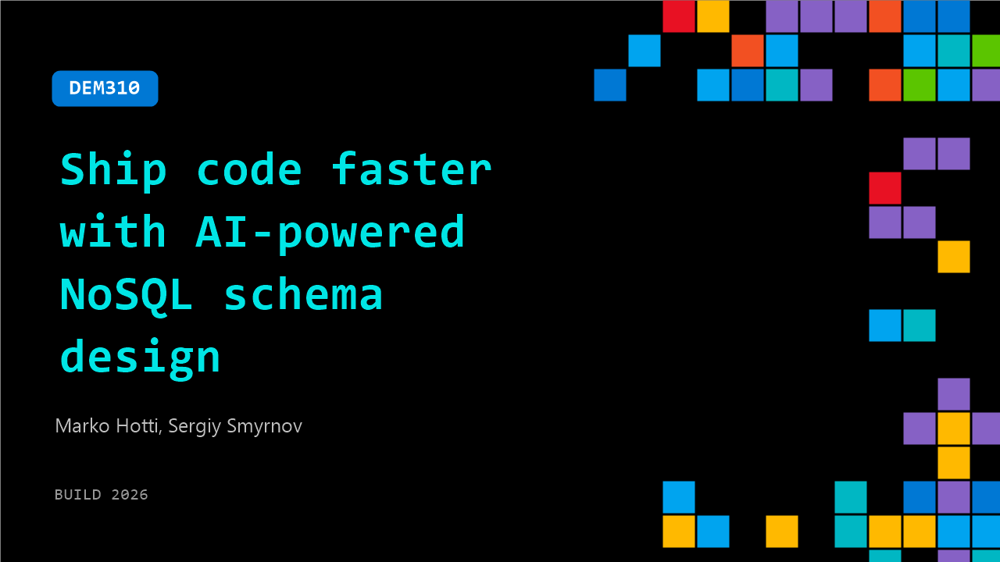

# DEM310: Ship code faster with AI-powered NoSQL schema design

**Session code:** DEM310  
**Date:** Tuesday, June 2, 2026 / 4:30 PM - 4:55 PM PDT (Duration 25 minutes)  
**Watch on-demand:** <https://build.microsoft.com/en-US/sessions/DEM310>

---

## Speakers

- **Marko Hotti** - Sr. Technical Product Marketing Manager, Microsoft
- **Sergiy Smyrnov** - Principal Program Manager, Azure Cosmos DB, Microsoft

## About the session

NoSQL schema design is hard—denormalization decisions, partition key selection, and data modeling patterns require expertise. Use GitHub Copilot and the new Azure Cosmos DB Agent Toolkit to accelerate development with AI-assisted schema generation, query optimization suggestions, and refactoring recommendations. Iterate rapidly with the new Mac/Linux emulator for local testing. Demo shows schema evolution across three iterations in 30 minutes versus days of manual design.

Seating for this session is first-come, first-served. Add it to your schedule to plan your day and arrive early to secure a spot.

## AI summary

**Session Opening and Introduction:** The video begins with greetings and welcomes from the hosts 00:00:02–00:00:16. Marco and Sergei are introduced as the speakers who will discuss how to ship code faster using AI-powered NoSQL schema design. Marco starts the session by engaging the audience and asking how many are developing NoSQL applications with Azure Cosmos DB or other technologies such as MongoDB and DynamoDB 00:00:24–00:00:36. He highlights the appeal of NoSQL databases for agile schema iteration using JSON and explains how Azure Cosmos DB is optimized for low-latency, scalable applications, suitable for both operational data and AI-native workloads 00:00:48–00:01:11.

**Overview of Azure Cosmos DB and AI Integration:** Marco expands on the capabilities of Azure Cosmos DB, mentioning integrated vector search, full-text search, hybrid semantic ranking, and strong integration with Microsoft Foundry for hosting large language models 00:01:23–00:01:46. He emphasizes the platform’s suitability for globally distributed AI workloads and provides real-world examples like OpenAI’s use of Cosmos DB for ChatGPT and ServiceNow deployments 00:01:52–00:02:03. Marco transitions to how developers can use tools such as GitHub Copilot and MCP integration to accelerate application building with AI assistance, underscoring the importance of a standardized, secure connection method for apps and agents 00:02:30–00:02:39. He concludes the overview and hands the session over to Sergei for a demo showcasing Azure Cosmos DB Agent Kit 00:02:42–00:02:54.

**Demo Setup and Conceptual Foundations:** Sergei introduces the demo, focused on a classic e-commerce model including customer, product, and sales order domains 00:03:01–00:03:20. After regaining connection mid-demo, he explains that traditional modernization often converts relational tables directly into containers, which while valid, is suboptimal. His goal is to demonstrate how the Cosmos DB Agent Kit can improve schema efficiency using AI-guided design 00:04:18–00:04:41. The Agent Kit includes best practices and Copilot skills that can be installed locally through simple commands and used across different environments 00:05:00–00:05:11. He stresses how indexing and skill-based optimization empower the agent to evaluate schemas for NoSQL systems based on various SDKs.

**Defining Access Patterns and Optimization Strategy:** Sergei demonstrates how adding domains and defining structured access patterns allows the AI agent to design for both model and real-world query efficiency 00:06:35–00:07:00. Four main access patterns are defined: retrieving customers with recent orders, fetching single order details, performing CRUD operations on orders, and listing products by category 00:07:04–00:07:23. He discusses volumetric projections to anticipate scale from 10 development users to millions in production, showing how early design decisions affect cost and performance 00:07:42–00:08:29. The demo compares naive schema design, where each table becomes an individual container, with optimized approaches that merge domains and apply consistent partition strategies 00:09:01–00:09:50.

**Demonstration of Agent-Guided Schema and Data Validation:** Using the Agent Kit, Sergei runs AI-guided iterations that propose collapsing related domains (customers with orders, products with categories) to improve partitioning and indexing 00:14:46–00:15:19. He then deploys this optimized schema locally using the Azure Cosmos DB Emulator, iterating on container structures and verifying configurations 00:16:00–00:16:20. The emulator’s fast iteration allows validation of indexing policies and document shapes through CSV-driven data conversion and JSON validation routines 00:18:05–00:18:22. Sergei shows how data types are standardized and validated, resulting in clean combined customer and order documents optimized for query efficiency 00:19:53–00:20:22.

**Results, Cost Savings, and Conclusion:** In closing, Sergei compares performance metrics between naive and optimized iterations 00:23:01–00:23:06. The optimized schema yields over 50% savings in request units for frequent reads and up to 75% savings for order retrieval operations, showing dramatic cost reductions—an estimated $980,000 per month at production scale 00:24:07–00:24:29. He stresses the importance of iterative validation and simulation through the Agent Kit before deploying at full scale, ensuring database efficiency and avoiding costly schema mistakes. Marco and Sergei conclude by encouraging developers to use these AI-driven tools and the Cosmos DB emulator to continuously validate schemas and evolve NoSQL designs intelligently 00:25:01–00:25:32.

## Session tags

- **Session type:** Demo
- **Level:** (200) Intermediate
- **Topic:** Cloud platform & data
- **Tags:** Azure Cosmos DB, CP&D, Data
- **Location:** Gateway Pavilion, Level 2, Theater C
