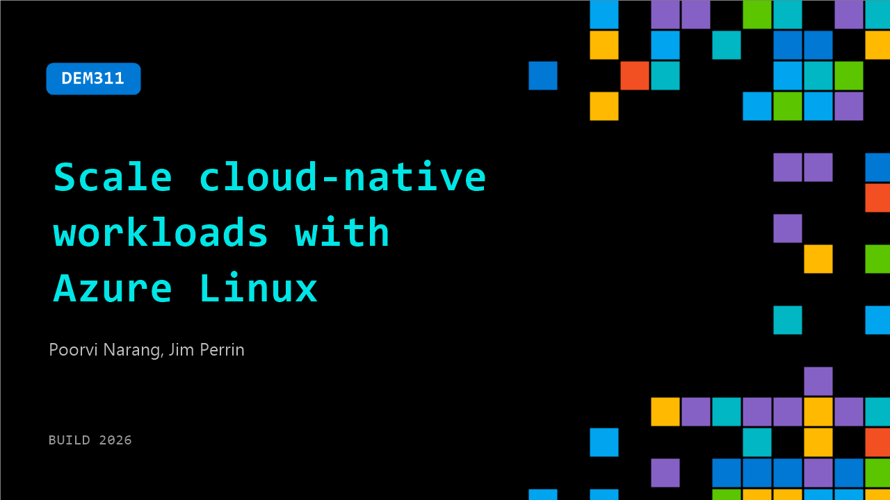

# DEM311: Scale cloud-native workloads with Azure Linux

**Session code:** DEM311  
**Date:** Wednesday, June 3, 2026 / 5:00 PM - 5:25 PM PDT (Duration 25 minutes)  
**Watch on-demand:** <https://build.microsoft.com/en-US/sessions/DEM311>

---

## Speakers

- **Poorvi Narang** - Senior Program Manager, Microsoft
- **Jim Perrin** - Principal Program Manager Lead, Microsoft

## About the session

Azure Linux is a purpose-built Linux distribution optimized for Azure. Learn how Azure Linux supports cloud-native and AI workloads with deep integration into the Azure ecosystem, delivering a consistent Linux platform across containers and other Azure compute services. Designed with a minimal footprint, Azure Linux enables faster provisioning and scaling, reduces the attack surface, and incorporates Azure's robust cloud security standards.

Seating for this session is first-come, first-served. Add it to your schedule to plan your day and arrive early to secure a spot.

## AI summary

**Introduction and Agenda:** The presentation opens with Jim Perrin and Poorvinder Rang introducing themselves as program managers on the Azure Linux team (00:00:04). They briefly outline the session: an overview of Azure Linux, insights into Azure Container Linux for Kubernetes and container users, a product demo, and time for questions. The goal, as Perrin explains, is to help attendees understand what Azure Linux is, what Microsoft is building, and how it integrates with both containerized and virtualized environments within Azure (00:00:23). The introduction sets the stage for a technical deep dive into the evolution of Azure’s Linux distribution strategy.

**Azure Linux Foundations and Fedora Partnership:** Early in the session, Jim details how Azure Linux derives from Fedora, echoing the upstream–downstream relationship that Red Hat Enterprise Linux maintains (00:00:50). Microsoft partners closely with the Fedora community, contributing upstream while maintaining transparency in how Azure Linux deviates from Fedora via public GitHub repositories (00:01:42). The use of Fedora as an upstream source streamlines ecosystem alignment and brings existing third-party support. Jim emphasizes Microsoft’s added value around compliance—like FIPS and FedRAMP certifications—and the concept of a consistent cadence for updates and vulnerability management modeled after the well-known “Patch Tuesday” concept (00:02:30). This consistency ensures reliability across workloads and security levels for enterprises adopting Azure Linux.

**Architecture and Kernel Optimization for Azure:** Jim transitions into the technical structure defining both Azure Linux and Azure Container Linux (00:03:02–00:03:48). Both share identical binaries for compatibility, tuned specifically for Azure performance, reliability, and hardware enablement. The kernel supports both long-term stability and rapid iteration cycles as required by different customers (00:03:33). These optimizations combine open-source flexibility with Azure’s managed fleet consistency, integrating natively with tools such as Azure Update Manager. This architectural coherence ensures customers can deploy workloads seamlessly across virtual machines, containers, or immutable infrastructure images without revalidation, preserving environment parity across the ecosystem.

**Live Demonstration Across Environments:** Poorvi leads the live demo beginning with Azure Linux 4.0 running on Windows Subsystem for Linux (WSL) (00:05:21). She runs a simple Python application to demonstrate that the same app behaves identically in WSL, a virtual machine, and a Kubernetes deployment via Azure Kubernetes Service (AKS). During the VM portion, she highlights integrated security features such as SELinux enforced by default, lean image sizes designed through “declarative deviations,” and removal of nonessential desktop packages for hardened, cloud-native security (00:09:39). The demo also spotlights the new DNF 5 package manager for faster dependency handling, default firewall rules with explicit manual control, and preconfigured security postures. This portion underlines the central Azure Linux tenet: strong out-of-the-box security and consistency from developer workstation to cloud infrastructure (00:13:36).

**Azure Container Linux and Immutable Infrastructure:** Jim then elaborates on Azure Container Linux as an immutable derivative built from Flatcar Container Linux, contributed by Microsoft to the CNCF (00:18:40). He clarifies that Flatcar is not being deprecated—Azure Container Linux simply provides an enterprise-ready, productized variant aligned with Azure’s operational model. The distribution maintains consistency with Azure Linux, featuring secure boot, dm-verity validation, read-only file systems, and SELinux enforcement. The live deployment demo on AKS showcases automatic verification, minimal kernel variations, and secure configuration defaults (00:21:35). Azure Container Linux 3.0 is now generally available, with version 4.0 entering preview alignment. Together, these editions unify the immutable infrastructure experience within Azure’s container ecosystem.

**Q&A and Closing Remarks:** In closing (00:22:32–00:25:27), Jim answers an audience query regarding firewall D rule management, assuring clear documentation of any package deviations in GitHub. The presenters summarize product availability: Azure Linux 4.0 in public preview, with Azure Container Linux officially GA. They invite collaboration, feedback, and partnerships through GitHub and community calls. The session concludes with encouragement for developers and partners to test, validate, and integrate Azure Linux across WSL, VM, and Kubernetes deployments, emphasizing Microsoft’s commitment to transparent open-source stewardship and secure, universal Linux experience in the Azure cloud.

## Session tags

- **Session type:** Demo
- **Level:** (300) Advanced
- **Topic:** Cloud platform & data
- **Tags:** Azure Linux
- **Location:** Festival Pavilion, Theater A
