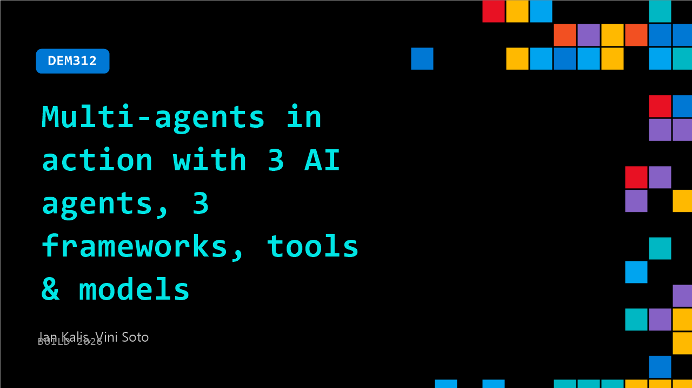

# DEM312: Multi-agents in action with 3 AI agents, 3 frameworks, tools & models

**Session code:** DEM312  
**Date:** Wednesday, June 3, 2026 / 10:00 AM - 10:25 AM PDT (Duration 25 minutes)  
**Watch on-demand:** <https://build.microsoft.com/en-US/sessions/DEM312>

---

## Speakers

- **Jan Kalis** - PM @ Azure Container Apps, Microsoft
- **Vini Soto** - Azure Container Apps | Engineering Manager, Microsoft

## About the session

Three agent frameworks. One Agentic Startup Content Factory. Zero manual steps. In this live demo we build an intelligent system that researches topics, writes articles and code samples, and refines its own output, all while running autonomously. We'll deploy LangGraph, .NET Microsoft Agent Framework, and GitHub Copilot SDK agents to Azure Container Apps, then connect Microsoft Foundry for observability and evals. You'll walk out with an Agentic Startup Content Factory you can clone and ship.

Seating for this session is first-come, first-served. Add it to your schedule to plan your day and arrive early to secure a spot.

## AI summary

**Introduction and Agenda:** The session opens with an introduction by Jan and Vinnie from the Azure Container Apps team. They welcome the audience to their presentation on multi-agents in action and outline the plan to showcase three different agent frameworks running at scale (00:00:04–00:00:25). The agenda includes explaining what modern agentic infrastructure is, why it matters, and demonstrating the "Agentic Content Factory" demo. They also reference a forthcoming GitHub repository link for attendees to explore after the talk (00:00:34). Gartner’s forecast that 40% of agentic projects will face cancellations by 2025 is highlighted, attributed not to AI model limitations but to issues like governance, runtime instability, and unmonitored budgets (00:00:57–00:01:18).

**Introducing Azure Container App Sandboxes:** The speakers discuss typical runtime problems—like cold starts, untrusted code execution, and lack of lifecycle control—and introduce Azure Container App Sandboxes as a solution (00:02:28–00:02:56). They announce a private preview of this feature, emphasizing its secure, isolated, and stateful infrastructure on demand. Users can run code safely with snapshot-based restoration and near-instant resumption (00:03:02). Internal teams like Microsoft Foundry and GitHub are already leveraging this for hosted agents. They also showcase Azure Container Apps Express, described as an agent-first technology that offers provisioning in seconds and near-zero scale-up latency (00:03:43–00:03:57).

**Three-Agent Architecture and System Design:** The demo portion introduces three collaborating agents—a researcher, a content creator, and a narrator—working together within the content factory pipeline (00:04:02–00:05:00). Each agent uses a different technology stack: LangGraph in Python for research, Agent Framework in C#, and GitHub Copilot SDK for narrative generation. Managed through a Foundry orchestrator, these agents emit OpenTelemetry (Otel) data to allow system-wide observability. The goal is to demonstrate how multi-agent pipelines can operate under one management plane, regardless of framework diversity. Agent telemetry and metrics are collected across all applications to illustrate real-time coordination and monitoring (00:06:03).

**Live Demo: Soccer Simulation and Sandboxes in Action:** For an engaging use case, the presenters run a soccer match simulation between Mexico and the Czech Republic, dynamically executed by the agents through sandbox environments (00:07:00–00:10:02). The research agent fetches live data, executes dynamic Python code in isolated sandboxes, and leverages Foundry’s LLMs to predict outcomes. Each sandbox represents a temporary, secure compute environment that spins up, executes code, then snapshots and idles automatically when inactive (00:11:20). They demonstrate security through egress and access policies—showing how URLs can be blocked, outbound calls controlled, and secrets protected from exposure by injecting API keys via an external egress gateway rather than hardcoding them inside agent logic (00:16:02–00:17:06).

**Security, Observability, and Workflow Management:** The team explains secure credential handling using Azure Managed Identity for internal API access, alongside transformation-based egress policies that transparently attach secure keys to outbound requests (00:14:09–00:16:49). Observability is achieved through unified OpenTelemetry aggregation into Application Insights, allowing administrators to trace agent flows, performance metrics, and errors (00:18:40). The demo also shows continuous evaluation and centralized monitoring through Microsoft Foundry, regardless of whether agents use different SDKs or programming languages. This unified oversight helps maintain governance while managing large multi-agent systems (00:19:19–00:19:28).

**Conclusion and Next Steps:** Jan and Vinnie conclude by recapping that Azure Container App Sandboxes enable fast, stateful, and isolated execution for multi-agent workloads (00:20:00–00:20:12). They emphasize security-by-design, observability, and cost efficiency achieved via automated idling and on-demand scaling. Attendees are encouraged to visit the Azure Container Apps booth and to try sandboxes directly at sandboxes.azure.com (00:21:10). The presenters close with an invitation to upcoming sessions and demos at Build, thanking the audience for participating and reiterating Microsoft’s mission to make multi-agent orchestration secure, manageable, and developer-friendly.

## Session tags

- **Session type:** Demo
- **Level:** (200) Intermediate
- **Topic:** Cloud platform & data
- **Location:** Gateway Pavilion, Level 2, Theater C
