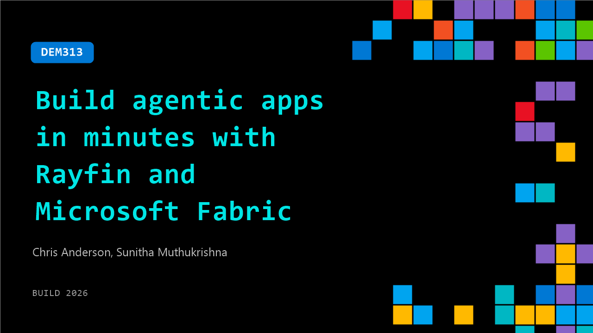

# DEM313: Build agentic apps in minutes with Rayfin and Microsoft Fabric

**Session code:** DEM313  
**Date:** Tuesday, June 2, 2026 / 12:30 PM - 12:55 PM PDT (Duration 25 minutes)  
**Watch on-demand:** <https://build.microsoft.com/en-US/sessions/DEM313>

---

## Speakers

- **Chris Anderson** - PM - Fabric App Dev + Rayfin, Microsoft
- **Sunitha Muthukrishna** - Principal Product Manager, Microsoft

## About the session

Build an enterprise app in minutes with Rayfin, an agent-friendly, code-first backend-as-a-service. In this demo, we show how an AI agent generates a full stack web app with a managed database, authentication, and backend services. Learn how to connect the app to existing data in your Microsoft Fabric data estate, define services in code, and use Fabric’s built-in analytics, BI, and AI capabilities to power insights and intelligent experiences.

Seating for this session is first-come, first-served. Add it to your schedule to plan your day and arrive early to secure a spot.

## AI summary

_No AI summary available._

## Session tags

- **Session type:** Demo
- **Level:** (300) Advanced
- **Topic:** Cloud platform & data
- **Tags:** Microsoft Fabric, CP&D, Data
- **Location:** Festival Pavilion, Theater A
