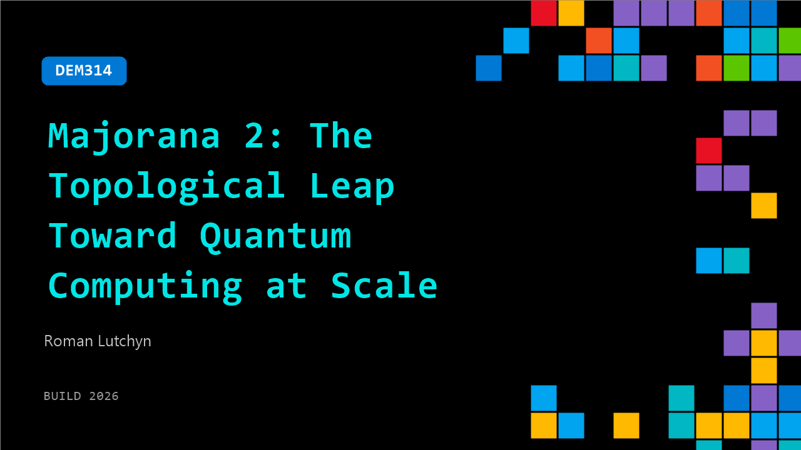

# DEM314: Majorana 2: The Topological Leap Toward Quantum Computing at Scale

**Session code:** DEM314  
**Date:** Wednesday, June 3, 2026 / 4:30 PM - 4:55 PM PDT (Duration 25 minutes)  
**Watch on-demand:** <https://build.microsoft.com/en-US/sessions/DEM314>

---

## Speakers

- **Roman Lutchyn** - Partner, Quantum Design, Microsoft

## About the session

Go beyond the keynote with Majorana 2 - our latest topological quantum chip, enabled by a reimagined material stack and AI‑accelerated R&D. Learn what one-minute qubit lifetimes mean for error correction, and discover the latest advances in the Microsoft Quantum software stack on the path to a scalable quantum machine.

## AI summary

**Introduction and the Promise of Quantum Computing:** The speaker begins by highlighting the enormous transformative potential of quantum technologies for multiple industries (00:00:02–00:00:12). Quantum computing, they note, can revolutionize healthcare by drastically reducing drug discovery and therapy development cycles, enhance energy and climate research through new catalysts for carbon capture and nitrogen fixation, and accelerate innovation across scientific domains. Microsoft aims to address this opportunity through a unified approach combining artificial intelligence (AI), quantum computation, and high-performance computing (HPC) to create hybrid workflows that are scalable and impactful (00:00:44–00:01:20).

**Microsoft’s Full-Stack Quantum Vision:** At Microsoft, the focus is on developing a full-stack quantum system that integrates deeply from the hardware up through applications (00:01:32–00:02:02). Rather than emphasizing qubit count, the company’s approach builds on every layer of the quantum stack, from physical processors and error correction methods to classical compute integration and software usability. The ultimate objective is for CPUs, GPUs, and QPUs to work seamlessly within Microsoft’s cloud environment to solve commercially valuable problems at scale (00:02:07–00:02:23).

**Developing Reliable Topological Qubits:** The presentation then dives into quantum hardware, where Microsoft’s research has centered on building small, fast, and reliable qubits (00:02:34–00:02:51). The company favors a topological approach to encoding quantum information, using Majorana modes—exotic quantum states that inherently protect against errors. Achieving this required inventing a new material stack and engineering a new phase of matter that supports these fault-tolerant states. The speaker proudly introduces “Majorana 2,” a new quantum processing unit based on these principles, integrating cryogenic CMOS controllers for efficient operation at extremely low temperatures (00:03:29–00:04:47).

**The Science of New Quantum Materials:** To achieve the reliability required for practical quantum computing, the team developed a hybrid phase of matter known as a topological superconductor, or “topoconductor” (00:05:03–00:06:31). This material emerges by precisely combining superconductors and semiconductors under specific magnetic conditions, enabling the manifestation of Majorana modes. The fabrication process involves atomic-scale engineering for pristine interfaces, a key factor for qubit performance. A major milestone in the research was replacing aluminum with lead as the superconducting layer, which has a fourfold larger energy gap, resulting in a thousandfold improvement in qubit performance over previous devices (00:07:02–00:08:04).

**Scaling Qubit Arrays and Demonstrating Breakthroughs:** The new materials enable Microsoft to design modular qubit arrays that can scale toward large, credit-card-sized chips containing millions of qubits (00:09:22–00:10:25). Lab results show devices achieving qubit lifetimes of up to one minute—an extraordinary feat compared to previous results of only 10 milliseconds (00:12:02–00:12:22). This thousandfold improvement validates Microsoft’s material-first design philosophy and underscores the effectiveness of AI-driven simulation and optimization tools. Based on these rapid advancements, Microsoft accelerated its roadmap for building a commercially viable quantum machine from 2033 to 2029 (00:13:05).

**AI-Accelerated Quantum Design and Conclusion:** In closing, the speaker emphasizes how AI has dramatically shortened the design and optimization process for complex quantum chips—tasks that now take weeks instead of years (00:13:33–00:14:12). The combination of advanced materials, AI tools, and scalable architectures transforms what was once hard physics into a structured roadmap for a practical quantum computer. The talk concludes with a reaffirmation of Microsoft’s commitment to accelerating across every front—materials science, fabrication, algorithms, and architecture—to achieve quantum computing at scale, marking a confident step toward the future (00:14:54–00:15:05).

## Session tags

- **Session type:** Demo
- **Level:** (200) Intermediate
- **Topic:** Cloud platform & data
- **Location:** Gateway Pavilion, Level 2, Theater C
